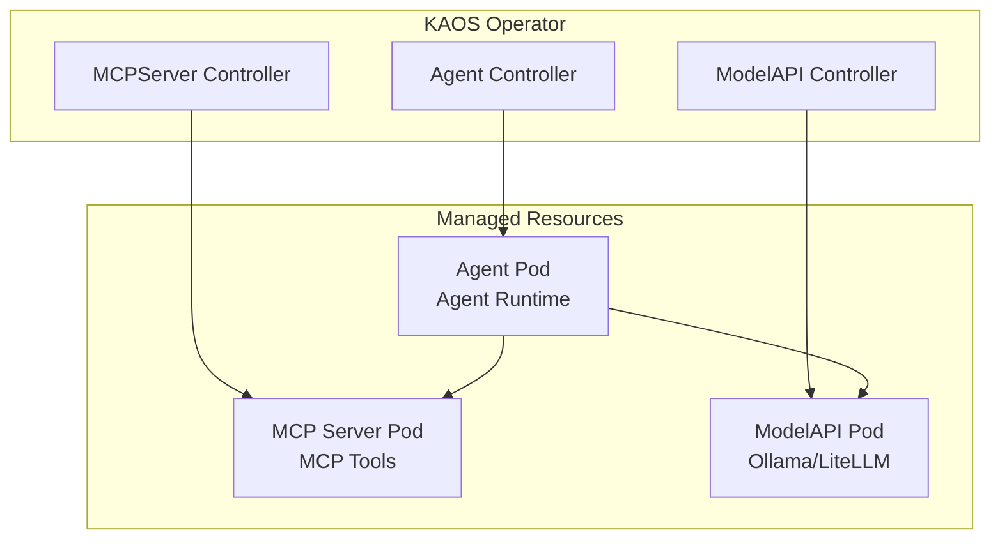

# KAOS: K8s Agent Orchestration System

<p align="center">
  <strong>Deploy, manage, and orchestrate AI agents on Kubernetes</strong>
</p>


<table width="100%">
<tr>
<td>

</td>
<td>
<br>
    <p align="center">
      <a href="https://opensource.org/licenses/Apache-2.0"></a><br>
      <a href="https://kubernetes.io"></a><br>
      <a href="https://go.dev"></a><br>
      <a href="https://python.org"></a><br>
    </p>
    <h3 align="center">Docs Nav</h3>
    <p align="center">
      <a href="#features">Features</a> <br>
      <a href="#quick-start">Quick Start</a> <br>
      <a href="#architecture">Architecture</a> <br>
      <a href="#documentation">Documentation</a> <br>
    </p>
</td>
</tr>
</table>

---

KAOS is a Kubernetes-native framework for deploying and orchestrating AI agents with tool access, multi-agent coordination, and seamless LLM integration.

## Features

| Feature | Description |
|---------|-------------|
| **🖥️ CLI & Web UI** | Install and manage agents with `kaos` CLI and visual dashboard |
| **🤖 Agent CRD** | Deploy agents as Kubernetes Custom Resources |
| **🔧 MCP Tools** | Tool integration via the Model Context Protocol standard |
| **🔗 Multi-Agent** | Hierarchical agent systems with automatic delegation |
| **📡 OpenAI-Compatible** | All agents expose `/v1/chat/completions` endpoints |
| **🎛️ Visual Dashboard** | Monitor agents, test chat, debug memory and tools |

## Quick Start

### Prerequisites

- Kubernetes cluster (Docker Desktop, kind, minikube)
- kubectl configured

### Option 1: KAOS CLI/UI (Recommended)

```bash
# Install the CLI
pip install kaos-cli

# Install KAOS in your cluster
kaos install

# Open the UI
kaos ui
```


The UI opens at [axsaucedo.github.io/kaos-ui](https://axsaucedo.github.io/kaos-ui). For CLI/UI documentation, see the [CLI Guide](https://axsaucedo.github.io/kaos/cli/overview).

### Option 2: Helm/kubectl

```bash
# Add the Helm repository
helm repo add kaos https://axsaucedo.github.io/kaos/charts
helm repo update

# Install the operator
helm install kaos kaos/kaos-operator -n kaos-system --create-namespace
```

#### Deploy Your First Agent

```yaml
# simple-agent.yaml
apiVersion: kaos.tools/v1alpha1
kind: ModelAPI
metadata:
  name: ollama
spec:
  mode: Hosted
  hostedConfig:
    model: "smollm2:135m"

---
apiVersion: kaos.tools/v1alpha1
kind: MCPServer
metadata:
  name: echo-tools
spec:
  type: python-runtime
  config:
    tools:
      fromString: |
        def echo(message: str) -> str:
            """Echo back the message."""
            return f"Echo: {message}"

---
apiVersion: kaos.tools/v1alpha1
kind: Agent
metadata:
  name: assistant
spec:
  modelAPI: ollama
  mcpServers:
    - echo-tools
  config:
    description: "AI assistant with echo tools"
    instructions: "You are a helpful assistant."
    env:
      - name: MODEL_NAME
        value: "ollama/smollm2:135m"
```

```bash
kubectl apply -f simple-agent.yaml

# Wait for pods to be ready
kubectl wait --for=condition=ready pod -l agent=assistant --timeout=120s

# Port-forward and test
kubectl port-forward svc/agent-assistant 8000:8000
curl http://localhost:8000/v1/chat/completions \
  -H "Content-Type: application/json" \
  -d '{"model": "assistant", "messages": [{"role": "user", "content": "Hello!"}]}'
```

#### Multi-Agent Systems

KAOS supports hierarchical multi-agent systems where a coordinator delegates tasks to specialist agents:

```yaml
apiVersion: kaos.tools/v1alpha1
kind: Agent
metadata:
  name: coordinator
spec:
  modelAPI: ollama
  config:
    description: "Coordinator that delegates to specialists"
    instructions: "Delegate research to researcher, calculations to analyst."
  agentNetwork:
    access:
      - researcher
      - analyst
```

See [`operator/config/samples/`](operator/config/samples/) for complete multi-agent examples.

## Architecture



## Documentation

| Resource | Link |
|----------|------|
| 📖 Full Documentation | [axsaucedo.github.io/kaos](https://axsaucedo.github.io/kaos) |
| 🚀 Quick Start | [Getting Started](https://axsaucedo.github.io/kaos/getting-started/quickstart) |
| 🖥️ CLI Guide | [CLI Commands](https://axsaucedo.github.io/kaos/cli/commands) |
| 🎛️ Web UI | [UI Features](https://axsaucedo.github.io/kaos/ui/features) |
| 🤖 Agent CRD | [Agent Reference](https://axsaucedo.github.io/kaos/operator/agent-crd) |
| 🔗 Multi-Agent | [Multi-Agent Tutorial](https://axsaucedo.github.io/kaos/tutorials/multi-agent) |

## Development

```bash
# Python tests
cd python && uv sync && uv run pytest tests/ -v

# Go tests  
cd operator && make test

# E2E tests (requires kind)
cd operator && make kind-create
cd operator && make kind-e2e-run-tests
```

## Sample Configurations

See [`operator/config/samples/`](operator/config/samples/) for examples:

1. **Simple Agent** - Single agent with echo MCP tool
2. **Multi-Agent** - Coordinator with worker agents
3. **Hierarchical** - Multi-level agent hierarchy
4. **Custom Tools** - Dynamic tool creation with `tools.fromString`

## License

Apache 2.0
