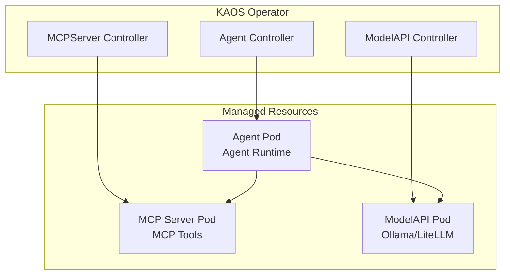

# KAOS: K8s Agent Orchestration System

<p align="center">
  <strong>Deploy, manage, and orchestrate AI agents on Kubernetes</strong>
</p>


<table width="100%">
<tr>
<td>

</td>
<td>
<br>
    <p align="center">
      <a href="https://opensource.org/licenses/Apache-2.0"></a><br>
      <a href="https://kubernetes.io"></a><br>
      <a href="https://go.dev"></a><br>
      <a href="https://python.org"></a><br>
    </p>
    <h3 align="center">Docs Nav</h3>
    <p align="center">
      <a href="#features">Features</a> <br>
      <a href="#quick-start">Quick Start</a> <br>
      <a href="#architecture">Architecture</a> <br>
      <a href="#documentation">Documentation</a> <br>
    </p>
</td>
</tr>
</table>

---

KAOS is a Kubernetes-native framework for deploying and orchestrating AI agents with tool access, multi-agent coordination, and seamless LLM integration.

## Principles & Features

| Principle | Description |
|-----------|-------------|
| **🎯 Kubernetes-Native** | Agents, tools, and LLM backends are Custom Resources managed by controllers |
| **🔧 MCP Standard** | Tool integration via the Model Context Protocol for interoperability |
| **🔗 Multi-Agent Delegation** | Hierarchical agent systems with automatic discovery and delegation |
| **📡 OpenAI-Compatible** | All agents expose standard `/v1/chat/completions` endpoints |
| **🌐 Gateway API** | Optional unified ingress via Kubernetes Gateway API |
| **🔄 Agentic Reasoning** | Built-in reasoning loop with configurable max steps |

## Quick Start

### Prerequisites

- Kubernetes cluster (Docker Desktop, kind, minikube)
- kubectl configured
- Helm 3.x

##### Interfaces

1) KAOS Native (cli/ui)
2) Kubernetes Vanilla (helm/kubectl)

### Option 1: KAOS Native (CLI/UI)

```bash
# Install KAOS in your cluster
kaos install

# Run Proxy and Open UI
kaos ui
```

#### Access UI

You can then access the UI at [axsaucedo.github.io/kaos](axsaucedo.github.io/kaos). High level walk-through:


#### Next Steps

For detailed deep dive on the KAOS cli/ui you can check out the [documentation](https://axsaucedo.github.io/kaos/).


### Option 2: Kubernetes Vanilla (heln/kubectl)

```bash
cd operator
helm install kaos-operator chart/ -n kaos-system --create-namespace
```

#### Deploy Your First Agent

```yaml
# simple-agent.yaml
apiVersion: kaos.tools/v1alpha1
kind: ModelAPI
metadata:
  name: ollama
spec:
  mode: Hosted
  hostedConfig:
    model: "smollm2:135m"

---
apiVersion: kaos.tools/v1alpha1
kind: MCPServer
metadata:
  name: echo-tools
spec:
  type: python-runtime
  config:
    mcp: "test-mcp-echo-server"

---
apiVersion: kaos.tools/v1alpha1
kind: Agent
metadata:
  name: assistant
spec:
  modelAPI: ollama
  mcpServers:
    - echo-tools
  config:
    description: "AI assistant with echo tools"
    instructions: "You are a helpful assistant. Use the echo tool when asked to repeat something."
    env:
      - name: MODEL_NAME
        value: "ollama/smollm2:135m"
```

```bash
kubectl apply -f simple-agent.yaml

# Wait for pods to be ready
kubectl wait --for=condition=ready pod -l app=assistant --timeout=120s

# Port-forward and test
kubectl port-forward svc/assistant 8000:80
curl http://localhost:8000/v1/chat/completions \
  -H "Content-Type: application/json" \
  -d '{"model": "assistant", "messages": [{"role": "user", "content": "Hello!"}]}'
```

#### Multi-Agent with Gateway API

KAOS supports complex multi-agent systems with Gateway API for external access:

```yaml
# multi-agent-gateway.yaml
apiVersion: kaos.tools/v1alpha1
kind: ModelAPI
metadata:
  name: ollama
spec:
  mode: Hosted
  hostedConfig:
    model: "llama3.2:latest"

---
apiVersion: kaos.tools/v1alpha1
kind: MCPServer
metadata:
  name: search-tools
spec:
  type: python-runtime
  config:
    tools:
      fromString: |
        def web_search(query: str) -> str:
            """Search the web for information."""
            return f"Results for: {query}"

---
apiVersion: kaos.tools/v1alpha1
kind: MCPServer
metadata:
  name: calculator
spec:
  type: python-runtime
  config:
    tools:
      fromString: |
        def calculate(expression: str) -> str:
            """Evaluate a mathematical expression."""
            return str(eval(expression))

---
apiVersion: kaos.tools/v1alpha1
kind: Agent
metadata:
  name: coordinator
spec:
  modelAPI: ollama
  config:
    description: "Coordinator that delegates to specialist agents"
    instructions: |
      You are a coordinator. Delegate research tasks to researcher,
      and calculations to analyst.
  agentNetwork:
    access:
      - researcher
      - analyst
  gatewayRoute:
    timeout: "120s"

---
apiVersion: kaos.tools/v1alpha1
kind: Agent
metadata:
  name: researcher
spec:
  modelAPI: ollama
  mcpServers:
    - search-tools
  config:
    description: "Research specialist with web search"
    instructions: "You are a researcher. Use web_search to find information."

---
apiVersion: kaos.tools/v1alpha1
kind: Agent
metadata:
  name: analyst
spec:
  modelAPI: ollama
  mcpServers:
    - calculator
  config:
    description: "Data analyst with calculation tools"
    instructions: "You are an analyst. Use calculate for math operations."
```

With Gateway API enabled, agents are accessible via:
```
http://<gateway-ip>/coordinator/v1/chat/completions
```

## Architecture



## Documentation

| Resource | Link |
|----------|------|
| 📖 Full Documentation | [axsaucedo.github.io/kaos](https://axsaucedo.github.io/kaos) |
| 🚀 Quick Start | [Getting Started](https://axsaucedo.github.io/kaos/getting-started/quickstart) |
| 🤖 Agent CRD | [Agent Reference](https://axsaucedo.github.io/kaos/operator/agent-crd) |
| 🔗 Multi-Agent | [Multi-Agent Tutorial](https://axsaucedo.github.io/kaos/tutorials/multi-agent) |

## Development

```bash
# Python tests
cd python && uv sync && uv run pytest tests/ -v

# Go tests  
cd operator && make test

# E2E tests (requires kind)
cd operator && make kind-create
cd operator && make kind-e2e-run-tests
```

## Sample Configurations

See [`operator/config/samples/`](operator/config/samples/) for examples:

1. **Simple Agent** - Single agent with echo MCP tool
2. **Multi-Agent** - Coordinator with worker agents
3. **Hierarchical** - Multi-level agent hierarchy
4. **Custom Tools** - Dynamic tool creation with `tools.fromString`

## License

Apache 2.0
