# Securing agents: who they are, and what they're allowed to do

When an agent calls a tool, two questions must be answered before anything runs:

1. **Who is asking?** The agent itself, and, if a person started it, which person.
2. **Is that allowed?** Can *this* user use *this* agent, and can *this* agent reach *that* tool or model?

KAOS answers both on every request, at a single gateway every call passes through, before the request reaches anything. This guide explains how, installs it end to end, then walks a concrete example where some calls succeed and others are correctly refused.

> No security background needed. Each term is introduced in plain language the first time it appears, and the KAOS CLI does the fiddly parts (logging in, calling through the gateway) for you.

---

## 1. The control plane

The **control plane** is the set of components that establish identity and decide the rules. None of them carry your agents' actual traffic; they answer the two questions above about it. Here they are on one map. The greyed pieces belong to [Part 5](#5-agents-acting-on-behalf-of-users-on-outside-services) and can be ignored for now.

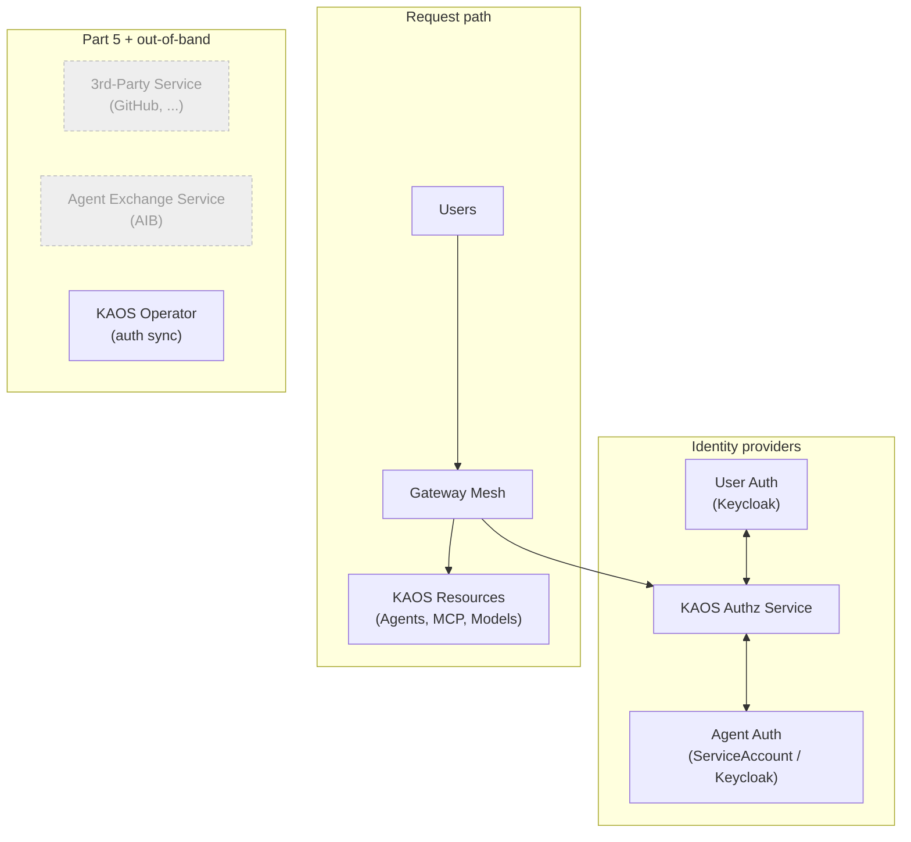

A few of these names deserve a gloss on first meeting. The **Gateway Mesh** is a single gateway every request passes through — including agent-to-tool and agent-to-model calls, which is what makes it a mesh; after this introduction we'll often just say "the gateway". The **KAOS Authz Service** (authz, short for authorization) is the service that answers allow/deny. **User Auth** is the user authentication service — the login service; KAOS uses [Keycloak](https://www.keycloak.org/) as the example. And the **KAOS Operator** is the component that reconciles what you declared into the other components.

| Component | Responsibility |
|---|---|
| **User Auth (Keycloak)** | Proves who a **user** is and which **groups** they belong to (like "Sign in with..."). Keycloak is the example; any standard OIDC provider works. |
| **Agent Auth (ServiceAccount / Keycloak)** | Gives each **agent** its own identity, so the gateway knows which agent is calling. Two providers: Kubernetes ServiceAccounts (the default) or Keycloak (used in this guide — see [4.1](#41-agent-identity-how-does-an-agent-prove-who-it-is)). |
| **KAOS Authz Service** | Given who is asking, answers *yes/no* to "is this allowed?". Runs inside the cluster as its own always-on service; the gateway consults it on every request. |
| **KAOS Operator (auth sync)** | You declare agents, tools, and rules as ordinary Kubernetes objects. The operator keeps the other components aligned with those declarations, so you never configure them by hand. |
| **Agent Exchange Service (AIB)** | Lets an agent act on an **outside** service (like GitHub) **as the user**, by exchanging in-cluster identity for the user's real third-party token. Introduced in [Part 5](#5-agents-acting-on-behalf-of-users-on-outside-services). |

The whole point of the operator is that these components never drift from each other. You write down *what should be true*, "this group exists", "this agent may reach that tool", as Kubernetes objects, and the KAOS Operator is responsible for making User Auth, Agent Auth, and the Authz Service reflect exactly that. There is no separate admin console to keep in step by hand, and nothing to forget to update when you delete an agent.

Here is the same map with a request traced across it, step by step. Steps 0 and 1 happen before the request (the identities exist first); steps 7–9 are the greyed Part 5 flow:

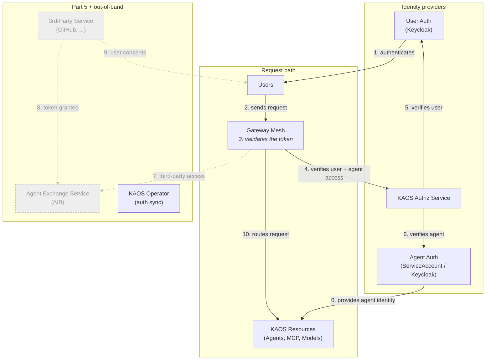

The KAOS Operator has no numbered edge because it is not on the request path at all: it works out-of-band, reconciling identities and grants before any request arrives (its edges appear in [4.1](#41-agent-identity-how-does-an-agent-prove-who-it-is)).

### 1.1 Install it in one command

A single command stands up everything on the map — the Gateway Mesh, User Auth, Agent Auth, the KAOS Authz Service, the KAOS Operator, and the Agent Exchange Service — and wires them together:

```bash
kaos system install \
  --gateway-enabled \
  --gateway-strict \
  --authz-enabled \
  --user-auth keycloak \
  --agent-auth keycloak \
  --token-exchange-enabled \
  --aib-chart-path agentic-identity-broker/charts/agentic-identity-broker \
  --create-cli-config
```

What each flag does:

- **`--gateway-enabled` and `--gateway-strict`** work as a pair and are worth dwelling on. The first puts the gateway *on the path*, but on its own a workload could still be reached directly by its in-cluster address, sidestepping the checks. `--gateway-strict` closes that door: it turns on network isolation so the gateway becomes the *only* way in, and rewrites the addresses agents use so their calls to tools, models, and each other are routed back through the gateway too. Enable both together and there is no unchecked path left.
- **`--authz-enabled`** turns on the KAOS Authz Service and fail-closed enforcement.
- **`--user-auth keycloak`** stands up Keycloak as User Auth and connects it.
- **`--agent-auth keycloak`** selects how agents prove who they are (`serviceaccount`, `oidc`, or `keycloak`). This guide uses `keycloak` because [Part 5](#5-agents-acting-on-behalf-of-users-on-outside-services) needs it; the trade-off, and the `serviceaccount` default, are explained in [4.1](#41-agent-identity-how-does-an-agent-prove-who-it-is).
- **`--token-exchange-enabled`** enables delegated third-party access via the Agent Exchange Service (Part 5). It requires the two `keycloak` flags above, plus `--aib-chart-path`.
- **`--aib-chart-path`** points at the Agent Exchange Service's Helm chart, which is installed as its own release. The path shown is a local dev path (the chart is vendored during development); a real install points at the published chart.
- **`--create-cli-config`** writes `.kaos-config.yaml` so every CLI command talks through the gateway.

`kaos system install --help` lists everything else (image tags, resource limits, replica counts, realm names, observability backends); the Helm values behind each flag are shown per-component in [section 4](#4-how-each-piece-works).

Confirm the pieces are healthy:

```bash
kaos system status
```
```text
gateway           ready
login service     ready   (keycloak)
access-control    ready   (2/2 replicas)
sync service      ready
```

The status output uses the CLI's own short labels: `gateway` is the Gateway Mesh, `login service` is User Auth (Keycloak), `access-control` is the KAOS Authz Service, and `sync service` is the KAOS Operator.

`--create-cli-config` wrote `.kaos-config.yaml` in the current folder, recording the gateway address and login details, so every command below automatically goes **through the gateway**, the same path real traffic takes. Inspect or change it with `kaos config show`:

```bash
kaos config show
```
```text
gateway:
  address: http://kaos-gateway.kaos-system.svc.cluster.local
  through_gateway: true
auth:
  issuer: http://keycloak.keycloak.svc.cluster.local:8080/realms/kaos
  client_id: kaos
  realm: kaos
  broker_url: http://aib-agentic-identity-broker.aib-system.svc.cluster.local:8000
  broker_admin_url: http://aib-agentic-identity-broker.aib-system.svc.cluster.local:14000/api
namespace: kaos-system
sessions: {}
```

(The two `broker_*` entries point at the Agent Exchange Service; they matter only in Part 5.)

---

## 2. The data plane

The **data plane** is the actual agent traffic: users invoking agents, agents calling tools and models. Every one of those calls travels through the Gateway Mesh and is checked before it is let through. To make that concrete, the rest of this guide uses one small cast:

- two users: **alice** (group `researchers`) and **bob** (group `support`)
- two agents: **researcher** (user-facing — it needs a person behind it) and **nightly-reporter** (autonomous — it runs on its own and acts as itself)
- one tool: **notes-mcp** (an MCP server inside the cluster)
- one model: **chat-model** (a model endpoint both agents may use)
- *(for Part 5)* one external service: **GitHub** — external; not a cluster resource; no `MCPServer`, no `AccessGrant` will ever name it

The rules: the `researchers` group may use the `researcher` agent; the `researcher` agent may reach `notes-mcp` and `chat-model`; the autonomous `nightly-reporter` may reach `chat-model`. Everything else is denied — including bob:

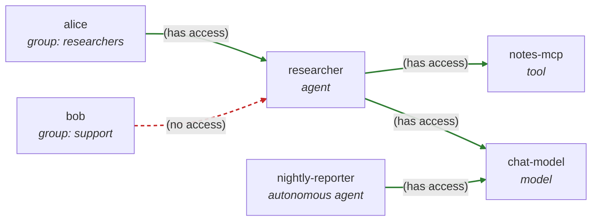

That map is the reference the Part 3 walkthrough checks off, row by row:

| Requester | Target | Verdict | Why |
|---|---|---|---|
| alice (`researchers`) | researcher | **allow** | `researchers` is granted the researcher agent |
| bob (`support`) | researcher | **deny** | `support` is named in no grant |
| researcher | notes-mcp | **allow** | the agent is granted the tool |
| researcher | chat-model | **allow** | the agent is granted the model |
| researcher (no user) | researcher | **deny** | no valid identity is behind the call |
| nightly-reporter (itself) | chat-model | **allow** | the autonomous agent is granted its model |
| *researcher* | *github* | *(Part 5)* | *delegated third-party access, covered later* |

### 2.1 How identity flows through a request

Every call, a user reaching an agent, or an agent reaching a tool or model, travels **through the Gateway Mesh**, which does two checks before letting it through:

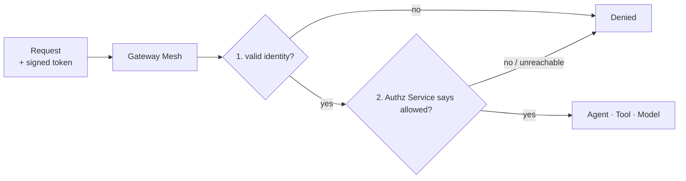

A *signed token* is an ID card an identity provider issued: tamper-proof, and it names the holder — for a person, User Auth issues it and it carries their groups; for an agent, Agent Auth does. The gateway does the two checks in order. First it confirms the token is genuine and unexpired (identity), then it asks the KAOS Authz Service whether that identity is allowed to do this (permission) — which is steps 4–6 on the Part 1 map, where the Authz Service verifies the user against User Auth and the agent against Agent Auth. Only if both pass does the request reach its destination.

Note the second check fails **closed**: if the Authz Service says no, *or can't be reached at all*, the request is denied, never waved through. A common failure mode in home-grown setups is "the checker was down, so we let everything past." KAOS does the opposite: no answer means no.

### 2.2 Deploy the agents and tools

Everything the example needs, both agents, the tool, and the model, is bundled as a single sample. Deploy it with one command:

```bash
kaos samples deploy 9-authorization-walkthrough -n kaos-system
```
```text
modelapi.kaos.tools/chat-model serverside-applied
mcpserver.kaos.tools/notes-mcp serverside-applied
agent.kaos.tools/researcher serverside-applied
agent.kaos.tools/nightly-reporter serverside-applied


Deployed sample '9-authorization-walkthrough'
```

The tool's single function is an echo, and the model's responses are mocked, so every result is deterministic and the walkthrough exercises *access control* rather than model behaviour. Four resources, each a plain Kubernetes object:

| Resource | Kind | What it is |
|---|---|---|
| **chat-model** | `ModelAPI` | A model endpoint both agents may call. |
| **notes-mcp** | `MCPServer` | A tool (an MCP server) exposing a single `echo` function the `researcher` may use. |
| **researcher** | `Agent` | A user-facing agent. It needs a person behind it and carries that person's identity through to whatever it calls. |
| **nightly-reporter** | `Agent` | An *autonomous* agent. No user behind it; it runs on a schedule and acts as itself. |

#### Reproduce it yourself

Each resource has its own `kaos ... create` command, so you can build an equivalent setup by hand and see the shape of each object. The model and tool first:

```bash
# a small in-cluster model endpoint
kaos modelapi create chat-model \
  --mode hosted \
  --model "smollm2:135m"

# an echo tool exposed as an MCP server
kaos mcp create notes-mcp \
  --runtime python-string \
  --params 'def echo(message: str) -> str:
      """Echo a note for the authorization walkthrough."""
      return f"Notes echo: {message}"'
```

Then the two agents. The user-facing one references the model and tool it should use:

```bash
kaos agent create researcher \
  --modelapi chat-model \
  --mcp notes-mcp \
  --instructions "Echo the user's request and use notes-mcp when asked about notes."
```

The autonomous one adds an `autonomous` goal so it runs on its own interval instead of waiting for a person:

```bash
kaos agent create nightly-reporter \
  --modelapi chat-model \
  --autonomous-goal "Produce the nightly echo report." \
  --autonomous-interval 3600
```

<details>
<summary>[Collapsed section] Expand to see the equivalent Kubernetes objects</summary>

`kaos ... create` writes ordinary KAOS objects; this is what the sample applies. The `ModelAPI` runs in `Proxy` mode and each agent carries `DEBUG_MOCK_RESPONSES`, so the echo replies are deterministic. Note `nightly-reporter` differs from `researcher` mainly by its `autonomous` block. That single field is what makes it act as itself rather than needing a user.

```yaml
apiVersion: kaos.tools/v1alpha1
kind: ModelAPI
metadata:
  name: chat-model
spec:
  mode: Proxy
  proxyConfig:
    models:
      - "*"
---
apiVersion: kaos.tools/v1alpha1
kind: MCPServer
metadata:
  name: notes-mcp
spec:
  runtime: python-string
  params: |
    def echo(message: str) -> str:
        """Echo a note for the authorization walkthrough."""
        return f"Notes echo: {message}"
---
apiVersion: kaos.tools/v1alpha1
kind: Agent
metadata:
  name: researcher
spec:
  modelAPI: chat-model
  model: echo
  mcpServers:
    - notes-mcp
  config:
    description: User-facing echo agent for authorization checks
    instructions: Echo the user's request and use notes-mcp when asked about notes.
  container:
    env:
      - name: DEBUG_MOCK_RESPONSES
        value: '["{\"tool_calls\": [{\"id\": \"call_1\", \"name\": \"echo\", \"arguments\": {\"message\": \"authorization note\"}}]}", "Researcher echo response"]'
  agentNetwork:
    expose: true
---
apiVersion: kaos.tools/v1alpha1
kind: Agent
metadata:
  name: nightly-reporter
spec:
  modelAPI: chat-model
  model: echo
  config:
    description: Autonomous echo agent for authorization checks
    instructions: Echo a short nightly report.
    autonomous:
      goal: Produce the nightly echo report.
      intervalSeconds: 3600
  container:
    env:
      - name: DEBUG_MOCK_RESPONSES
        value: '["Nightly reporter echo response"]'
  agentNetwork:
    expose: true
```
</details>

### 2.3 Grant access

At this point the resources exist but no one can reach anything. With access control on and no rules declared, every request fails closed. Access rules are plain, reviewable objects called **AccessGrants**. Each one binds a **subject** (who) to one or more **resources** (what). `kaos auth grant create` writes them; `--dry-run` *shows* you the object instead of applying it, so you can see exactly what a rule is before it takes effect:

```bash
kaos auth grant create --group researchers --resource agent/researcher --dry-run
```
```yaml
apiVersion: kaos.tools/v1alpha1
kind: AccessGrant
metadata:
  name: researchers-to-researcher
spec:
  subjects:
    - kind: Group
      name: researchers
  resources:
    - kind: Agent
      name: researcher
```

A `subject` has a `kind` of **Group** (matched against the groups in the user's token), **User** (matched against the user's subject or email), or **Agent** (matched against an agent's own identity, which is how an autonomous agent or an agent-to-tool rule is expressed). A `resource` names a `kind` (`Agent`, `MCPServer`, `ModelAPI`, or `MemoryStore`) and a `name`, or, if you prefer, a label `selector` to match many resources at once. Both lists can hold more than one entry, which is how the agent-to-tools rule grants two resources in a single object.

Apply the three rules the example needs (drop `--dry-run` to apply):

```bash
# 1. the researchers group may use the researcher agent
kaos auth grant create --group researchers --resource agent/researcher

# 2. the researcher agent may reach the notes tool and the chat model
kaos auth grant create --agent researcher --resource mcp/notes-mcp,modelapi/chat-model

# 3. the autonomous nightly-reporter may reach the chat model it runs on
kaos auth grant create --agent nightly-reporter --resource modelapi/chat-model
```
```text
✓ created AccessGrant researchers-to-researcher
✓ created AccessGrant researcher-to-notes-mcp-and-chat-model
✓ created AccessGrant nightly-reporter-to-chat-model
```

The second grant is the interesting one. Its subject is the *agent itself*, and it lists two resources:

<details>
<summary>[Collapsed section] Expand to see the agent-to-tools AccessGrant it wrote</summary>

```yaml
apiVersion: kaos.tools/v1alpha1
kind: AccessGrant
metadata:
  name: researcher-to-notes-mcp-and-chat-model
spec:
  subjects:
    - kind: Agent
      name: researcher
  resources:
    - kind: MCPServer
      name: notes-mcp
    - kind: ModelAPI
      name: chat-model
```
</details>

List or remove them like any resource:

```bash
kaos auth grant list
```
```text
NAME                                     SUBJECTS          RESOURCES              ENFORCED
researcher-to-notes-mcp-and-chat-model   researcher        notes-mcp,chat-model   True
researchers-to-researcher                researchers       researcher             True
nightly-reporter-to-chat-model           nightly-reporter  chat-model             True
```

The `ENFORCED` column is the KAOS Operator reporting back. `True` means it has projected the rule into the Authz Service and the gateway is enforcing it. If it read `False`, the column would name the reason (for example that access control isn't enabled, or that no user login provider is configured). Removing a grant is symmetric; here we drop one and re-create it, since the rest of the walkthrough depends on it:

```bash
kaos auth grant delete researchers-to-researcher
kaos auth grant create --group researchers --resource agent/researcher
```

Those three grants are the *only* rules that exist. Here is the same map from the start of this section, this time with each green edge labelled by the AccessGrant that makes it green. Everything not drawn green is denied:

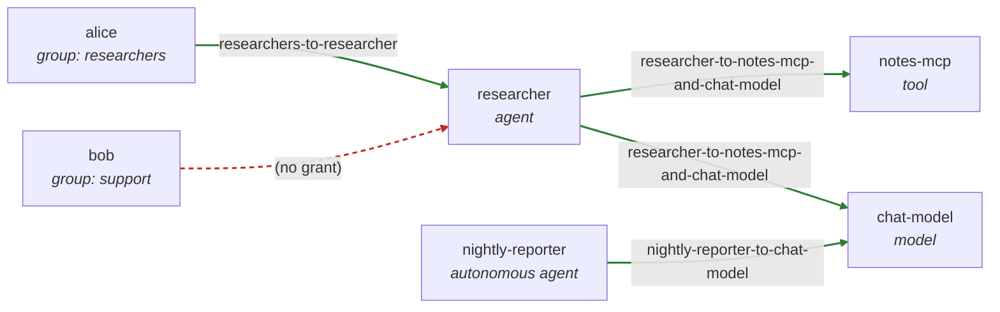

---

## 3. Walk the example

### 3.1 Log in as the users

`kaos auth login` gets a token from the login service and remembers it, printing what that login proves:

```bash
kaos auth login alice --password kaos-password
kaos auth login bob --password kaos-password
```
```text
✓ logged in as alice — groups: researchers
✓ logged in as bob — groups: support
```

The "groups" it prints aren't decoration. They're the exact claim the gateway will read out of the token on every request, and the exact thing an AccessGrant's `Group` subject matches against. alice carries `researchers`; bob carries `support`. Nothing about alice as an individual is granted anything; her *group* is.

### 3.2 Run the requests

`--user` sends the call **through the gateway as that person**, and the CLI prints the plain result:

```bash
kaos agent invoke researcher --user alice -m "summarise repo X"
kaos agent invoke researcher --user bob -m "summarise repo X"
```
```text
Researcher echo response
✓ allowed — request permitted
✗ denied — user not in a granted group
```

Same agent, same request. The only difference is who's behind it. alice's token carries `researchers`, which the `researchers-to-researcher` grant allows; bob's carries `support`, which nothing grants, so he's refused at the door. alice's request lights up the granted path:

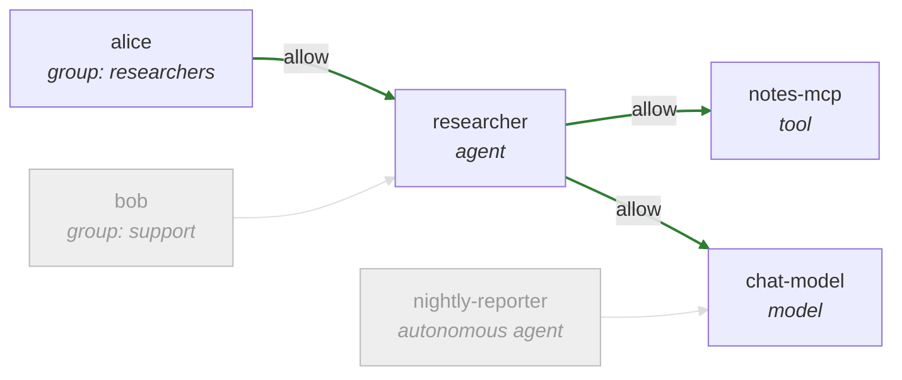

...while bob's request never gets past the first edge:

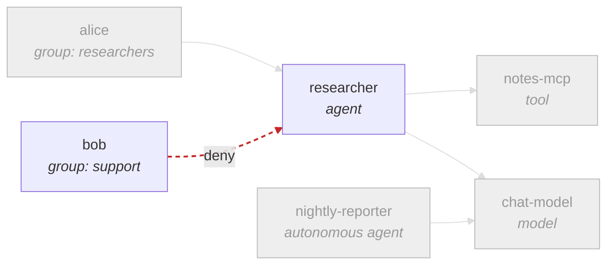

The agent using its granted tool and model:

```bash
kaos agent invoke researcher --user alice -m "read notes-mcp and ask chat-model"
```
```text
Researcher echo response
✓ allowed — request permitted
```

This exercises the *second* kind of rule. alice got in (first check), and now the agent reaches out to `notes-mcp` and `chat-model`. Each of those hops is itself a request through the gateway, checked against the `researcher-to-notes-mcp-and-chat-model` grant. Both are listed, so both succeed — they are the two right-hand green edges on alice's diagram above.

The autonomous agent acts as **itself** (no user), allowed only what *it* was granted:

```bash
kaos agent invoke nightly-reporter -m "run the nightly summary"
```
```text
Nightly reporter echo response
✓ allowed — request permitted
```

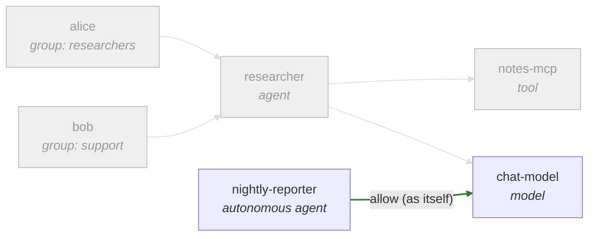

There is no `--user` here, yet the call is allowed, while the very next example (a user-facing agent with no `--user`) is denied. That is not a hole in fail-closed; it is fail-closed working. The autonomous agent presents its *own* identity, which is valid, and grant 3 lets that identity reach `chat-model`. A user-facing agent invoked with no `--user` has *no* identity behind it at all:

```bash
kaos agent invoke researcher -m "summarise repo X"      # no --user
```
```text
✗ denied — no valid identity
```

And the fails-closed guarantee. `kaos system access-control` scales the KAOS Authz Service up or down; with it gone, the gateway denies rather than guesses:

```bash
kaos system access-control --off
kaos agent invoke researcher --user alice -m "hi"
kaos system access-control --on
```
```text
✓ access-control off
✗ denied — access-control unavailable (failing closed)
✓ access-control on
```

Every row of the Part 2 table, proven with plain commands, and nothing was configured by hand in User Auth or the Authz Service; the KAOS Operator kept them aligned with the objects you declared.

---

## 4. How each piece works

The example above is the *what*. This section is the *how*, one capability at a time. Each sub-section ends with the actual configuration behind it: declared objects and Helm values.

### 4.1 Agent identity: how does an agent prove who it is?

How does the gateway know which agent is calling — even when no person started it? That is Agent Auth's job, and it is the one place on the Part 1 map where the KAOS Operator's out-of-band work is easiest to see. Here is the same map from the operator's point of view, with the sync work drawn in:

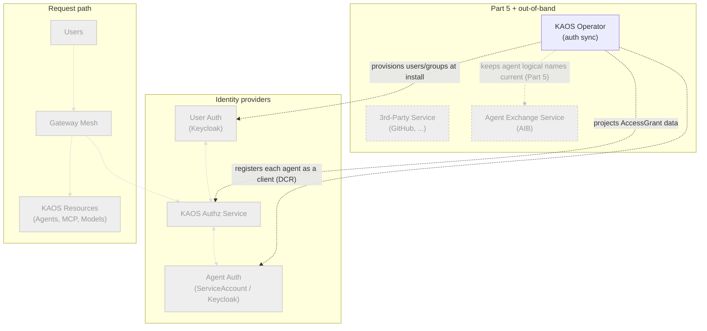

Every agent gets an identity so the gateway knows who is calling. **By default that identity is a Kubernetes ServiceAccount.** When an agent's pod starts, KAOS mounts a short-lived ServiceAccount token into it, scoped so it's only valid for the gateway (its *audience* is `kaos-gateway`). Every call the agent makes carries that token; the gateway reads it to learn which agent is calling, then checks that agent's grants. The token expires and is refreshed automatically, so there's no long-lived secret sitting in the pod. The operator registers each agent so the Authz Service recognises it.

This guide selected `keycloak` at install instead, because delegated third-party access (Part 5) needs each agent to hold a login-service identity. With `keycloak`, the operator registers each agent as its *own client* in User Auth automatically, using dynamic client registration (DCR) — the "registers each agent as a client" edge on the chart. No one creates those clients by hand. The stored Kubernetes Secret holding the agent's client credentials is the idempotency key: if the Secret is present the agent is already registered, and deleting it forces a clean re-registration on the next reconcile. Timing differs by subject too, as the chart's other edges show: users and groups are provisioned once at install, while each agent's client is created when the agent is reconciled. For everything in Parts 1 to 4, `serviceaccount` is simpler and preferred; only Part 5 requires `keycloak`.

An **autonomous** agent (like `nightly-reporter`) has no user behind it, so it acts **as itself**. Its own identity is the "who asked", and it can reach only what that identity was granted. A user-facing agent (like `researcher`) instead carries the *user's* identity through to whatever it calls, so downstream checks see the real person.

<details>
<summary>[Collapsed section] Expand to see the Helm values that drive agent identity</summary>

Agent identity is a single `provider` choice under `security.agentAuth.identity`. The default provider is Kubernetes-native:

```yaml
security:
  agentAuth:
    gatewayJwtOptional: true
    identity:
      provider: serviceaccount        # the default
      serviceAccount:
        audience: kaos-gateway
        expirationSeconds: 3600
        tokenPath: /var/run/secrets/kaos-agent/token
```

`gatewayJwtOptional: true` means that for agent tokens, the Authz Service performs the full identity check; the gateway's own user-token check does not block agent calls. This is required for autonomous agents: their Kubernetes-issued ServiceAccount token is not a user login token, and the user login provider would otherwise reject it before the access check ever runs. The `serviceAccount` block is the short-lived mounted token described above: valid only for the gateway (`audience`), auto-refreshed (`expirationSeconds`), read from `tokenPath`.

Switching the provider is the whole difference between the two modes — this is what `--agent-auth keycloak` sets:

```yaml
security:
  agentAuth:
    identity:
      provider: keycloak     # each agent becomes its own login-service client
```

With this provider the operator registers each agent's client via dynamic client registration and stores its credentials in a Kubernetes Secret — the idempotency key described above; delete it to force re-registration on the next reconcile. This is heavier than `serviceaccount`, and needed only when the agent must present a login-service identity to the Agent Exchange Service (Part 5).
</details>

### 4.2 User identity: who is this person, and what groups are they in?

Who is this person, and which groups are they in? When a person is behind a request, User Auth (Keycloak in our example) proves who they are and **which groups** they're in. That group membership is what access rules match on. `alice` isn't granted access personally; her *group* `researchers` is. The intuition in one picture:

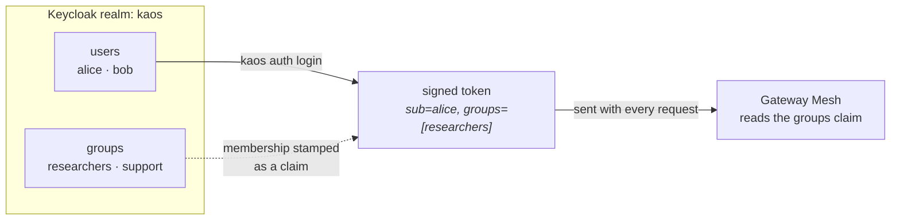

`kaos auth login` ran the standard login exchange and cached alice's token; the groups it printed are the same ones the gateway will read on every request. The one thing KAOS requires of the login service is that issued tokens carry a **groups** claim (and a stable **subject** claim naming the user). Everything else about your identity provider, how people actually authenticate, where the groups come from, is up to you.

<details>
<summary>[Collapsed section] Expand to see the Keycloak realm KAOS configures</summary>

The installer creates a realm with the users, the `researchers`/`support` groups, and, critically, a set of *protocol mappers* that stamp the right claims onto every issued token. The mappers are the load-bearing part: without the groups mapper, tokens wouldn't carry group membership and group-based AccessGrants couldn't match. This is the shape KAOS provisions (trimmed to the relevant pieces):

```json
{
  "realm": "kaos",
  "enabled": true,
  "groups": [
    { "name": "researchers" },
    { "name": "support" }
  ],
  "users": [
    {
      "username": "alice",
      "email": "alice@example.com",
      "enabled": true,
      "groups": ["researchers"],
      "credentials": [{ "type": "password", "value": "…", "temporary": false }]
    },
    {
      "username": "bob",
      "email": "bob@example.com",
      "enabled": true,
      "groups": ["support"],
      "credentials": [{ "type": "password", "value": "…", "temporary": false }]
    }
  ],
  "clients": [
    {
      "clientId": "kaos",
      "publicClient": false,
      "secret": "kaos-dev-secret",
      "directAccessGrantsEnabled": true,
      "standardFlowEnabled": true,
      "protocolMappers": [
        {
          "name": "kaos-groups",
          "protocolMapper": "oidc-group-membership-mapper",
          "config": {
            "claim.name": "groups",
            "full.path": "false",
            "access.token.claim": "true"
          }
        },
        {
          "name": "kaos-subject",
          "protocolMapper": "oidc-usermodel-property-mapper",
          "config": {
            "user.attribute": "id",
            "claim.name": "sub",
            "access.token.claim": "true"
          }
        },
        {
          "name": "kaos-audience",
          "protocolMapper": "oidc-audience-mapper",
          "config": {
            "included.client.audience": "kaos",
            "access.token.claim": "true"
          }
        }
      ]
    }
  ]
}
```

The gateway is told where to find this realm and what audience to expect through two Helm values:

```yaml
security:
  userAuth:
    issuer: http://keycloak.keycloak.svc.cluster.local:8080/realms/kaos
    audience: kaos      # tokens must be minted for this audience
```

In production you point `--user-auth` at your own OIDC provider instead, and map your existing directory groups into the `groups` claim. KAOS doesn't care *how* the claim gets populated, only that it's there.
</details>

### 4.3 Access control: the rules and their enforcement

This is where "is it allowed?" is answered. Two kinds of rule:

- **Who may use a resource.** An `AccessGrant` binds a **group** (or user) to a resource: *"`researchers` may use `researcher`."* This gates a person reaching an agent.
- **What an agent may reach.** An `AccessGrant` binds an **agent** to tools/models: *"`researcher` may reach `notes-mcp` and `chat-model`."* This gates movement between components.

Both are the same object type; only the subject differs (a group/user vs. an agent). That uniformity is deliberate: there's one rule format to learn, one place to look, and one `kaos auth grant list` that shows every permission in the cluster.

Enforcement lives at the gateway, which asks the **KAOS Authz Service** on every request. That service:

- runs **in-cluster as its own always-on service** (multiple replicas, so it's highly available),
- **fails closed**: if it says no, or can't be reached, the request is denied (you saw this with `--off`), and
- is only reachable *through the gateway* when `--gateway-strict` is set, so a workload can't sidestep it by calling a resource directly.

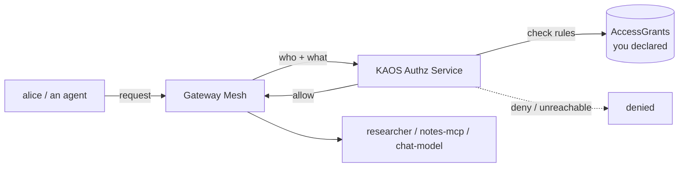

The Authz Service never reads your AccessGrant objects directly. The KAOS Operator is the go-between: it watches the objects, compiles them into the data the Authz Service evaluates, and keeps that projection current as you add and remove grants. This is what the `ENFORCED` column reported: the operator confirming the rule is live.

Autonomous agents fit the same model. Their *own* identity is the subject, so `nightly-reporter` needs a grant for anything it touches, exactly like a user does.

<details>
<summary>[Collapsed section] Expand to see the Helm values that drive enforcement</summary>

Enforcement is the KAOS Authz Service (stock OPA behind Envoy's authorization plugin) plus the operator's projection of your grants into it:

```yaml
security:
  pdp:
    enabled: true                 # the KAOS Authz Service
    image: openpolicyagent/opa:1.18.1-envoy-static
    replicas: 2                   # highly available
  agentAuth:
    authorization:
      # "automated": the KAOS Operator projects grant data from your
      # AccessGrant objects. You never author decision-service policy by hand.
      policyDataSource: automated
    projection:
      # prune removes stale grant data when an Agent or AccessGrant is deleted,
      # so permissions never outlive the object that declared them.
      prune: true
  # the "gateway is the only path" posture, so the check can't be bypassed
  strictGatewayApi:
    enabled: true
  networkPolicy:
    enabled: true                 # deny direct workload-to-workload traffic
  gatewayRouting:
    enabled: true                 # route agent -> tool/model/peer calls via the gateway
```

The fail-closed behaviour isn't a setting you turn on. It's how the gateway treats an authorization backend that says no *or* doesn't answer. Denying on "no answer" is the default and can't be relaxed into "allow on error".
</details>

---

## 5. Agents acting on behalf of users - on outside services

What happens when the researcher needs GitHub? Whose GitHub account does it act on? Everything so far stays inside the cluster; this last capability lets an agent call a **real outside service, GitHub, say, as the specific user**, not as a shared bot account.

### 5.1 The intuition

The naive way to let an agent use GitHub is to give it a single bot account's token and let every user's request ride on it. That's the default failure mode because it is the *easy* thing to build: one token in a Secret, one HTTP client, done. But it's a shared credential: GitHub sees one identity for everyone, you can't tell whose request was whose, and revoking one person's access means rotating the token for all of them. Worse, that durable token now lives somewhere the agent can read.

And nothing from Parts 1–4 can fix it, because an in-cluster `AccessGrant` cannot express "GitHub as alice". The cluster has no authority over GitHub's tokens: it can decide *whether* a request leaves, but it cannot make GitHub see alice instead of the bot. Bridging that gap needs a component that holds each user's *real* GitHub credential — issued by GitHub, consented to by the user — and puts the right one on each outbound call.

KAOS does the opposite of the shared bot on all three counts:

- **Acting as the user, never a shared bot.** When alice asks the researcher to touch GitHub, GitHub receives *alice's own* token and sees alice. bob's requests go out as bob. Permissions and audit on the GitHub side are per-person, exactly as if each user called GitHub directly.
- **The agent never sees a durable credential.** The agent only ever holds its own short-lived in-cluster identity. The real GitHub token is swapped onto the outbound request at the gateway; the agent code never touches it.
- **Revocation is per user.** alice can withdraw her approval at any time without affecting anyone else.

### 5.2 Enter the Agent Exchange Service (AIB)

The component that holds each user's real credential is the **Agent Exchange Service** (AIB; deployed from the `agentic-identity-broker` chart). It runs as its own self-managed Helm release alongside the cluster, much like Keycloak — the KAOS operator deploys none of it. What it holds: each user's real third-party tokens, in a vault, put there when the user consents (5.4). What it does: exactly one thing — **exchange**. Present it proof of who the user is and which agent is acting, and it returns that user's stored third-party token. It never issues anyone's identity; agents get theirs from Agent Auth, users from User Auth, and the AIB only ever trades one proven identity for a stored credential.

**Nothing new is installed here.** Every component in this part went in with the single install command in 1.1 (`--agent-auth keycloak`, `--token-exchange-enabled`). On the Part 1 map, the greyed pieces simply light up, and it is everything *else* that goes grey:

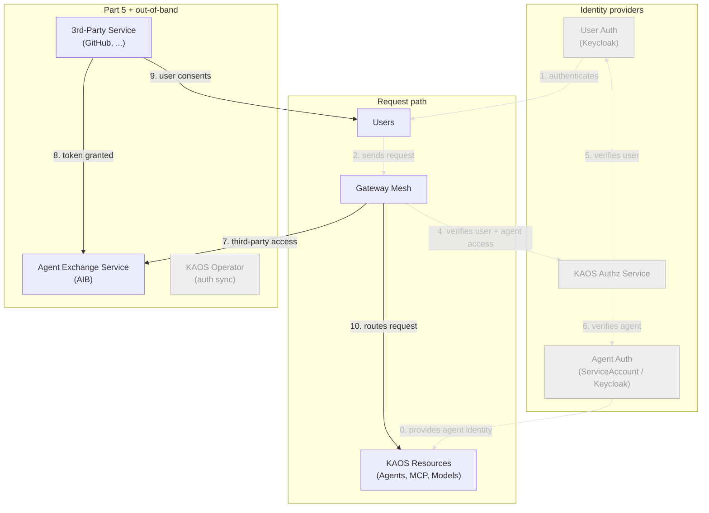

This is also why the install needed `--agent-auth keycloak`: the AIB must be able to tie an exchange request to a specific agent, and for that the agent needs a login-service identity rather than a ServiceAccount. The KAOS Operator keeps the connection current from the other side — it registers each agent in the AIB under a stable **logical name** (`kaos/<namespace>/<name>`) and keeps that record's client id up to date across re-registrations, the greyed operator edge on the 4.1 chart.

### 5.3 Register GitHub and create a permission set

Here the graded introduction of GitHub ends and the contrast matters, so let's state it plainly. `notes-mcp` is a tool **inside** the cluster — a KAOS resource, gated by AccessGrants. GitHub is a service **outside** it. You could wrap GitHub in an internal MCP server with a shared bot token — that is exactly the anti-pattern the intuition section described. Instead, GitHub is declared **in the AIB**, and each call goes out as the real user.

Outside services are administered in the AIB itself, not as cluster objects, because the AIB is what actually holds the user's third-party tokens. The declaration has three parts: the **service** (GitHub — its API hostname and OAuth endpoints), a **permission set** (the scopes an agent may request on it), and the **agent link** (which agent may use that permission set, keyed by the agent's stable logical name). The operator keeps that logical name and the agent's login-service client current, and *reflects* the declaration into the cluster plumbing it implies. The safety property that makes this trustworthy: the token swap exists only on the GitHub route; internal traffic never touches the AIB.

<details>
<summary>[Collapsed section] Expand to see the outside-service declaration in the AIB</summary>

The declaration is AIB-native. There is no third-party YAML in your Git repo; the AIB is the config authority, and it is where third-party access is audited (the accepted trade-off for keeping it out of the cluster API).

```yaml
# Administered in the AIB, not as a Kubernetes object.
service:
  name: github
  hostnames: ["api.github.com"]
  oauth:
    authorization_url: https://github.com/login/oauth/authorize
    token_url: https://github.com/login/oauth/access_token
  scopes: ["repo", "read:user"]

permission_set:
  service: github
  scopes: ["repo", "read:user"]

agent:
  logical_name: kaos/kaos-system/researcher
  client_id: <keycloak-dcr-uuid>
  permission_sets: ["github"]
```

The `logical_name` is the stable agent name the operator maintains; `client_id` is the agent's login-service client (the DCR UUID from 4.1), kept current across re-registrations. From this declaration the operator materializes the egress route to `api.github.com`, attaches the AIB's token-swap filter to *only* that generated route, and injects the exchange target into the bound agent. Nothing here touches the internal access-control path.
</details>

Inside the cluster, nothing about the earlier checks changes: alice still has to be allowed to use the researcher, and the researcher still has to be granted its tools. The new part is only the *last hop*, the outbound call to GitHub.

### 5.4 The request and consent flow

The very first time alice asks for something on GitHub there's no approval on file, so the request is refused with an instruction. alice approves once, the AIB stores her token, and from then on it just works, until she revokes it:

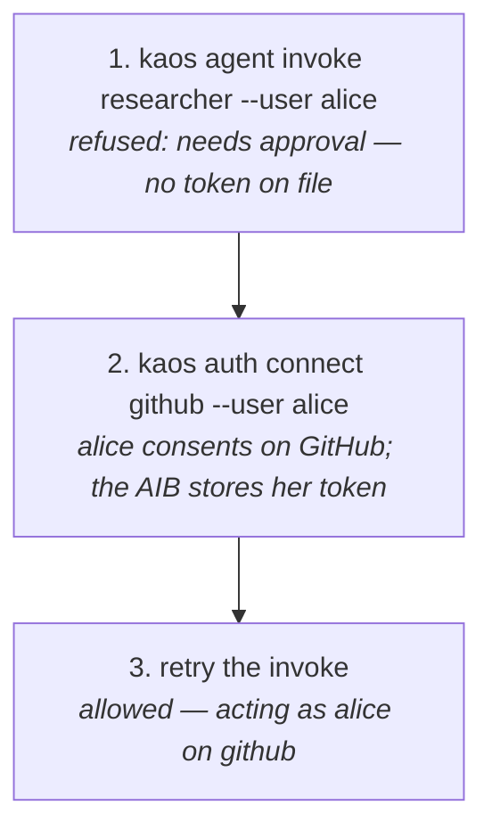

Walk it for real. The first time, there's no approval yet:

```bash
kaos agent invoke researcher --user alice -m "list my GitHub repos"
```
```text
✗ needs approval — run: kaos auth connect github --user alice
```

alice approves. The CLI opens GitHub's approval screen, she clicks allow, and the AIB stores her token:

```bash
kaos auth connect github --user alice
```
```text
✓ connected — alice can now use github through their agents
```

*(On a local demo cluster the approval is completed automatically against a mock GitHub, so the notebook runs without a real browser; in production alice clicks "allow" in her browser. That's the only difference.)*

Retry. Now it works, **as alice**:

```bash
kaos agent invoke researcher --user alice -m "list my GitHub repos"
```
```text
Third-party tool completed.
✓ allowed — acting as alice on github
```

Approval is revocable, and revocation simply returns you to step 1 of the flow: after a disconnect the agent is refused again until re-approved:

```bash
kaos auth disconnect github --user alice
kaos agent invoke researcher --user alice -m "list my GitHub repos"
```
```text
✓ disconnected
✗ needs approval — run: kaos auth connect github --user alice
```

**Under the hood**, that successful call is three moves:

1. The agent runtime **re-mints alice's own token so it also names the acting agent**. This is a standard token exchange against User Auth, authenticated with the agent's own client credentials, and it produces a token with `sub=alice`, `azp=researcher`, `aud=token-exchange-broker` — one token that proves both who the user is and which agent is acting.
2. On the outbound GitHub route — and **only** on that route — the gateway presents the re-minted token, together with the agent's own credential, to the AIB. The AIB validates both, checks that alice consented, and returns alice's real GitHub token from its vault.
3. The gateway swaps alice's GitHub token onto the outbound request. GitHub receives it and sees alice — steps 7–10 on the 5.2 map.

The token swap can never leak onto internal paths, because the swap filter is attached only to the egress route the operator generated for the declared service. Only alice's own token ever reaches GitHub, and the agent never sees a long-lived credential. But you don't have to think about any of that: `connect` once, then `invoke --user` as normal.
