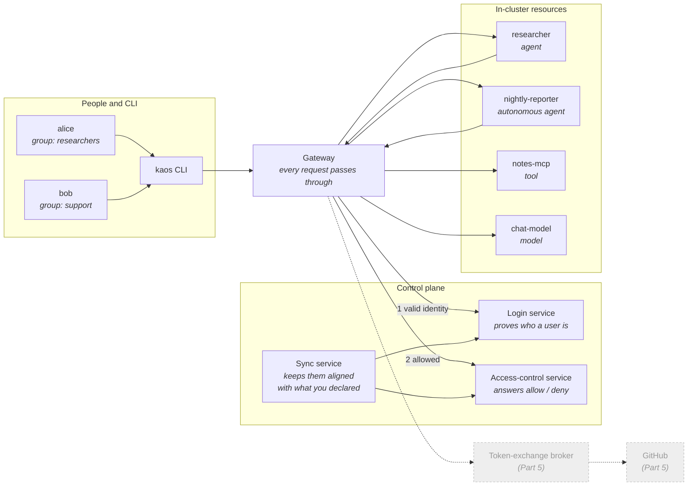
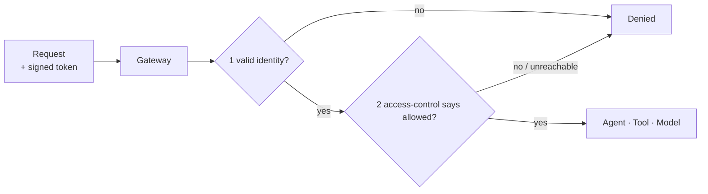
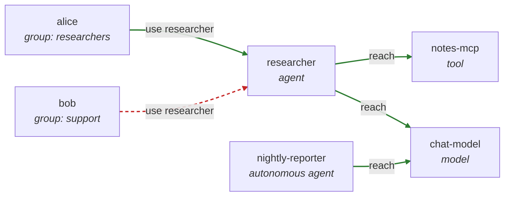
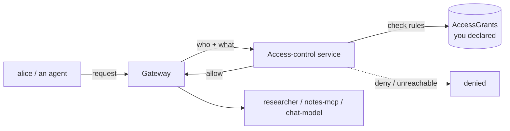
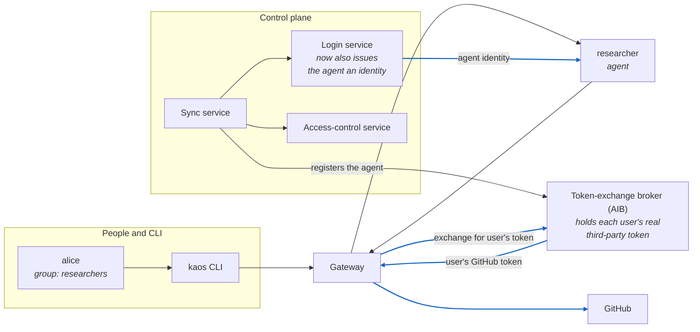
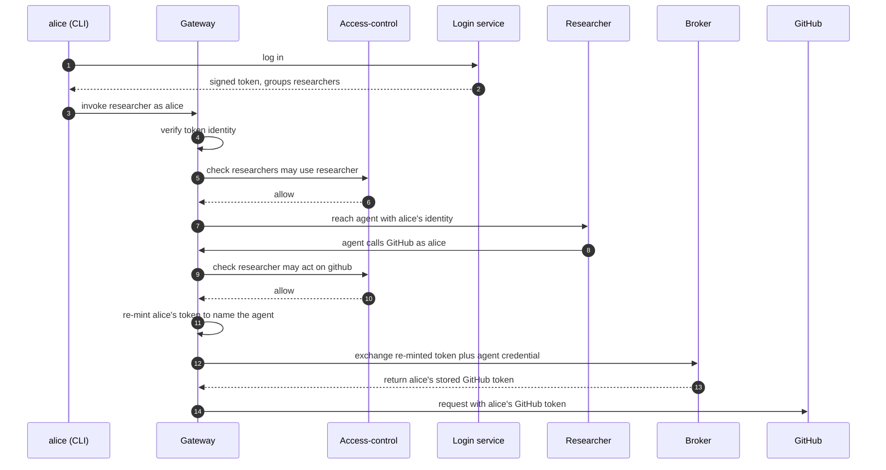

# Securing agents: who they are, and what they're allowed to do

When an agent calls a tool, two questions must be answered before anything runs:

1. **Who is asking?** The agent itself, and, if a person started it, which person.
2. **Is that allowed?** Can *this* user use *this* agent, and can *this* agent reach *that* tool or model?

KAOS answers both on every request, at the gateway, before the request reaches anything. This guide explains how, installs it end to end, then walks a concrete example where some calls succeed and others are correctly refused.

> No security background needed. Each term is introduced in plain language the first time it appears, and the KAOS CLI does the fiddly parts (logging in, calling through the gateway) for you.

---

## 1. How it fits together

There are two halves: the **control plane** (the components that establish identity and decide the rules) and the **data plane** (the actual agent traffic that gets checked). Here is the whole system on one map. The greyed pieces belong to [Part 5](#5-agents-acting-on-behalf-of-users-on-outside-services) and can be ignored for now.



### The control plane: four components

| Component | Responsibility |
|---|---|
| **Login service** | Proves who a **user** is and which **groups** they belong to (like "Sign in with..."). KAOS uses [Keycloak](https://www.keycloak.org/) as the example; any standard OIDC provider works. |
| **Access-control service** | Given who is asking, answers *yes/no* to "is this allowed?". Runs inside the cluster as its own always-on service; the gateway consults it on every request. |
| **Sync service** | You declare agents, tools, and rules as ordinary Kubernetes objects. The sync service keeps the other three components aligned with those declarations, so you never configure them by hand. |
| **Token-exchange broker** | Lets an agent act on an **outside** service (like GitHub) **as the user**, by returning the user's real third-party token on their behalf. Introduced in [Part 5](#5-agents-acting-on-behalf-of-users-on-outside-services). |

The whole point of the sync service is that these four components never drift from each other. You write down *what should be true*, "this group exists", "this agent may reach that tool", as Kubernetes objects, and the sync service is responsible for making the login service and access-control service reflect exactly that. There is no separate admin console to keep in step by hand, and nothing to forget to update when you delete an agent.

### The data plane: every request is checked

Every call, a user reaching an agent, or an agent reaching a tool or model, travels **through the gateway**, which does two checks before letting it through:



A *signed token* is an ID card the login service issued: tamper-proof, and it names the user and their groups. The gateway does the two checks in order. First it confirms the token is genuine and unexpired (identity), then it asks the access-control service whether that identity is allowed to do this (permission). Only if both pass does the request reach its destination.

Note the second check fails **closed**: if the access-control service says no, *or can't be reached at all*, the request is denied, never waved through. A common failure mode in home-grown setups is "the checker was down, so we let everything past." KAOS does the opposite: no answer means no.

### The example we'll use throughout

Two people, two agents, two in-cluster resources:

| Who / what | Detail |
|---|---|
| **alice** | a user in group `researchers` |
| **bob** | a user in group `support` |
| **researcher** | an agent people start (needs a user behind it) |
| **nightly-reporter** | an *autonomous* agent that runs on its own (acts as itself) |
| **notes-mcp** | a tool (MCP server) the `researcher` may use |
| **chat-model** | a model both agents may use |

The rules: the `researchers` group may use the `researcher` agent; the `researcher` agent may reach `notes-mcp` and `chat-model`; the autonomous `nightly-reporter` may reach `chat-model`. Everything else is denied. That is the reference the Part 3 walkthrough checks off, row by row:

| Requester | Target | Verdict | Why |
|---|---|---|---|
| alice (`researchers`) | researcher | **allow** | `researchers` is granted the researcher agent |
| bob (`support`) | researcher | **deny** | `support` is named in no grant |
| researcher | notes-mcp | **allow** | the agent is granted the tool |
| researcher | chat-model | **allow** | the agent is granted the model |
| researcher (no user) | researcher | **deny** | no valid identity is behind the call |
| nightly-reporter (itself) | chat-model | **allow** | the autonomous agent is granted its model |
| *researcher* | *github* | *(Part 5)* | *delegated third-party access, covered later* |

---

## 2. Install it in one command

A single command stands up the gateway, the login service, the access-control service, the sync service, and the token-exchange broker, and wires them together:

```bash
kaos system install \
  --gateway-enabled \             # put the gateway on the path of every request
  --gateway-strict \              # make the gateway the only path in (isolation + routing)
  --authz-enabled \               # turn on the access-control service and enforcement
  --user-auth keycloak \          # stand up Keycloak as the login service for users
  --agent-auth keycloak \         # give each agent a login-service identity
  --token-exchange-enabled aib \  # enable delegated third-party access via the broker (Part 5)
  --create-cli-config \           # write .kaos-config.yaml so the CLI goes through the gateway
  --wait \                        # block until every component reports ready
  --chart-path operator/chart \
  --aib-chart-path agentic-identity-broker/charts/agentic-identity-broker
```

The default is ServiceAccount identity; this guide uses Keycloak (`--agent-auth keycloak`) because Part 5 needs it. `--aib-chart-path` is a local dev path (the broker's chart is vendored during development); a real install points it at the published AIB chart.

**The flags that matter**

| Flag | Meaning |
|---|---|
| `--gateway-enabled` | Route all traffic through the gateway, where identity and access checks happen. |
| `--gateway-strict` | Enforce the gateway as the *only* path. A workload cannot reach a resource directly and skip the checks. |
| `--authz-enabled` | Turn on the access-control service and enforcement. |
| `--user-auth keycloak` | Stand up Keycloak as the login service and connect it. |
| `--agent-auth keycloak` | How agents prove who they are. `keycloak` gives each agent a login-service identity, needed for delegated access (Part 5); the default is `serviceaccount`. |
| `--token-exchange-enabled aib` | Enable the token-exchange broker for delegated third-party access (Part 5). |
| `--create-cli-config` | Write `.kaos-config.yaml` so every CLI command talks through the gateway. |
| `--wait` | Block until all components report ready. |
| `--chart-path` / `--aib-chart-path` | Local chart paths for the operator and the broker (dev paths). |

Two of these flags work as a pair and are worth dwelling on. `--gateway-enabled` puts the gateway *on the path*, but on its own a workload could still be reached directly by its in-cluster address, sidestepping the checks. `--gateway-strict` closes that door: it turns on network isolation so the gateway becomes the *only* way in, and rewrites the addresses agents use so their calls to tools, models, and each other are routed back through the gateway too. Enable both together and there is no unchecked path left.

<details>
<summary>[Collapsed section] Expand to see the installer Helm values</summary>

`kaos system install --help` lists everything else (image tags, resource limits, replica counts, realm names, observability backends). The flags above map onto Helm values in the operator chart; the ones this guide relies on are:

```yaml
security:
  # --authz-enabled turns on the access-control service (stock OPA behind the
  # Envoy ext_authz gRPC plugin) with 2 replicas for high availability.
  pdp:
    enabled: true
    image: openpolicyagent/opa:1.18.1-envoy-static
    replicas: 2
  agentAuth:
    identity:
      # --agent-auth keycloak: each agent is registered as its own client in the
      # login service, so it can present a login-service identity (needed in Part 5).
      provider: keycloak
    authorization:
      # the operator (sync service) projects the grant data automatically from
      # the AccessGrant objects you declare. No policy is authored by hand.
      policyDataSource: automated
  userAuth:
    # --user-auth keycloak fills these in for you, pointing at the in-cluster realm.
    issuer: http://keycloak.keycloak.svc.cluster.local:8080/realms/kaos
    audience: kaos
  # --gateway-strict turns on both halves of "gateway is the only path".
  strictGatewayApi:
    enabled: true
  networkPolicy:
    enabled: true
  gatewayRouting:
    enabled: true
```

The rest of `values.yaml` (TLS termination, egress policy, telemetry, per-agent resource limits) is orthogonal to this guide.
</details>

Confirm the pieces are healthy:

```bash
kaos system status
```
```text
gateway           ready
login service     ready   (keycloak)
access-control    ready   (2/2 replicas)
sync service      ready
```

`--create-cli-config` wrote `.kaos-config.yaml` in the current folder, recording the gateway address and login details, so every command below automatically goes **through the gateway**, the same path real traffic takes. Inspect or change it with `kaos config show`.

```bash
kaos config show
```
```text
gateway:
  address: http://kaos-gateway.kaos-system.svc.cluster.local
  through_gateway: true
auth:
  issuer: http://keycloak.keycloak.svc.cluster.local:8080/realms/kaos
  client_id: kaos
  realm: kaos
namespace: kaos-system
sessions: {}
```

---

## 3. Walk the example

### Deploy the agents and tools

Everything the example needs, both agents, the tool, and the model, is bundled as a single sample. Deploy it with one command:

```bash
kaos samples deploy 9-authorization-walkthrough -n kaos-system
```
```text
modelapi.kaos.tools/chat-model serverside-applied
mcpserver.kaos.tools/notes-mcp serverside-applied
agent.kaos.tools/researcher serverside-applied
agent.kaos.tools/nightly-reporter serverside-applied


Deployed sample '9-authorization-walkthrough'
```

The tool's single function is an echo, and the model's responses are mocked, so every result is deterministic and the walkthrough exercises *access control* rather than model behaviour. Four resources, each a plain Kubernetes object:

| Resource | Kind | What it is |
|---|---|---|
| **chat-model** | `ModelAPI` | A model endpoint both agents may call. |
| **notes-mcp** | `MCPServer` | A tool (an MCP server) exposing a single `echo` function the `researcher` may use. |
| **researcher** | `Agent` | A user-facing agent. It needs a person behind it and carries that person's identity through to whatever it calls. |
| **nightly-reporter** | `Agent` | An *autonomous* agent. No user behind it; it runs on a schedule and acts as itself. |

#### Reproduce it yourself

Each resource has its own `kaos ... create` command, so you can build an equivalent setup by hand and see the shape of each object. The model and tool first:

```bash
# a small in-cluster model endpoint
kaos modelapi create chat-model \
  --mode hosted \
  --model "smollm2:135m"

# an echo tool exposed as an MCP server
kaos mcp create notes-mcp \
  --runtime python-string \
  --params 'def echo(message: str) -> str:
      """Echo a note for the authorization walkthrough."""
      return f"Notes echo: {message}"'
```

Then the two agents. The user-facing one references the model and tool it should use:

```bash
kaos agent create researcher \
  --modelapi chat-model \
  --mcp notes-mcp \
  --instructions "Echo the user's request and use notes-mcp when asked about notes."
```

The autonomous one adds an `autonomous` goal so it runs on its own interval instead of waiting for a person:

```bash
kaos agent create nightly-reporter \
  --modelapi chat-model \
  --autonomous-goal "Produce the nightly echo report." \
  --autonomous-interval 3600
```

<details>
<summary>[Collapsed section] Expand to see the equivalent Kubernetes objects</summary>

`kaos ... create` writes ordinary KAOS objects; this is what the sample applies. The `ModelAPI` runs in `Proxy` mode and each agent carries `DEBUG_MOCK_RESPONSES`, so the echo replies are deterministic. Note `nightly-reporter` differs from `researcher` mainly by its `autonomous` block. That single field is what makes it act as itself rather than needing a user.

```yaml
apiVersion: kaos.tools/v1alpha1
kind: ModelAPI
metadata:
  name: chat-model
spec:
  mode: Proxy
  proxyConfig:
    models:
      - "*"
---
apiVersion: kaos.tools/v1alpha1
kind: MCPServer
metadata:
  name: notes-mcp
spec:
  runtime: python-string
  params: |
    def echo(message: str) -> str:
        """Echo a note for the authorization walkthrough."""
        return f"Notes echo: {message}"
---
apiVersion: kaos.tools/v1alpha1
kind: Agent
metadata:
  name: researcher
spec:
  modelAPI: chat-model
  model: echo
  mcpServers:
    - notes-mcp
  config:
    description: User-facing echo agent for authorization checks
    instructions: Echo the user's request and use notes-mcp when asked about notes.
  container:
    env:
      - name: DEBUG_MOCK_RESPONSES
        value: '["{\"tool_calls\": [{\"id\": \"call_1\", \"name\": \"echo\", \"arguments\": {\"message\": \"authorization note\"}}]}", "Researcher echo response"]'
  agentNetwork:
    expose: true
---
apiVersion: kaos.tools/v1alpha1
kind: Agent
metadata:
  name: nightly-reporter
spec:
  modelAPI: chat-model
  model: echo
  config:
    description: Autonomous echo agent for authorization checks
    instructions: Echo a short nightly report.
    autonomous:
      goal: Produce the nightly echo report.
      intervalSeconds: 3600
  container:
    env:
      - name: DEBUG_MOCK_RESPONSES
        value: '["Nightly reporter echo response"]'
  agentNetwork:
    expose: true
```
</details>

### Grant access

At this point the resources exist but no one can reach anything. With access control on and no rules declared, every request fails closed. Access rules are plain, reviewable objects called **AccessGrants**. Each one binds a **subject** (who) to one or more **resources** (what). `kaos auth grant create` writes them; `--dry-run` *shows* you the object instead of applying it, so you can see exactly what a rule is before it takes effect:

```bash
kaos auth grant create --group researchers --resource agent/researcher --dry-run
```
```yaml
apiVersion: kaos.tools/v1alpha1
kind: AccessGrant
metadata:
  name: researchers-to-researcher
spec:
  subjects:
    - kind: Group
      name: researchers
  resources:
    - kind: Agent
      name: researcher
```

A `subject` has a `kind` of **Group** (matched against the groups in the user's token), **User** (matched against the user's subject or email), or **Agent** (matched against an agent's own identity, which is how an autonomous agent or an agent-to-tool rule is expressed). A `resource` names a `kind` (`Agent`, `MCPServer`, `ModelAPI`, or `MemoryStore`) and a `name`, or, if you prefer, a label `selector` to match many resources at once. Both lists can hold more than one entry, which is how the agent-to-tools rule grants two resources in a single object.

Apply the three rules the example needs (drop `--dry-run` to apply):

```bash
# 1. the researchers group may use the researcher agent
kaos auth grant create --group researchers --resource agent/researcher

# 2. the researcher agent may reach the notes tool and the chat model
kaos auth grant create --agent researcher --resource mcp/notes-mcp,modelapi/chat-model

# 3. the autonomous nightly-reporter may reach the chat model it runs on
kaos auth grant create --agent nightly-reporter --resource modelapi/chat-model
```
```text
✓ created AccessGrant researchers-to-researcher
✓ created AccessGrant researcher-to-notes-mcp-and-chat-model
✓ created AccessGrant nightly-reporter-to-chat-model
```

The second grant is the interesting one. Its subject is the *agent itself*, and it lists two resources:

<details>
<summary>[Collapsed section] Expand to see the agent-to-tools AccessGrant it wrote</summary>

```yaml
apiVersion: kaos.tools/v1alpha1
kind: AccessGrant
metadata:
  name: researcher-to-notes-mcp-and-chat-model
spec:
  subjects:
    - kind: Agent
      name: researcher
  resources:
    - kind: MCPServer
      name: notes-mcp
    - kind: ModelAPI
      name: chat-model
```
</details>

List or remove them like any resource:

```bash
kaos auth grant list
```
```text
NAME                                     SUBJECTS          RESOURCES              ENFORCED
researcher-to-notes-mcp-and-chat-model   researcher        notes-mcp,chat-model   True
researchers-to-researcher                researchers       researcher             True
nightly-reporter-to-chat-model           nightly-reporter  chat-model             True
```

The `ENFORCED` column is the sync service reporting back. `True` means it has projected the rule into the access-control service and the gateway is enforcing it. If it read `False`, the column would name the reason (for example that access control isn't enabled, or that no user login provider is configured). Removing a grant is symmetric; here we drop one and re-create it, since the rest of the walkthrough depends on it:

```bash
kaos auth grant delete researchers-to-researcher
kaos auth grant create --group researchers --resource agent/researcher
```

Those three grants are the *only* rules that exist. On the system map, the granted edges are green and everything not drawn green is denied, including bob:



### Log in as our users

`kaos auth login` gets a token from the login service and remembers it, printing what that login proves:

```bash
kaos auth login alice --password kaos-password
kaos auth login bob --password kaos-password
```
```text
✓ logged in as alice — groups: researchers
✓ logged in as bob — groups: support
```

The "groups" it prints aren't decoration. They're the exact claim the gateway will read out of the token on every request, and the exact thing an AccessGrant's `Group` subject matches against. alice carries `researchers`; bob carries `support`. Nothing about alice as an individual is granted anything; her *group* is.

### Run the requests

`--user` sends the call **through the gateway as that person**, and the CLI prints the plain result:

```bash
kaos agent invoke researcher --user alice -m "summarise repo X"
kaos agent invoke researcher --user bob -m "summarise repo X"
```
```text
Researcher echo response
✓ allowed — request permitted
✗ denied — user not in a granted group
```

Same agent, same request. The only difference is who's behind it. alice's token carries `researchers`, which the `researchers-to-researcher` grant allows; bob's carries `support`, which nothing grants, so he's refused at the door.

The agent using its granted tool and model:

```bash
kaos agent invoke researcher --user alice -m "read notes-mcp and ask chat-model"
```
```text
Researcher echo response
✓ allowed — request permitted
```

This exercises the *second* kind of rule. alice got in (first check), and now the agent reaches out to `notes-mcp` and `chat-model`. Each of those hops is itself a request through the gateway, checked against the `researcher-to-notes-mcp-and-chat-model` grant. Both are listed, so both succeed.

The autonomous agent acts as **itself** (no user), allowed only what *it* was granted:

```bash
kaos agent invoke nightly-reporter -m "run the nightly summary"
```
```text
Nightly reporter echo response
✓ allowed — request permitted
```

There is no `--user` here, yet the call is allowed, while the very next example (a user-facing agent with no `--user`) is denied. That is not a hole in fail-closed; it is fail-closed working. The autonomous agent presents its *own* identity, which is valid, and grant 3 lets that identity reach `chat-model`. A user-facing agent invoked with no `--user` has *no* identity behind it at all:

```bash
kaos agent invoke researcher -m "summarise repo X"      # no --user
```
```text
✗ denied — no valid identity
```

And the fails-closed guarantee:

```bash
kaos system access-control --off
kaos agent invoke researcher --user alice -m "hi"
kaos system access-control --on
```
```text
✓ access-control off
✗ denied — access-control unavailable (failing closed)
✓ access-control on
```

Every arrow from Part 1, proven with plain commands, and nothing was configured by hand in the login or access-control services; the sync service kept them aligned with the objects you declared.

---

## 4. How each piece works

The example above is the *what*. This section is the *how*, one capability at a time. Each sub-section ends with the actual configuration behind it: declared objects and Helm values.

### 4.1 Agent identity: how an agent proves who it is

Every agent gets an identity so the gateway knows who is calling. By default that's a **Kubernetes ServiceAccount**, and the sync service registers each agent so the access-control service recognises it.

When an agent's pod starts, KAOS mounts a short-lived ServiceAccount token into it, scoped so it's only valid for the gateway (its *audience* is `kaos-gateway`). Every call the agent makes carries that token; the gateway reads it to learn which agent is calling, then checks that agent's grants. The token expires and is refreshed automatically, so there's no long-lived secret sitting in the pod.

This guide selected `keycloak` at install (Part 5 needs it), so it's worth knowing what each option does. With `serviceaccount` (the default) the identity is the ServiceAccount token above. With `keycloak`, the sync service registers each agent as its *own client* in the login service automatically, using dynamic client registration. No one creates those clients by hand. The stored Kubernetes Secret holding the agent's client credentials is the idempotency key: if the Secret is present the agent is already registered, and deleting it forces a clean re-registration on the next reconcile. Timing differs by subject too: the users and groups are provisioned once at install, while each agent's `keycloak` client is created when the agent is reconciled.

An **autonomous** agent (like `nightly-reporter`) has no user behind it, so it acts **as itself**. Its own identity is the "who asked", and it can reach only what that identity was granted. A user-facing agent (like `researcher`) instead carries the *user's* identity through to whatever it calls, so downstream checks see the real person.

<details>
<summary>[Collapsed section] Expand to see the Helm values that drive agent identity</summary>

Agent identity is a single `provider` choice under `security.agentAuth.identity`:

```yaml
security:
  agentAuth:
    # For agent tokens, the access-control service performs the full identity
    # check; the gateway's own user-token check does not block agent calls. This
    # is REQUIRED for autonomous agents: their Kubernetes-issued ServiceAccount
    # token is not a user login token, and the user login provider would
    # otherwise reject it before the access check ever runs.
    gatewayJwtOptional: true
    identity:
      provider: serviceaccount        # the default; Kubernetes-native
      serviceAccount:
        audience: kaos-gateway        # token is only valid for the gateway
        expirationSeconds: 3600       # short-lived, auto-refreshed
        tokenPath: /var/run/secrets/kaos-agent/token
```
</details>

<details>
<summary>[Collapsed section] Expand to see how the keycloak agent identity is registered</summary>

Switching `provider` to `keycloak` registers each agent as a client in the login service instead of using a ServiceAccount. This is heavier, and needed only for delegated third-party access (Part 5), where the agent must present a login-service identity to the token-exchange broker.

```yaml
security:
  agentAuth:
    identity:
      provider: keycloak     # each agent becomes its own login-service client
      # The sync service registers the client via dynamic client registration
      # and stores its credentials in a Kubernetes Secret. That Secret is the
      # idempotency key: delete it to force re-registration on the next reconcile.
```

For everything in Parts 1 to 4, `serviceaccount` is simpler and preferred; only Part 5 requires `keycloak`.
</details>

### 4.2 User identity: the login service

When a person is behind a request, the login service (Keycloak in our example) proves who they are and **which groups** they're in. That group membership is what access rules match on. `alice` isn't granted access personally; her *group* `researchers` is.

`kaos auth login` ran the standard login exchange and cached alice's token; the groups it printed are the same ones the gateway will read on every request. The one thing KAOS requires of the login service is that issued tokens carry a **groups** claim (and a stable **subject** claim naming the user). Everything else about your identity provider, how people actually authenticate, where the groups come from, is up to you.

<details>
<summary>[Collapsed section] Expand to see the Keycloak realm KAOS configures</summary>

The installer creates a realm with the users, the `researchers`/`support` groups, and, critically, a set of *protocol mappers* that stamp the right claims onto every issued token. The mappers are the load-bearing part: without the groups mapper, tokens wouldn't carry group membership and group-based AccessGrants couldn't match. This is the shape KAOS provisions (trimmed to the relevant pieces):

```json
{
  "realm": "kaos",
  "enabled": true,
  "groups": [
    { "name": "researchers" },
    { "name": "support" }
  ],
  "users": [
    {
      "username": "alice",
      "email": "alice@example.com",
      "enabled": true,
      "groups": ["researchers"],
      "credentials": [{ "type": "password", "value": "…", "temporary": false }]
    },
    {
      "username": "bob",
      "email": "bob@example.com",
      "enabled": true,
      "groups": ["support"],
      "credentials": [{ "type": "password", "value": "…", "temporary": false }]
    }
  ],
  "clients": [
    {
      "clientId": "kaos",
      "publicClient": false,
      "secret": "kaos-dev-secret",
      "directAccessGrantsEnabled": true,
      "standardFlowEnabled": true,
      "protocolMappers": [
        {
          "name": "kaos-groups",
          "protocolMapper": "oidc-group-membership-mapper",
          "config": {
            "claim.name": "groups",
            "full.path": "false",
            "access.token.claim": "true"
          }
        },
        {
          "name": "kaos-subject",
          "protocolMapper": "oidc-usermodel-property-mapper",
          "config": {
            "user.attribute": "id",
            "claim.name": "sub",
            "access.token.claim": "true"
          }
        },
        {
          "name": "kaos-audience",
          "protocolMapper": "oidc-audience-mapper",
          "config": {
            "included.client.audience": "kaos",
            "access.token.claim": "true"
          }
        }
      ]
    }
  ]
}
```

The gateway is told where to find this realm and what audience to expect through two Helm values:

```yaml
security:
  userAuth:
    issuer: http://keycloak.keycloak.svc.cluster.local:8080/realms/kaos
    audience: kaos      # tokens must be minted for this audience
```

In production you point `--user-auth` at your own OIDC provider instead, and map your existing directory groups into the `groups` claim. KAOS doesn't care *how* the claim gets populated, only that it's there.
</details>

### 4.3 Access control: the rules and their enforcement

This is where "is it allowed?" is answered. Two kinds of rule:

- **Who may use a resource.** An `AccessGrant` binds a **group** (or user) to a resource: *"`researchers` may use `researcher`."* This gates a person reaching an agent.
- **What an agent may reach.** An `AccessGrant` binds an **agent** to tools/models: *"`researcher` may reach `notes-mcp` and `chat-model`."* This gates movement between components.

Both are the same object type; only the subject differs (a group/user vs. an agent). That uniformity is deliberate: there's one rule format to learn, one place to look, and one `kaos auth grant list` that shows every permission in the cluster.

Enforcement lives at the gateway, which asks the **access-control service** on every request. That service:

- runs **in-cluster as its own always-on service** (multiple replicas, so it's highly available),
- **fails closed**: if it says no, or can't be reached, the request is denied (you saw this with `--off`), and
- is only reachable *through the gateway* when `--gateway-strict` is set, so a workload can't sidestep it by calling a resource directly.



The access-control service never reads your AccessGrant objects directly. The sync service is the go-between: it watches the objects, compiles them into the data the decision service evaluates, and keeps that projection current as you add and remove grants. This is what the `ENFORCED` column reported: the sync service confirming the rule is live.

Autonomous agents fit the same model. Their *own* identity is the subject, so `nightly-reporter` needs a grant for anything it touches, exactly like a user does.

<details>
<summary>[Collapsed section] Expand to see the Helm values that drive enforcement</summary>

Enforcement is the access-control service (stock OPA behind Envoy's authorization plugin) plus the sync service's projection of your grants into it:

```yaml
security:
  pdp:
    enabled: true                 # the access-control service
    image: openpolicyagent/opa:1.18.1-envoy-static
    replicas: 2                   # highly available
  agentAuth:
    authorization:
      # "automated": the sync service (operator) projects grant data from your
      # AccessGrant objects. You never author decision-service policy by hand.
      policyDataSource: automated
    projection:
      # prune removes stale grant data when an Agent or AccessGrant is deleted,
      # so permissions never outlive the object that declared them.
      prune: true
  # the "gateway is the only path" posture, so the check can't be bypassed
  strictGatewayApi:
    enabled: true
  networkPolicy:
    enabled: true                 # deny direct workload-to-workload traffic
  gatewayRouting:
    enabled: true                 # route agent -> tool/model/peer calls via the gateway
```

The fail-closed behaviour isn't a setting you turn on. It's how the gateway treats an authorization backend that says no *or* doesn't answer. Denying on "no answer" is the default and can't be relaxed into "allow on error".
</details>

---

## 5. Agents acting on behalf of users - on outside services

Everything so far stays inside the cluster. The last capability lets an agent call a **real outside service, GitHub, say, as the specific user**, not as a shared bot account.

### Enter the Agentic Identity Broker

That job belongs to the **Agentic Identity Broker (AIB)**: a self-managed broker deployed alongside the cluster much like Keycloak (its own Helm release; the KAOS operator deploys none of it). The broker holds each user's real third-party tokens in a vault and performs the exchange that turns an in-cluster request into a call GitHub trusts. On the shared system map, the two greyed pieces from Part 1 now light up:



### The intuition

The naive way to let an agent use GitHub is to give it a single bot account's token and let every user's request ride on it. That's a shared credential: GitHub sees one identity for everyone, you can't tell whose request was whose, and revoking one person's access means rotating the token for all of them. Worse, that durable token now lives somewhere the agent can read.

KAOS does the opposite on all three counts:

- **Acting as the user, never a shared bot.** When alice asks the researcher to touch GitHub, GitHub receives *alice's own* token and sees alice. bob's requests go out as bob. Permissions and audit on the GitHub side are per-person, exactly as if each user called GitHub directly.
- **The agent never sees a durable credential.** The agent only ever holds its own short-lived in-cluster identity. The real GitHub token is held by the broker and swapped onto the outbound request at the gateway; the agent code never touches it.
- **Revocation is per user.** alice can withdraw her approval at any time without affecting anyone else.

### What changes: the control plane

Two components join what you already have. The agent now needs a **login-service identity** rather than a ServiceAccount, because the broker must be able to tie an exchange request to a specific agent. And the **token-exchange broker** itself is enabled. You already enabled both in Part 2 (`--agent-auth keycloak` and `--token-exchange-enabled`).

### Declare the outside service (in the broker)

Outside services are administered **in the broker itself**, not as cluster objects, because the broker is what actually holds the user's third-party tokens. You declare "GitHub, these scopes, this agent may use it" once, keyed to the agent's stable logical name (`kaos/<namespace>/<name>`); the sync service keeps that name and the agent's login-service client current, and *reflects* the declaration into the cluster plumbing it implies. The safety property that makes this trustworthy: the token swap exists only on the GitHub route; internal traffic never touches the broker.

<details>
<summary>[Collapsed section] Expand to see the outside-service declaration in the broker</summary>

The declaration is AIB-native: a service, a permission set (the scopes an agent may request), and the agent linked to it by its stable logical name. There is no third-party YAML in your Git repo; the broker is the config authority, and it is where third-party access is audited (the accepted trade-off for keeping it out of the cluster API).

```yaml
# Administered in the broker (AIB), not as a Kubernetes object.
service:
  name: github
  hostnames: ["api.github.com"]
  oauth:
    authorization_url: https://github.com/login/oauth/authorize
    token_url: https://github.com/login/oauth/access_token
  scopes: ["repo", "read:user"]

permission_set:
  service: github
  scopes: ["repo", "read:user"]

agent:
  # the agent's stable logical name, kept current by the sync service
  logical_name: kaos/kaos-system/researcher
  client_id: <keycloak-dcr-uuid>   # maintained across re-registrations
  permission_sets: ["github"]
```

From this the sync service materializes the egress route to `api.github.com`, attaches the broker's token-swap filter to *only* that generated route, and injects the re-mint target into the bound agent. Nothing here touches the internal access-control path.
</details>

### What changes: the data plane

Inside the cluster, nothing about the earlier checks changes: alice still has to be allowed to use the researcher, and the researcher still has to be granted its tools. The new part is only the *last hop*, the outbound call to GitHub. On the way out, the gateway proves to the broker **both who the user is and which agent is acting**. It re-mints alice's *own* in-cluster token so that it also names the acting agent (`sub=alice`, `azp=researcher`, `aud=token-exchange-broker`), and presents that re-minted token together with the agent's own credential. The broker validates both, then returns alice's stored GitHub token, which the gateway swaps onto the request. GitHub only ever sees alice.

In plain terms: the gateway proves to the broker both who the user is and which agent is acting; the broker returns the user's real GitHub token, and the gateway puts it on the outbound request. The agent never holds the GitHub token, and no shared bot credential exists anywhere in the path.

### The request and consent flow

The very first time alice asks for something on GitHub there's no approval on file, so the request is refused with an instruction. alice approves once, the broker stores her token, and from then on it just works, until she revokes it. Walk it for real. The first time, there's no approval yet:

```bash
kaos agent invoke researcher --user alice -m "list my GitHub repos"
```
```text
✗ needs approval — run: kaos auth connect github --user alice
```

alice approves. The CLI opens GitHub's approval screen, she clicks allow, and the broker stores her token:

```bash
kaos auth connect github --user alice
```
```text
✓ connected — alice can now use github through their agents
```

*(On a local demo cluster the approval is completed automatically against a mock GitHub, so the notebook runs without a real browser; in production alice clicks "allow" in her browser. That's the only difference.)*

Retry. Now it works, **as alice**:

```bash
kaos agent invoke researcher --user alice -m "list my GitHub repos"
```
```text
Third-party tool completed.
✓ allowed — acting as alice on github
```

Approval is revocable; afterwards the agent is refused again until re-approved (disconnecting returns you to the first step):

```bash
kaos auth disconnect github --user alice
kaos agent invoke researcher --user alice -m "list my GitHub repos"
```
```text
✓ disconnected
✗ needs approval — run: kaos auth connect github --user alice
```

Under the hood: the runtime re-mints alice's own in-cluster token so it names the acting agent, the broker exchanges *that* (plus the agent's credential) for the real GitHub token it holds for alice, and the gateway puts the GitHub token on the outbound request. Only alice's own token ever reaches GitHub, and the agent never sees a long-lived credential. But you don't have to think about any of that: `connect` once, then `invoke --user` as normal.

### Putting it all together

Here is the whole path, from alice's login to a GitHub call made as alice, in order:


