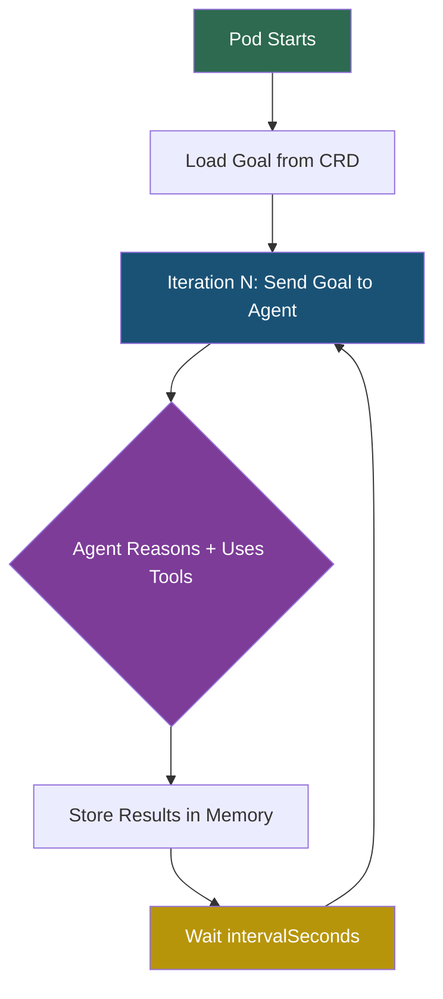
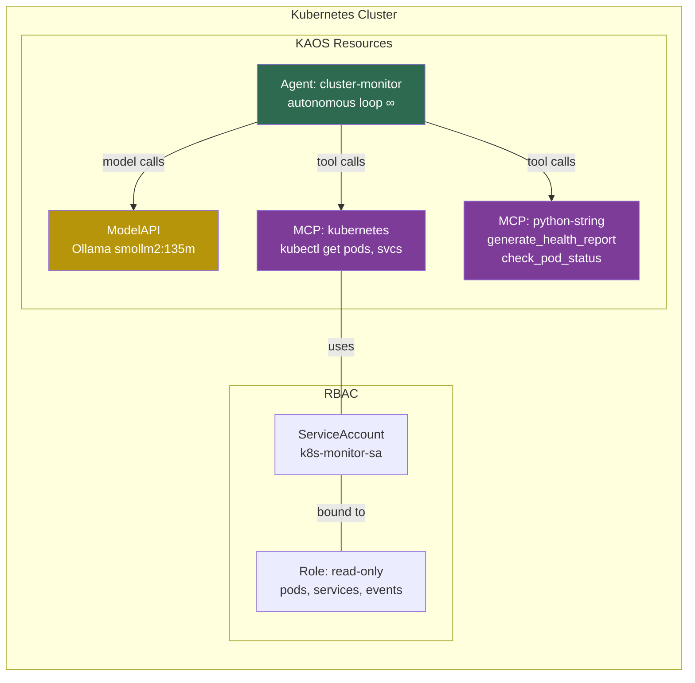

---
jupyter:
  jupytext:
    cell_metadata_filter: -all
    text_representation:
      extension: .md
      format_name: markdown
      format_version: '1.3'
      jupytext_version: 1.19.1
  kernelspec:
    display_name: Python 3 (ipykernel)
    language: python
    name: python3
---

# Autonomous Agent Execution

> **Try it yourself!** This example is available as an executable [Jupyter notebook](/examples/autonomous-agent.ipynb).

This example demonstrates **autonomous (self-looping) agent execution** in KAOS. Autonomous agents run **continuously and indefinitely** — the goal is injected on every iteration and the agent loops forever with configurable pauses between iterations, similar to always-on agent infrastructure like [OpenClaw](https://docs.openclaw.ai). This makes them ideal for monitoring, maintenance, and other ongoing operational tasks.

## How Autonomous Execution Works

Traditional agent interaction is request-response — one message in, one response out:

```
User: "Check system health"  →  Agent runs once  →  Response
```

Autonomous agents run in a **perpetual self-loop**. The goal is provided to the agent on every iteration, and the agent continues running forever (or until the pod is terminated):



**Key points:**
- The loop **never stops** on its own — it runs indefinitely until the pod is killed or the CRD is deleted
- The goal is re-injected on **every iteration**, so the agent re-evaluates the current state each time
- `intervalSeconds` controls the pause between iterations (e.g., 60s for a monitoring agent)
- `maxIterRuntimeSeconds` caps how long a **single iteration** can take (prevents runaway calls)
- Each iteration can use tools, call sub-agents, and store results in memory

Autonomous execution is activated by setting a `goal` in the Agent CRD's `spec.config.autonomous` section. When the agent pod starts, it immediately begins the self-loop.

## Prerequisites

- A running Kubernetes cluster with KAOS operator installed
- `kaos` CLI installed and configured
- `kubectl` configured for the cluster

## Setup

```python
import os, json, time, subprocess

NAMESPACE = "autonomous-example"
os.environ["NAMESPACE"] = NAMESPACE
```

```python
!kubectl create namespace $NAMESPACE 2>/dev/null; echo "ok"
!kubectl config set-context --current --namespace=$NAMESPACE
```

## Step 1: Create a ModelAPI

Create a ModelAPI in Proxy mode. We use mock responses so no real LLM is needed:

```python
!kaos modelapi deploy auto-api --mode Proxy --wait
```

## Step 2: Create an MCP Server (Echo Tool)

Deploy a simple echo MCP server that the agent can call as a tool:

```python
os.environ["ECHO_FUNC"] = 'def echo(message: str) -> str:\n    """Echo the provided message back."""\n    return f"Echo: {message}"'
```

```python
!kaos mcp deploy auto-echo --runtime python-string --params "$ECHO_FUNC" --wait
```

## Step 3: Deploy an Autonomous Agent

Deploy an agent with autonomous mode enabled. The `--autonomous` flag sets the goal, and `--auto-interval` controls the pause between iterations. Mock responses simulate the agent calling the echo tool and then producing a text summary:

```python
os.environ["MOCK1"] = json.dumps({
    "tool_calls": [{
        "id": "call_1",
        "name": "echo",
        "arguments": {"message": "checking system status"}
    }]
})
os.environ["MOCK2"] = "System check complete. Echo confirmed: checking system status."
```

```python
!kaos agent deploy auto-agent \
    --modelapi auto-api --model gpt-4o \
    --mcp auto-echo \
    --instructions "You are a test agent. Use the echo tool when asked." \
    --mock-response "$MOCK1" --mock-response "$MOCK2" \
    --autonomous "Use the echo tool to check system status and report the result" \
    --auto-interval 1
```

```python
for _ in range(30):
    time.sleep(2)
    r = subprocess.run(
        ["kubectl", "wait", "deployment/agent-auto-agent",
         "--for=condition=available", "--timeout=5s"],
        capture_output=True, text=True,
    )
    if r.returncode == 0:
        break
print("✅ Agent deployment is available")
```

The agent starts its perpetual autonomous loop immediately on pod boot. Because we're using mock responses, every iteration follows the same pattern:
- **Every odd model call**: Calls the `echo` tool with "checking system status"
- **Every even model call**: Returns the text summary (no tool calls)

Since the loop runs forever, iterations will keep accumulating in memory.

## Step 4: Verify Autonomous Execution via Memory

Give the agent a few seconds to run several iterations, then check that memory recorded the execution:

```python
time.sleep(8)
result = subprocess.run(
    ["kaos", "agent", "memory", "auto-agent", "--json"],
    capture_output=True, text=True, check=True,
)
data = json.loads(result.stdout)
events = data.get("events", [])
assert len(events) >= 2, f"Expected at least 2 memory events, got {len(events)}"

types = [e["event_type"] for e in events]
assert "user_message" in types, "Missing goal user_message"
assert "agent_response" in types, "Missing agent_response"

print(f"✅ Autonomous session recorded: {len(events)} events")
for e in events[:6]:
    content = str(e.get("content", ""))[:80]
    print(f"  [{e['event_type']}] {content}")
if len(events) > 6:
    print(f"  ... and {len(events) - 6} more events (loop continues indefinitely)")
```

## Step 5: Verify Agent Card

Check the agent's A2A card to confirm it's healthy and has discovered the echo tool:

```python
result = subprocess.run(
    ["kaos", "agent", "status", "auto-agent", "--json"],
    capture_output=True, text=True, check=True,
)
card = json.loads(result.stdout)

assert "jsonrpc" in card.get("supportedProtocols", []), "Missing A2A protocol support"
skills = [s["name"] for s in card.get("skills", [])]
assert "echo" in skills, f"Echo tool not found in skills: {skills}"

print(f"✅ Agent healthy: {len(skills)} tool(s), A2A enabled")
print(f"  Skills: {skills}")
```

## Step 6: Send a Sync A2A Message

Even while the autonomous loop is running, you can still send interactive messages via A2A. This uses the sync (default) mode:

```python
result = subprocess.run(
    ["kaos", "agent", "a2a", "send", "auto-agent",
     "--message", "Say hello via A2A", "--json"],
    capture_output=True, text=True, check=True,
)
data = json.loads(result.stdout)
task = data.get("result", {})
state = task.get("status", {}).get("state")

assert state == "completed", f"Expected completed, got {state}"

history = task.get("history", [])
agent_msgs = [h for h in history if h.get("role") == "agent"]
assert len(agent_msgs) > 0, "No agent response in history"

print(f"✅ A2A sync message completed: {state}")
print(f"  Agent response: {agent_msgs[0]['parts'][0]['text'][:100]}")
```

## Real-World Example: Kubernetes Cluster Monitor

The example above uses mock responses to demonstrate the mechanics. Now let's look at a real-world use case: an autonomous agent that **continuously monitors a Kubernetes cluster**, checking pod health and generating reports on every iteration.

This is a more involved setup that requires RBAC, real MCP tools, and a working model API. KAOS includes this as a ready-made sample:

```
kaos samples deploy 6-autonomous-monitor
```

> **Note:** This sample deploys its own Hosted ModelAPI (Ollama with `smollm2:135m`). If you want to use an existing ModelAPI instead, use `--modelapi <name>` to override it.

The architecture for this setup looks like:



Here's what the sample includes, annotated:

### RBAC: Least-privilege Kubernetes access

```yaml
apiVersion: v1
kind: ServiceAccount
metadata:
  name: k8s-monitor-sa
---
apiVersion: rbac.authorization.k8s.io/v1
kind: Role
metadata:
  name: k8s-monitor-role
rules:
  # Read-only access to core resources
  - apiGroups: [""]
    resources: ["pods", "services", "events", "namespaces"]
    verbs: ["get", "list"]
  - apiGroups: ["apps"]
    resources: ["deployments", "replicasets"]
    verbs: ["get", "list"]
```

### MCP Servers: Kubernetes introspection + report generation

```yaml
# Kubernetes MCP server — queries cluster state
apiVersion: kaos.tools/v1alpha1
kind: MCPServer
metadata:
  name: monitor-k8s-mcp
spec:
  runtime: kubernetes                    # Built-in Kubernetes runtime
  serviceAccountName: k8s-monitor-sa     # Uses the RBAC service account
  params: |
    allowedNamespaces:
      - kaos-autonomous                  # Scoped to specific namespace
---
# Python MCP server — generates health reports
apiVersion: kaos.tools/v1alpha1
kind: MCPServer
metadata:
  name: monitor-report-mcp
spec:
  runtime: python-string
  params: |
    from datetime import datetime

    def generate_health_report(pod_data: str) -> str:
        """Generate a formatted cluster health report."""
        timestamp = datetime.now().strftime("%Y-%m-%d %H:%M:%S")
        return f"=== Cluster Health Report ===\nGenerated: {timestamp}\n---\n{pod_data}\n=== End Report ==="

    def check_pod_status(pod_name: str, status: str) -> str:
        """Check whether a pod is healthy or needs attention."""
        healthy = ["Running", "Succeeded", "Completed"]
        icon = "✅" if status in healthy else "❌"
        state = "HEALTHY" if status in healthy else "UNHEALTHY"
        return f"{icon} {pod_name}: {state} ({status})"
```

### Autonomous Agent: Perpetual cluster monitor

```yaml
apiVersion: kaos.tools/v1alpha1
kind: Agent
metadata:
  name: cluster-monitor
spec:
  modelAPI: monitor-modelapi            # Override with --modelapi if using existing
  model: "smollm2:135m"
  mcpServers:
    - monitor-k8s-mcp                   # Kubernetes introspection tools
    - monitor-report-mcp                # Report generation tools
  config:
    description: "Autonomous cluster monitoring agent"
    instructions: |
      You are a Kubernetes cluster monitoring agent. Your goal is to:
      1. List all pods in the namespace
      2. Check the status of each pod
      3. Generate a health report
    autonomous:
      goal: "Monitor cluster health. List pods, check status, generate report."
      intervalSeconds: 60               # Pause 60s between iterations
      maxIterRuntimeSeconds: 120        # Max 2 minutes per single iteration
    taskConfig:
      maxIterations: 5                  # A2A async tasks: max 5 iterations
      maxRuntimeSeconds: 300            # A2A async tasks: max 5 minutes
      maxToolCalls: 20                  # A2A async tasks: max 20 tool calls
    reasoningLoopMaxSteps: 10           # Max model calls per iteration
  agentNetwork:
    expose: true                        # Expose via Gateway API for A2A access
```

Key configuration differences from the demo:
- `intervalSeconds: 60` — production agents don't need sub-second intervals
- `maxIterRuntimeSeconds: 120` — caps each iteration (the loop itself runs forever)
- `taskConfig` — separate budgets for A2A async tasks (independent of the autonomous loop)
- Real model (`smollm2:135m` via Ollama) instead of mock responses
- Multiple MCP servers working together (Kubernetes + Python report tools)

## Cleanup

```python
!kubectl delete namespace $NAMESPACE --wait=false
print(f"✅ Namespace '{NAMESPACE}' deletion initiated")
```

## Next Steps

- [KAOS Monkey](/examples/kaos-monkey) — Chaos engineering agent with Kubernetes tools
- [Multi-Agent Telemetry](/examples/multi-agent-telemetry) — Multi-agent delegation with OpenTelemetry
- [Agent CRD Reference](/operator/agent-crd) — Full autonomous configuration options
