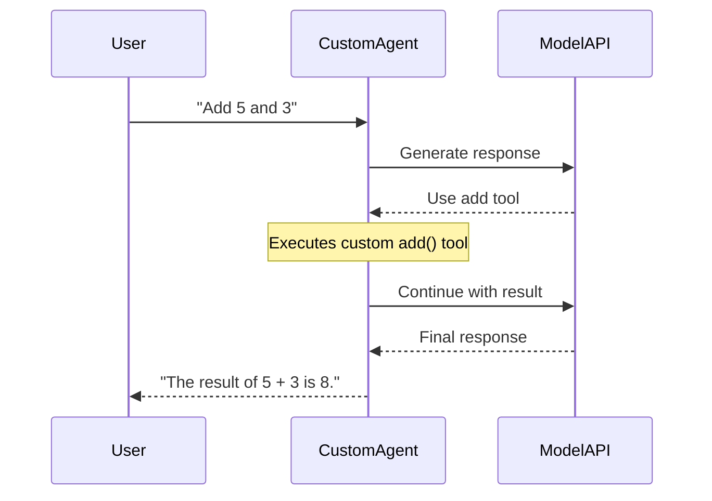

---
jupyter:
  jupytext:
    cell_metadata_filter: -all
    text_representation:
      extension: .md
      format_name: markdown
      format_version: '1.3'
      jupytext_version: 1.19.1
  kernelspec:
    display_name: Python 3 (ipykernel)
    language: python
    name: python3
---

# Building a Custom Agent Image

> 📓 **Try it yourself!** This example is available as an executable [Jupyter notebook](/examples/custom-agent.ipynb).

This example walks through creating a custom Pydantic AI agent with custom tools, packaging it as a Docker image, and deploying it to KAOS using the `container.image` CRD override.



## Prerequisites

- KAOS operator installed ([Installation Guide](/getting-started/installation))
- `kaos-cli` installed (`pip install kaos-cli`)
- Docker available for building images
- kubectl configured to your cluster

## Setup

```python
import os
os.environ['NAMESPACE'] = 'custom-agent-example'
REPO_ROOT = os.path.abspath("../../")
os.environ['REPO_ROOT'] = REPO_ROOT
```

```bash
kubectl create namespace $NAMESPACE 2>/dev/null || true
kubectl config set-context --current --namespace=$NAMESPACE
```

## Step 1: Create the Custom Agent

Create a `server.py` with your custom Pydantic AI agent and tools:

```python
%%writefile custom_server.py
"""Custom Agent — Pydantic AI agent with custom tools and logic."""

import random
from pydantic_ai import Agent as PydanticAgent
from pai_server.server import create_agent_server


def create_custom_agent():
    """Create a Pydantic AI agent with custom tools."""
    agent = PydanticAgent(
        model="test",  # Overridden by KAOS env vars at runtime
        instructions="You are a helpful math and utility assistant.",
        name="custom-agent",
        defer_model_check=True,
    )

    @agent.tool_plain
    def add(a: float, b: float) -> str:
        """Add two numbers together.

        Args:
            a: First number
            b: Second number

        Returns:
            The sum as a string
        """
        return str(a + b)

    @agent.tool_plain
    def multiply(a: float, b: float) -> str:
        """Multiply two numbers.

        Args:
            a: First number
            b: Second number

        Returns:
            The product as a string
        """
        return str(a * b)

    @agent.tool_plain
    def random_number(min_val: int = 1, max_val: int = 100) -> str:
        """Generate a random number in a range.

        Args:
            min_val: Minimum value (inclusive)
            max_val: Maximum value (inclusive)

        Returns:
            A random integer as a string
        """
        return str(random.randint(min_val, max_val))

    return agent


def get_app():
    """ASGI app factory for uvicorn."""
    server = create_agent_server(custom_agent=create_custom_agent())
    return server.app


if __name__ == "__main__":
    import uvicorn
    uvicorn.run("custom_server:get_app", factory=True, host="0.0.0.0", port=8000)
```

## Step 2: Create the Dockerfile

The Dockerfile installs the KAOS framework and copies your custom agent code:

```python
%%writefile Dockerfile.custom-agent
FROM python:3.12-slim

WORKDIR /app

RUN --mount=type=cache,target=/root/.cache/pip pip install uv

# Install KAOS framework dependencies
COPY data-plane/pai-server/pyproject.toml /tmp/pai-server/pyproject.toml
RUN --mount=type=cache,target=/root/.cache/uv \
    cd /tmp/pai-server && \
    uv pip compile pyproject.toml -o requirements.txt && \
    uv pip install --system -r requirements.txt

# Copy framework source
COPY data-plane/pai-server/pai_server/ /app/pai_server/
COPY data-plane/pai-server

# Copy custom agent
COPY docs/examples/custom_server.py /app/custom_server.py

RUN useradd -m -u 65532 agentic && chown -R agentic:agentic /app
USER agentic

EXPOSE 8000

CMD ["python", "-m", "uvicorn", "custom_server:get_app", "--factory", \
     "--host", "0.0.0.0", "--port", "8000"]
```

## Step 3: Build and Load the Image

Build the image from the repository root (needed for COPY paths):

```python
import subprocess
# Build from repo root; image may already exist in CI
result = subprocess.run(
    ["docker", "build", "-t", "custom-agent:test", "-f", "Dockerfile.custom-agent", REPO_ROOT],
    capture_output=True, text=True
)
if result.returncode != 0:
    # In CI the image is pre-built by the workflow
    print(f"Docker build skipped (may be pre-built): {result.stderr.strip()[:200]}")
else:
    print("Image built successfully")
```

For KIND clusters, load the image directly:

```python
!kind load docker-image custom-agent:test --name kaos-e2e 2>/dev/null || echo "Not using KIND or image already loaded"
```

## Step 4: Create a ModelAPI

Create a ModelAPI in Proxy mode (we'll use mock responses so no real LLM needed):

```bash
kaos modelapi deploy custom-api --mode Proxy --wait
```

## Step 5: Deploy the Custom Agent

Deploy the agent with custom image and mock responses that exercise the `add` tool:

```python
import json, subprocess

mock1 = json.dumps({"tool_calls": [{"id": "call_1", "name": "add", "arguments": {"a": 5, "b": 3}}]})
mock2 = "The result of 5 + 3 is 8."
mock_responses = json.dumps([mock1, mock2])

namespace = os.environ["NAMESPACE"]
yaml_manifest = f"""apiVersion: kaos.tools/v1alpha1
kind: Agent
metadata:
  name: custom-math-agent
  namespace: {namespace}
spec:
  modelAPI: custom-api
  model: mock-model
  config:
    description: Custom math agent with add, multiply, and random tools
    instructions: You are a helpful math and utility assistant.
    reasoningLoopMaxSteps: 5
  container:
    image: custom-agent:test
    env:
    - name: AGENT_LOG_LEVEL
      value: DEBUG
    - name: DEBUG_MOCK_RESPONSES
      value: '{mock_responses}'
  agentNetwork:
    access: []
"""

result = subprocess.run(["kubectl", "apply", "-f", "-"], input=yaml_manifest, capture_output=True, text=True)
print(result.stdout or result.stderr)
assert result.returncode == 0, f"kubectl apply failed: {result.stderr}"
```

Wait for the agent to be ready:

```python
import subprocess, time

for i in range(60):
    result = subprocess.run(
        ["kubectl", "get", "agent/custom-math-agent", "-o", "jsonpath={.status.phase}"],
        capture_output=True, text=True
    )
    if result.stdout.strip() == "Ready":
        print(f"Agent ready after ~{i*2}s")
        break
    time.sleep(2)
else:
    raise RuntimeError("Agent did not become Ready within 120s")
```

## Step 6: Test the Agent

Verify the agent card shows custom tools:

```python
import httpx
import subprocess
import json

# Get the Gateway URL
gateway_url = os.environ.get("GATEWAY_URL", "http://localhost:8888")
namespace = os.environ["NAMESPACE"]
agent_url = f"{gateway_url}/{namespace}/agent/custom-math-agent"

# Wait for agent to be accessible
import time
for _ in range(30):
    try:
        r = httpx.get(f"{agent_url}/health", timeout=2.0)
        if r.status_code == 200:
            break
    except Exception:
        pass
    time.sleep(1)

# Check agent card
response = httpx.get(f"{agent_url}/.well-known/agent.json", timeout=10.0)
assert response.status_code == 200, f"Agent card failed: {response.status_code}"
card = response.json()
skill_names = [s.get("name") for s in card.get("skills", [])]
print(f"Agent skills: {skill_names}")
assert "add" in skill_names, f"add not in skills: {skill_names}"
assert "multiply" in skill_names, f"multiply not in skills: {skill_names}"
assert "random_number" in skill_names, f"random_number not in skills: {skill_names}"
print("SUCCESS: Custom tools discovered!")
```

Now invoke the agent:

```python
response = httpx.post(
    f"{agent_url}/v1/chat/completions",
    json={
        "model": "custom-math-agent",
        "messages": [{"role": "user", "content": "Add 5 and 3"}],
    },
    timeout=30.0,
)
assert response.status_code == 200, f"Chat failed: {response.text}"
data = response.json()
content = data["choices"][0]["message"]["content"]
print(f"Agent response: {content}")
assert len(content) > 0, "Empty response"
print("SUCCESS: Custom agent responded!")
```

Verify memory has tool events:

```python
response = httpx.get(f"{agent_url}/memory/events", timeout=10.0)
memory = response.json()
event_types = [e["event_type"] for e in memory["events"]]
print(f"Memory event types: {event_types}")
assert "tool_call" in event_types, f"Missing tool_call in {event_types}"
assert "tool_result" in event_types, f"Missing tool_result in {event_types}"
print("SUCCESS: Tool events recorded in memory!")
```

## What You Get

Custom agent images automatically include:
- **Health/Ready probes** — `GET /health`, `GET /ready`
- **A2A agent card** — `GET /.well-known/agent.json` with custom tool discovery
- **Memory endpoints** — `GET /memory/events`, `GET /memory/sessions`
- **OpenAI-compatible API** — `POST /v1/chat/completions`
- **Session management** — `X-Session-ID` header support
- **OpenTelemetry** — set `OTEL_ENABLED=true` in the CRD env

## Cleanup

```bash
kubectl delete namespace $NAMESPACE --wait=false
```

```python
# Clean up local files
import os
for f in ["custom_server.py", "Dockerfile.custom-agent"]:
    if os.path.exists(f):
        os.remove(f)
```

## Next Steps

- [Custom MCP Server](/examples/custom-mcp-server) — Build custom MCP tool servers
- [Multi-Agent Telemetry](/examples/multi-agent-telemetry) — Add observability
- [Agent CRD Reference](/operator/agent-crd) — Full CRD documentation
