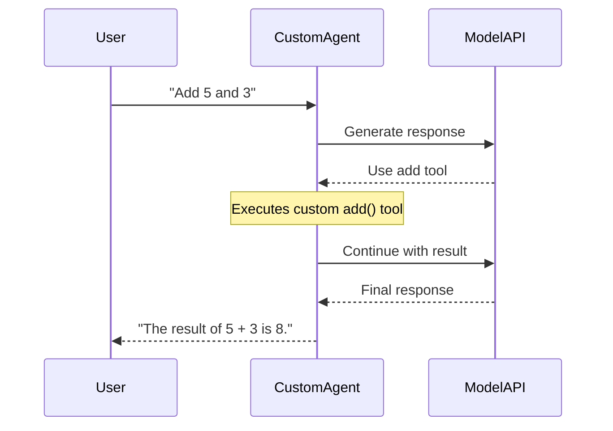

# Building a Custom Agent Image

This example walks through creating a custom Pydantic AI agent with custom tools, packaging it as a Docker image, and deploying it to KAOS using the `container.image` CRD override.



## Prerequisites

- KAOS operator installed ([Installation Guide](/getting-started/installation))
- Docker available for building images
- kubectl configured to your cluster

## Step 1: Create the Custom Agent

Create a `server.py` with your custom Pydantic AI agent and tools:

```python
"""Custom Agent — Pydantic AI agent with custom tools and logic."""

import random
from pydantic_ai import Agent as PydanticAgent
from agent.server import AgentServer, create_agent_server


def create_custom_agent():
    """Create a Pydantic AI agent with custom tools."""
    agent = PydanticAgent(
        model="test",  # Overridden by KAOS env vars at runtime
        instructions="You are a helpful math and utility assistant.",
        name="custom-agent",
        defer_model_check=True,
    )

    @agent.tool_plain
    def add(a: float, b: float) -> str:
        """Add two numbers together.

        Args:
            a: First number
            b: Second number

        Returns:
            The sum as a string
        """
        return str(a + b)

    @agent.tool_plain
    def multiply(a: float, b: float) -> str:
        """Multiply two numbers.

        Args:
            a: First number
            b: Second number

        Returns:
            The product as a string
        """
        return str(a * b)

    @agent.tool_plain
    def random_number(min_val: int = 1, max_val: int = 100) -> str:
        """Generate a random number in a range.

        Args:
            min_val: Minimum value (inclusive)
            max_val: Maximum value (inclusive)

        Returns:
            A random integer as a string
        """
        return str(random.randint(min_val, max_val))

    return agent


def get_app():
    """ASGI app factory for uvicorn."""
    server = create_agent_server(custom_agent=create_custom_agent())
    return server.app


if __name__ == "__main__":
    import uvicorn
    uvicorn.run("server:get_app", factory=True, host="0.0.0.0", port=8000)
```

## Step 2: Create the Dockerfile

The Dockerfile installs the KAOS framework and copies your custom agent code:

```dockerfile
FROM python:3.12-slim

WORKDIR /app

RUN --mount=type=cache,target=/root/.cache/pip pip install uv

# Install KAOS framework dependencies
COPY data-plane/kaos-framework/pyproject.toml /tmp/kaos-framework/pyproject.toml
RUN --mount=type=cache,target=/root/.cache/uv \
    cd /tmp/kaos-framework && \
    uv pip compile pyproject.toml -o requirements.txt && \
    uv pip install --system -r requirements.txt

# Copy framework source
COPY data-plane/kaos-framework/agent/ /app/agent/
COPY data-plane/kaos-framework/telemetry/ /app/telemetry/

# Copy custom agent
COPY examples/custom-agent/server.py /app/custom_server.py

RUN useradd -m -u 65532 agentic && chown -R agentic:agentic /app
USER agentic

EXPOSE 8000

CMD ["python", "-m", "uvicorn", "custom_server:get_app", "--factory", \
     "--host", "0.0.0.0", "--port", "8000"]
```

## Step 3: Build and Load the Image

```console
# Build the image (from repo root)
$ docker build -t custom-agent:v1 -f examples/custom-agent/Dockerfile .

# For KIND clusters, load directly
$ kind load docker-image custom-agent:v1 --name kaos-e2e
```

## Step 4: Deploy to Kubernetes

Create an Agent CRD with `container.image` to use your custom image:

```yaml
apiVersion: kaos.tools/v1alpha1
kind: Agent
metadata:
  name: custom-math-agent
spec:
  modelAPI: my-modelapi
  model: ollama/smollm2:135m
  config:
    description: Custom math agent with add, multiply, and random tools
    instructions: You are a helpful math and utility assistant.
  container:
    image: custom-agent:v1
```

```console
$ kubectl apply -f custom-math-agent.yaml
$ kubectl get agent custom-math-agent -w
```

The KAOS operator will use your custom image instead of the default agent image. All standard features (memory, health probes, A2A discovery, telemetry) are provided by the KAOS framework base.

## Step 5: Test the Agent

```console
# Via Gateway
$ curl http://<gateway>/ns/agent/custom-math-agent/v1/chat/completions \
  -H "Content-Type: application/json" \
  -d '{"model":"custom-math-agent","messages":[{"role":"user","content":"Add 5 and 3"}]}'

# Check the agent card to see custom tools
$ curl http://<gateway>/ns/agent/custom-math-agent/.well-known/agent
```

The agent card will list your custom tools (`add`, `multiply`, `random_number`) alongside any MCP tools or sub-agents configured in the CRD.

## What You Get

Custom agent images automatically include:
- **Health/Ready probes** — `GET /health`, `GET /ready`
- **A2A agent card** — `GET /.well-known/agent` with custom tool discovery
- **Memory endpoints** — `GET /memory/events`, `GET /memory/sessions`
- **OpenAI-compatible API** — `POST /v1/chat/completions`
- **Session management** — `X-Session-ID` header support
- **OpenTelemetry** — set `OTEL_ENABLED=true` in the CRD env

## Cleanup

```console
$ kubectl delete agent custom-math-agent
```

## Next Steps

- [Custom MCP Server](/examples/custom-mcp-server) — Build custom MCP tool servers
- [Multi-Agent Telemetry](/examples/multi-agent-telemetry) — Add observability
- [Agent CRD Reference](/operator/agent-crd) — Full CRD documentation
