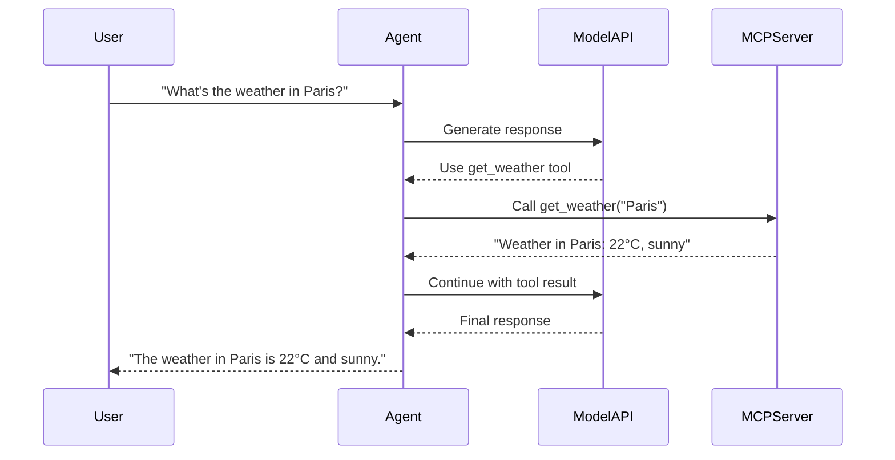

---
jupyter:
  jupytext:
    cell_metadata_filter: -all
    text_representation:
      extension: .md
      format_name: markdown
      format_version: '1.3'
      jupytext_version: 1.19.1
  kernelspec:
    display_name: Python 3 (ipykernel)
    language: python
    name: python3
---

# Building a Custom MCP Server

> 📓 **Try it yourself!** This example is available as an executable [Jupyter notebook](/examples/custom-mcp-server.ipynb).

This example walks through creating, building, and deploying a custom MCP server using the KAOS CLI. By the end, you'll have a working MCP server with custom tools.



## Prerequisites

- KAOS operator installed ([Installation Guide](/getting-started/installation))
- `kaos-cli` installed (`pip install kaos-cli`)
- Docker available for building images
- kubectl configured to your cluster

## Step 1: Initialize the Project

First, let's scaffold a new MCP server project using the CLI:

```python
# Create a temporary directory for our project
!mkdir -p weather-mcp

!cd weather-mcp
```

```python
# Initialize the MCP project
!kaos mcp init .
```

```python
# Verify the files were created
!ls -la
```

This creates three files:
- `server.py` - The FastMCP server with example tools
- `pyproject.toml` - Python project configuration  
- `README.md` - Project documentation

## Step 2: Customize the Server

Let's replace the default server with a weather information server:

```python
%%writefile server.py
"""Weather MCP Server - provides weather information tools."""

from fastmcp import FastMCP
import random

mcp = FastMCP("weather-mcp-server")


@mcp.tool()
def get_weather(city: str) -> str:
    """Get the current weather for a city.
    
    Args:
        city: The name of the city to get weather for.
    
    Returns:
        A string describing the current weather conditions.
    """
    conditions = ["sunny", "cloudy", "rainy", "partly cloudy", "windy"]
    temp = random.randint(15, 30)
    condition = random.choice(conditions)
    return f"Weather in {city}: {temp}°C, {condition}"


@mcp.tool()
def get_forecast(city: str, days: int = 3) -> str:
    """Get a weather forecast for a city.
    
    Args:
        city: The name of the city.
        days: Number of days to forecast (1-7).
    
    Returns:
        A multi-day forecast as a string.
    """
    if days < 1 or days > 7:
        return "Error: days must be between 1 and 7"
    
    forecasts = []
    conditions = ["sunny", "cloudy", "rainy", "partly cloudy"]
    for i in range(days):
        temp = random.randint(12, 28)
        condition = random.choice(conditions)
        forecasts.append(f"Day {i+1}: {temp}°C, {condition}")
    
    return f"Forecast for {city}:\n" + "\n".join(forecasts)


if __name__ == "__main__":
    mcp.run(transport="streamable-http", host="0.0.0.0", port=8000)
```

## Step 3: Build the Docker Image

Build the container image using the CLI. The `--create-dockerfile` flag generates a Dockerfile for you:

```python
# Generate a Dockerfile and build
!kaos mcp build --name weather-mcp --tag v1 --create-dockerfile
```

```python
# View the generated Dockerfile
!cat Dockerfile
```

For KIND clusters, use `--kind-load` to load the image directly:

```console
$ kaos mcp build --name weather-mcp --tag v1 --kind-load
```

## Step 4: Deploy to Kubernetes

> **Note**: The following steps require a running Kubernetes cluster with KAOS installed.

Deploy the MCP server to your cluster:

```console
# Deploy using the built image
$ kaos mcp deploy weather-mcp --image weather-mcp:v1

# Check the status
$ kaos mcp get weather-mcp

# Wait for it to be ready
$ kubectl get mcpserver weather-mcp -w
```

## Step 5: Create an Agent with Your Tools

Create an agent that uses your weather MCP server:

```console
# First, create a ModelAPI (using Hosted mode with Ollama)
$ kaos modelapi deploy weather-api --mode Hosted --model smollm2:135m

# Wait for it to be ready
$ kaos modelapi get weather-api

# Create an agent with access to the weather tools
$ kaos agent deploy weather-agent \
  --modelapi weather-api \
  --model smollm2:135m \
  --mcp weather-mcp \
  --instructions "You are a helpful weather assistant."
```

## Step 6: Test the Agent

Send a message to your agent:

```console
$ kaos agent invoke weather-agent --message "What's the weather like in London?"
```


## Cleanup

Remove the resources when done:

```console
$ kaos agent delete weather-agent --wait=false
$ kaos mcp delete weather-mcp --wait=false
$ kaos modelapi delete weather-api --wait=false
```

## Next Steps

- [KAOS Monkey](/examples/kaos-monkey) - Build an agent that manages Kubernetes
- [Multi-Agent Telemetry](/examples/multi-agent-telemetry) - Add observability to your agents
- [MCPServer CRD Reference](/operator/mcpserver-crd) - Full CRD documentation
