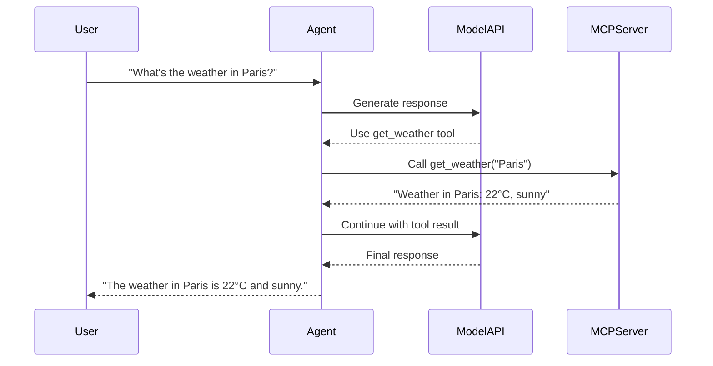

# Building a Custom MCP Server

This example walks through creating, building, and deploying a custom MCP server using the KAOS CLI. By the end, you'll have a working MCP server with custom tools running in your Kubernetes cluster.

## Prerequisites

- KAOS operator installed ([Installation Guide](/getting-started/installation))
- `kaos-cli` installed (`pip install kaos-cli`)
- Docker available for building images
- kubectl configured to your cluster

## Step 1: Initialize the Project

First, let's scaffold a new MCP server project using the CLI:

```bash
# Create a new directory and initialize
mkdir my-weather-mcp && cd my-weather-mcp
kaos mcp init .
```

This creates three files:
- `server.py` - The FastMCP server with example tools
- `pyproject.toml` - Python project configuration
- `README.md` - Project documentation

## Step 2: Customize the Server

Let's replace the default server with a weather information server. Edit `server.py`:

```python
"""Weather MCP Server - provides weather information tools."""

from fastmcp import FastMCP
import random

mcp = FastMCP("weather-mcp-server")


@mcp.tool()
def get_weather(city: str) -> str:
    """Get the current weather for a city.
    
    Args:
        city: The name of the city to get weather for.
    
    Returns:
        A string describing the current weather conditions.
    """
    # In a real implementation, this would call a weather API
    conditions = ["sunny", "cloudy", "rainy", "partly cloudy", "windy"]
    temp = random.randint(15, 30)
    condition = random.choice(conditions)
    return f"Weather in {city}: {temp}°C, {condition}"


@mcp.tool()
def get_forecast(city: str, days: int = 3) -> str:
    """Get a weather forecast for a city.
    
    Args:
        city: The name of the city.
        days: Number of days to forecast (1-7).
    
    Returns:
        A multi-day forecast as a string.
    """
    if days < 1 or days > 7:
        return "Error: days must be between 1 and 7"
    
    forecasts = []
    conditions = ["sunny", "cloudy", "rainy", "partly cloudy"]
    for i in range(days):
        temp = random.randint(12, 28)
        condition = random.choice(conditions)
        forecasts.append(f"Day {i+1}: {temp}°C, {condition}")
    
    return f"Forecast for {city}:\n" + "\n".join(forecasts)


@mcp.tool()
def convert_temperature(value: float, from_unit: str, to_unit: str) -> str:
    """Convert temperature between Celsius and Fahrenheit.
    
    Args:
        value: The temperature value to convert.
        from_unit: Source unit ('C' or 'F').
        to_unit: Target unit ('C' or 'F').
    
    Returns:
        The converted temperature as a string.
    """
    if from_unit.upper() == to_unit.upper():
        return f"{value}°{to_unit.upper()}"
    
    if from_unit.upper() == "C" and to_unit.upper() == "F":
        result = (value * 9/5) + 32
    elif from_unit.upper() == "F" and to_unit.upper() == "C":
        result = (value - 32) * 5/9
    else:
        return "Error: units must be 'C' or 'F'"
    
    return f"{value}°{from_unit.upper()} = {result:.1f}°{to_unit.upper()}"


if __name__ == "__main__":
    mcp.run(transport="streamable-http", host="0.0.0.0", port=8000)
```

## Step 3: Test Locally

Before deploying, test the server locally:

```bash
# Install dependencies
pip install -e .

# Run the server
python server.py
```

In another terminal, test the tools:

```bash
# The server exposes MCP protocol on port 8000
curl http://localhost:8000/health
```

## Step 4: Build the Docker Image

Build the container image using the CLI:

```bash
# Build with a tag
kaos mcp build --name weather-mcp --tag v1

# For KIND clusters, load directly
kaos mcp build --name weather-mcp --tag v1 --kind-load
```

## Step 5: Deploy to Kubernetes

Deploy the MCP server to your cluster:

```bash
# Deploy using the built image
kaos mcp deploy weather-mcp --image weather-mcp:v1

# Check the status
kaos mcp get weather-mcp
```

Wait for it to be ready:

```bash
# Watch until Ready=true
kubectl get mcpserver weather-mcp -w
```

## Step 6: Create an Agent with Your Tools

Now create an agent that uses your weather MCP server:

```bash
# First, create a ModelAPI (using Hosted mode with Ollama)
kaos modelapi deploy weather-api --mode Hosted --model smollm2:135m

# Wait for it to be ready
kaos modelapi get weather-api

# Create an agent with access to the weather tools
kaos agent deploy weather-agent \
  --modelapi weather-api \
  --model smollm2:135m \
  --mcp weather-mcp \
  --instructions "You are a helpful weather assistant. Use the weather tools to answer questions about weather conditions."
```

## Step 7: Test the Agent

Send a message to your agent:

```bash
kaos agent invoke weather-agent --message "What's the weather like in London?"
```

The agent will use the `get_weather` tool to provide an answer.

## Understanding the Flow



## Cleanup

Remove the resources when done:

```bash
kaos agent delete weather-agent
kaos mcp delete weather-mcp
kaos modelapi delete weather-api
```

## Next Steps

- [KAOS Monkey](/examples/kaos-monkey) - Build an agent that manages Kubernetes
- [Multi-Agent Telemetry](/examples/multi-agent-telemetry) - Add observability to your agents
- [MCPServer CRD Reference](/operator/mcpserver-crd) - Full CRD documentation
