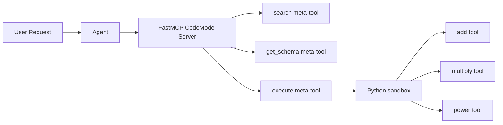

---
jupyter:
  jupytext:
    cell_metadata_filter: -all
    text_representation:
      extension: .md
      format_name: markdown
      format_version: '1.3'
      jupytext_version: 1.19.1
  kernelspec:
    display_name: Python 3 (ipykernel)
    language: python
    name: python3
---

# FastMCP Code Mode

> **Try it yourself!** This example is available as an executable [Jupyter notebook](/examples/fastmcp-codemode.ipynb).

This example demonstrates the **fastmcp-codemode** runtime, which wraps Python tool functions with FastMCP's [CodeMode](https://gofastmcp.com/servers/transforms/code-mode) transform. Instead of exposing individual tools, agents get meta-tools (`search`, `get_schema`, `execute`) that enable discovering and chaining tool calls via Python code execution in a sandbox.

## Understanding FastMCP Code Mode

With traditional MCP, each tool call is a round-trip through the LLM:

```
LLM: "I'll call add(42, 8)"      -> Tool executes -> Result
LLM: "Now I'll call multiply"    -> Tool executes -> Result
LLM: "Here's the final answer"
```

With FastMCP Code Mode, the agent writes Python code that chains operations in one call:

```python .noeval
# The LLM generates this Python code which runs in a sandbox:
result_add = await call_tool("add", {"a": 42, "b": 8})
result_mul = await call_tool("multiply", {"x": result_add, "y": 2})
return result_mul
```

This reduces:
- **LLM round-trips**: From N+1 to ~3 (search → execute → final response)
- **Token usage**: Only schemas for needed tools are loaded
- **Latency**: Multi-step operations complete in a single sandbox execution

## Architecture



## Prerequisites

- KAOS operator installed ([Installation Guide](/getting-started/installation))
- `kaos-cli` installed
- Access to a Kubernetes cluster

## Setup

```python
import os
os.environ['NAMESPACE'] = 'fastmcp-codemode-example'
```

```bash
kubectl create namespace $NAMESPACE 2>/dev/null || true
kubectl config set-context --current --namespace=$NAMESPACE
```

## Step 1: Create a ModelAPI

Create a ModelAPI in Proxy mode:

```bash
kaos modelapi deploy codemode-api --mode Proxy --wait
```

## Step 2: Create the FastMCP CodeMode Server

Deploy an MCPServer using the `fastmcp-codemode` runtime with calculator tools:

```bash
export CALC_FUNCS='
def add(a: int, b: int) -> int:
    """Add two numbers together."""
    return a + b

def multiply(x: int, y: int) -> int:
    """Multiply two numbers."""
    return x * y

def power(base: int, exponent: int) -> int:
    """Raise base to the power of exponent."""
    return base ** exponent
'

kaos mcp deploy calculator-codemode \
    --runtime fastmcp-codemode \
    --params "$CALC_FUNCS" \
    --wait
```

## Step 3: Create the Agent

Create an agent connected to the CodeMode server. The mock responses demonstrate the Code Mode flow — the agent discovers tools via `search`, then writes Python code that chains operations using the `execute` meta-tool:

```bash
# Mock response: agent calls search to discover tools, then execute to chain them
MOCK_CODE="{\
  \"tool_calls\": [{\
    \"id\": \"call_1\",\
    \"name\": \"execute\",\
    \"arguments\": {\
      \"code\": \"result_add = await call_tool('add', {'a': 42, 'b': 8}); result_mul = await call_tool('multiply', {'x': result_add, 'y': 2}); result_pow = await call_tool('power', {'base': result_mul, 'exponent': 2}); return result_pow\"\
    }\
  }]\
}"

MOCK_FINAL='I executed a calculation chain using Code Mode: (42+8)=50, 50*2=100, 100^2=10000. The final result is 10000.'

kaos agent deploy codemode-agent \
    --modelapi codemode-api \
    --model mock-model \
    --mcp calculator-codemode \
    --instructions "You use Code Mode to chain calculations efficiently via Python code execution." \
    --mock-response "$MOCK_CODE" \
    --mock-response "$MOCK_FINAL" \
    --expose \
    --wait
```

## Step 4: Invoke the Agent

Send a request that triggers multi-tool orchestration:

```bash
kaos agent invoke codemode-agent --message "Calculate (42+8)*2, then square the result"
```

## Step 5: Verify Agent Status

Check that the agent has discovered the Code Mode meta-tools:

```bash
kaos agent status codemode-agent
```

Verify the output shows A2A capabilities:

```bash
kaos agent status codemode-agent --json | grep -q "streaming" || exit 1
```

## Step 6: Verify Memory Events

Check that tool calls were recorded in memory:

```bash
kaos agent memory codemode-agent
```

Verify a tool_call event exists and no errors occurred:

```bash
# Check tool_call event exists
kaos agent memory codemode-agent --json | grep -q "tool_call" || exit 1
# Check no tool errors occurred
kaos agent memory codemode-agent --json | grep -q "tool_error" && exit 1 || true
```

## Cleanup

```bash
kubectl delete namespace $NAMESPACE --wait=false
```

## Next Steps

- [Unified MCP Gateway](/examples/unified-mcp-gateway) - Aggregate multiple MCP servers with pctx Code Mode
- [MCPServer CRD Reference](/operator/mcpserver-crd) - Full runtime documentation
- [FastMCP Code Mode docs](https://gofastmcp.com/servers/transforms/code-mode) - Upstream documentation
