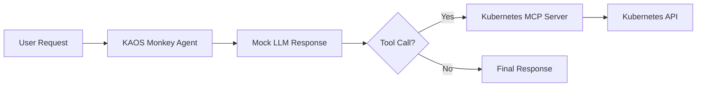

---
jupyter:
  jupytext:
    cell_metadata_filter: -all
    text_representation:
      extension: .md
      format_name: markdown
      format_version: '1.3'
      jupytext_version: 1.19.1
  kernelspec:
    display_name: Python 3 (ipykernel)
    language: python
    name: python3
---

# KAOS Monkey: Kubernetes Chaos Agent

> 📓 **Try it yourself!** This example is available as an executable [Jupyter notebook](/examples/kaos-monkey.ipynb).

This example demonstrates building a "chaos monkey" style agent that can interact with your Kubernetes cluster using the [Kubernetes MCP Server](https://github.com/manusa/kubernetes-mcp-server). The agent uses MCP tools to execute operations, controlled by deterministic mock responses.

::: warning
This example demonstrates powerful capabilities. Use with caution in production environments.
:::

## Prerequisites

- KAOS operator installed ([Installation Guide](/getting-started/installation))
- `kaos-cli` installed
- Access to a Kubernetes cluster

## Overview

We'll create an agent that can:
1. List pods in a namespace using the `pods_list` tool
2. Delete specific pods using the `pods_delete` tool
3. Return results of operations

The agent uses **mock responses** for deterministic behavior - this means we control exactly what the LLM "decides" to do, making the example reproducible and testable.

## Setup

First, let's set up the environment and create a unique namespace for this example:

```python
import os, time
# Set namespace as environment variable for shell commands
ns = os.environ.get("TEST_NAMESPACE", f"kaos-monkey-{int(time.time()) % 10000}")
os.environ["NS"] = ns
print(f"Using namespace: {ns}")
```

```python
!kubectl create namespace $NS --dry-run=client -o yaml | kubectl apply -f -
```

## Step 1: Create a ModelAPI

Create a ModelAPI in Proxy mode (we'll use mock responses so no real LLM needed):

```python
!kaos modelapi deploy chaos-api -n $NS --mode Proxy
```

Wait for ModelAPI to be ready:

```python
!kubectl wait deployment/modelapi-chaos-api -n $NS --for=condition=available --timeout=120s
```

## Step 2: Set Up RBAC for Kubernetes MCP Server

The Kubernetes MCP server needs permissions to interact with the Kubernetes API. We use `kaos system create-rbac` to create the necessary ServiceAccount, Role, and RoleBinding:

```python
!kaos system create-rbac k8s-mcp -n $NS --resources pods --verbs list,get,delete
```

## Step 3: Create the Kubernetes MCP Server

Deploy the Kubernetes MCP server using the built-in `kubernetes` runtime. This uses the [kubernetes-mcp-server](https://github.com/manusa/kubernetes-mcp-server) image which provides 22+ Kubernetes tools:

```python
%%writefile /tmp/k8s-mcp.yaml
apiVersion: kaos.tools/v1alpha1
kind: MCPServer
metadata:
  name: k8s-tools
spec:
  runtime: kubernetes
  serviceAccountName: k8s-mcp
```

```python
!kubectl apply -f /tmp/k8s-mcp.yaml -n $NS
```

Wait for MCP server to be ready:

```python
!kubectl wait deployment/mcpserver-k8s-tools -n $NS --for=condition=available --timeout=120s
```

## Step 4: Create a Test Pod

Create a simple test pod that our chaos agent can target:

```python
!kubectl run chaos-victim -n $NS --image=nginx:alpine --restart=Never
```

Wait for pod to be running:

```python
!kubectl wait pod/chaos-victim -n $NS --for=condition=ready --timeout=60s
```

## Step 5: Create the Chaos Agent

Create the agent with mock responses that will delete the test pod. The Kubernetes MCP server provides tools like `pods_list` and `pods_delete`:

```python
%%writefile /tmp/chaos-agent.yaml
apiVersion: kaos.tools/v1alpha1
kind: Agent
metadata:
  name: kaos-monkey
spec:
  modelAPI: chaos-api
  model: mock-model
  mcpServers:
  - k8s-tools
  config:
    instructions: "You are KAOS Monkey, a chaos engineering agent."
  agentNetwork:
    expose: true
```

```python
# Add mock responses via env var - note the tool names from kubernetes-mcp-server
import json
ns = os.environ["NS"]
mock_responses = [
    f'I will list the pods first.\n\n```tool_call\n{{"tool": "pods_list", "arguments": {{"namespace": "{ns}"}}}}\n```',
    f'Found chaos-victim pod. Deleting it now.\n\n```tool_call\n{{"tool": "pods_delete", "arguments": {{"namespace": "{ns}", "name": "chaos-victim"}}}}\n```',
    "Done! I have deleted the chaos-victim pod to simulate a failure scenario."
]

# Write the agent YAML with mock responses
import yaml
with open("/tmp/chaos-agent.yaml") as f:
    agent = yaml.safe_load(f)
agent["spec"]["container"] = {
    "env": [{"name": "DEBUG_MOCK_RESPONSES", "value": json.dumps(mock_responses)}]
}
with open("/tmp/chaos-agent.yaml", "w") as f:
    yaml.dump(agent, f)
```

```python
!kubectl apply -f /tmp/chaos-agent.yaml -n $NS
```

Wait for agent to be ready:

```python
!kubectl wait deployment/agent-kaos-monkey -n $NS --for=condition=available --timeout=120s
```

## Step 6: Unleash the Chaos

Now invoke the chaos agent to delete the pod:

```python
!kaos agent invoke kaos-monkey -n $NS --message "Cause some chaos by deleting a pod"
```

## Step 7: Verify the Chaos

Check that the pod was deleted:

```python
import time; time.sleep(2)
!kubectl get pod chaos-victim -n $NS 2>&1 || echo "SUCCESS: Pod was deleted by the chaos agent!"
```

## Understanding Mock Responses

The mock responses include `tool_call` blocks that trigger **real** MCP tool execution - only the LLM reasoning is mocked.

This is essential for:
- **Testing**: Deterministic behavior in CI/CD
- **Cost savings**: No LLM API calls during development
- **Reproducibility**: Same inputs always produce same outputs

## Kubernetes MCP Server Tools

The `kubernetes` runtime provides many useful tools:
- `pods_list`, `pods_get`, `pods_delete`, `pods_log`, `pods_exec`
- `namespaces_list`, `resources_list`, `resources_create_or_update`
- `helm_install`, `helm_list`, `helm_uninstall`
- And more! See the [kubernetes-mcp-server documentation](https://github.com/manusa/kubernetes-mcp-server).

## Architecture



## Cleanup

```python
!kubectl delete namespace $NS --ignore-not-found
print(f"Cleaned up namespace: {os.environ['NS']}")
```

## Next Steps

- [Multi-Agent Telemetry](/examples/multi-agent-telemetry) - Add observability
- [Gateway API](/operator/gateway-api) - Secure your agent endpoints
- [Agent CRD Reference](/operator/agent-crd) - Full configuration options
