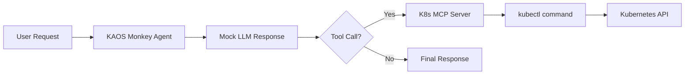

# KAOS Monkey: Kubernetes Chaos Agent

This example demonstrates building a "chaos monkey" style agent that can interact with your Kubernetes cluster. The agent uses the Kubernetes MCP runtime to execute kubectl commands, controlled by an LLM.

::: warning
This example demonstrates powerful cluster management capabilities. Use with caution in production environments.
:::

## Prerequisites

- KAOS operator installed ([Installation Guide](/getting-started/installation))
- `kaos-cli` installed
- A Kubernetes namespace with pods to test against

## Overview

We'll create an agent that can:
1. List pods in a namespace
2. Delete specific pods (for chaos testing)
3. Describe pod status

The agent will use **mock responses** for deterministic behavior - this means we control exactly what the LLM "decides" to do, making the example reproducible and testable.

## Step 1: Create RBAC for Kubernetes Access

Create a ServiceAccount with permissions to manage pods:

```console
$ kaos system create-rbac kaos-monkey-sa
```

This creates a ServiceAccount, Role, and RoleBinding in your current namespace.

## Step 2: Create a ModelAPI

Create a ModelAPI in Proxy mode (we'll use mock responses so no real LLM needed):

```console
$ kaos modelapi deploy chaos-api --mode Proxy
```

## Step 3: Deploy the Kubernetes MCP Runtime

Deploy an MCP server using the built-in `kubernetes` runtime:

```console
$ kaos mcp deploy k8s-tools --runtime kubernetes --sa kaos-monkey-sa
```

This creates an MCP server with kubectl access, using the ServiceAccount we created.

## Step 4: Create a Test Pod

Create a simple test pod that our chaos agent can target:

```console
$ kubectl run test-pod --image=nginx --restart=Never
```

## Step 5: Create the Chaos Agent

Create the agent with mock responses that will delete the test pod:

```console
$ kaos agent deploy kaos-monkey \
    --modelapi chaos-api \
    --model gpt-4o \
    --mcp k8s-tools \
    --instructions "You are KAOS Monkey, a chaos engineering agent." \
    --mock-response 'I will list the pods first.\n\n```tool_call\n{"tool": "kubectl_get", "arguments": {"resource": "pods"}}\n```' \
    --mock-response 'Found the test pod. Deleting it now.\n\n```tool_call\n{"tool": "kubectl_delete", "arguments": {"resource": "pod", "name": "test-pod"}}\n```' \
    --mock-response 'Done! I deleted test-pod to simulate a pod failure.' \
    --expose
```

Note: The `--instructions` are minimal because MCP tool descriptions are automatically provided to the agent.

## Step 6: Unleash the Chaos

Invoke the chaos agent:

```console
$ kaos agent invoke kaos-monkey --message "Cause some chaos"
```

Because we're using mock responses, the agent will:
1. First call `kubectl_get` to list pods
2. Then call `kubectl_delete` to remove test-pod
3. Return a summary of what it did

## Step 7: Verify the Chaos

Check that the pod was deleted:

```console
$ kubectl get pods
```

The `test-pod` should be gone (or in Terminating state).

## Understanding Mock Responses

The `--mock-response` flags provide deterministic LLM responses. Each invocation consumes the next response in sequence.

The mock responses include `tool_call` blocks that trigger **real** MCP tool execution - only the LLM reasoning is mocked.

This is essential for:
- **Testing**: Deterministic behavior in CI/CD
- **Cost savings**: No LLM API calls during development
- **Reproducibility**: Same inputs always produce same outputs

## Architecture



## Real LLM Usage

To use a real LLM instead of mocks, deploy without `--mock-response`:

```console
$ kaos agent deploy kaos-monkey \
    --modelapi my-openai-api \
    --model gpt-4o \
    --mcp k8s-tools \
    --instructions "You are KAOS Monkey, a chaos engineering agent." \
    --expose
```

## Safety Considerations

For production chaos engineering:

1. **Limit RBAC scope**: Use `--read-only` or specific `--resources` and `--verbs`
2. **Log all actions**: Enable telemetry to track what the agent does
3. **Set guardrails**: Configure which resources can/cannot be touched

## Cleanup

```console
$ kaos agent delete kaos-monkey
$ kaos mcp delete k8s-tools
$ kaos modelapi delete chaos-api
$ kubectl delete pod test-pod --ignore-not-found
```

## Next Steps

- [Multi-Agent Telemetry](/examples/multi-agent-telemetry) - Add observability
- [Gateway API](/operator/gateway-api) - Secure your agent endpoints
- [Agent CRD Reference](/operator/agent-crd) - Full configuration options
