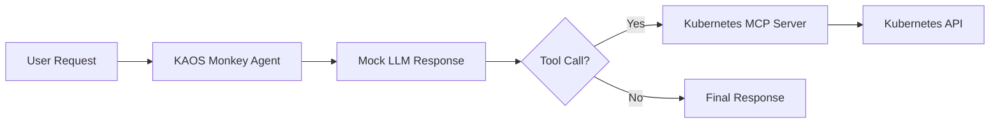

---
jupyter:
  jupytext:
    cell_metadata_filter: -all
    text_representation:
      extension: .md
      format_name: markdown
      format_version: '1.3'
      jupytext_version: 1.19.1
  kernelspec:
    display_name: Python 3 (ipykernel)
    language: python
    name: python3
---

# KAOS Monkey: Kubernetes Chaos Agent

> **Try it yourself!** This example is available as an executable [Jupyter notebook](/examples/kaos-monkey.ipynb).

This example demonstrates building a "chaos monkey" style agent that can interact with your Kubernetes cluster using the [Kubernetes MCP Server](https://github.com/manusa/kubernetes-mcp-server). The agent uses MCP tools to execute operations, controlled by deterministic mock responses.

## Understanding the Flow



::: warning
This example demonstrates powerful capabilities. Use with caution in production environments.
:::

## Prerequisites

- KAOS operator installed ([Installation Guide](/getting-started/installation))
- `kaos-cli` installed
- Access to a Kubernetes cluster

## Overview

We'll create an agent that can:
1. List pods in a namespace using the `pods_list` tool
2. Delete specific pods using the `pods_delete` tool
3. Return results of operations

The agent uses **mock responses** for deterministic behavior which allows us to control exactly what the LLM "decides" to do, making the example reproducible and testable (and doesn't require setting up external ModelAPI).

## Setup

First, let's set up the environment and create a namespace for this example:

```python
import os
os.environ['NAMESPACE'] = 'kaos-monkey-example'
```

```bash
kubectl create namespace $NAMESPACE 2>/dev/null || true
kubectl config set-context --current --namespace=$NAMESPACE
```

## Step 1: Create a ModelAPI

Create a ModelAPI in Proxy mode (we'll use mock responses so no real LLM needed):

```bash
kaos modelapi deploy chaos-api --mode Proxy --wait
```

## Step 2: Set Up RBAC for Kubernetes MCP Server

The Kubernetes MCP server needs permissions to interact with the Kubernetes API:

```bash
kaos system create-rbac k8s-mcp --resources pods --verbs list,get,delete
```

## Step 3: Create the Kubernetes MCP Server

Deploy the Kubernetes MCP server using the built-in `kubernetes` runtime with the service account we just created:

```bash
kaos mcp deploy k8s-tools --runtime kubernetes --sa k8s-mcp --wait
```

## Step 4: Create a Test Pod

Create a simple test pod that our chaos agent can target:

```bash
kubectl run chaos-victim --image=nginx:alpine --restart=Never | echo "exists"
```

Wait for pod to be running:

```bash
kubectl wait pod/chaos-victim --for=condition=ready --timeout=60s
```

## Step 5: Create the Chaos Agent

Create the agent with mock responses. The `--mock-response` flag can be used multiple times - each response is consumed in sequence:

```bash
# Build mock responses with JSON action format
# Two-phase loop: action1 -> action2 -> no-action -> final
MOCK1='{"tool": "pods_list", "arguments": {"namespace": "'$NAMESPACE'"}}'
MOCK2='{"tool": "pods_delete", "arguments": {"namespace": "'$NAMESPACE'", "name": "chaos-victim"}}'
MOCK3='{}'
MOCK4='Done! I have deleted the chaos-victim pod to simulate a failure scenario.'

kaos agent deploy kaos-monkey \
    --modelapi chaos-api \
    --model mock-model \
    --mcp k8s-tools \
    --instructions "You are KAOS Monkey, a chaos engineering agent." \
    --mock-response "$MOCK1" \
    --mock-response "$MOCK2" \
    --mock-response "$MOCK3" \
    --mock-response "$MOCK4" \
    --expose \
    --wait
```

## Step 6: Unleash the Chaos

Now invoke the chaos agent to delete the pod:

```bash
kaos agent invoke kaos-monkey --message "Cause some chaos by deleting a pod"
```

## Step 7: Verify the Chaos

Check that the pod was deleted:

```python
import subprocess

# Verify pod was deleted - this should fail (pod not found)
result = subprocess.run(["kubectl", "get", "event"], capture_output=True)
r_str = str(result.stdout)

if "Killing" in r_str and "pod/chaos-victim" in r_str:
    print("SUCCESS: Pod was deleted by the chaos agent!")
else:
    raise AssertionError("FAILED: Pod still exists - chaos agent did not delete it")
```

## Understanding Mock Responses

The mock responses include JSON action blocks (e.g., `{"tool": "..."}`) that trigger **real** MCP tool execution - only the LLM reasoning is mocked.

This is essential for:
- **Testing**: Deterministic behavior in CI/CD
- **Cost savings**: No LLM API calls during development
- **Reproducibility**: Same inputs always produce same outputs

## Kubernetes MCP Server Tools

The `kubernetes` runtime provides many useful tools:
- `pods_list`, `pods_get`, `pods_delete`, `pods_log`, `pods_exec`
- `namespaces_list`, `resources_list`, `resources_create_or_update`
- `helm_install`, `helm_list`, `helm_uninstall`
- And more! See the [kubernetes-mcp-server documentation](https://github.com/manusa/kubernetes-mcp-server).

## Cleanup

```bash
kubectl delete namespace $NAMESPACE --wait=false
```

## Next Steps

- [Multi-Agent Telemetry](/examples/multi-agent-telemetry) - Add observability
- [Gateway API](/operator/gateway-api) - Secure your agent endpoints
- [Agent CRD Reference](/operator/agent-crd) - Full configuration options
