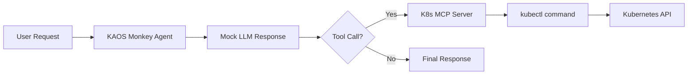

# KAOS Monkey: Kubernetes Chaos Agent

This example demonstrates building a "chaos monkey" style agent that can interact with your Kubernetes cluster. The agent uses the Kubernetes MCP runtime to execute kubectl commands, controlled by an LLM.

::: warning
This example demonstrates powerful cluster management capabilities. Use with caution in production environments.
:::

## Prerequisites

- KAOS operator installed ([Installation Guide](/getting-started/installation))
- `kaos-cli` installed
- A Kubernetes namespace with pods to test against

## Overview

We'll create an agent that can:
1. List pods in a namespace
2. Delete specific pods (for chaos testing)
3. Describe pod status

The agent will use **mock responses** for deterministic behavior - this means we control exactly what the LLM "decides" to do, making the example reproducible and testable.

## Step 1: Create RBAC for Kubernetes Access

First, generate the ServiceAccount and RBAC permissions:

```console
# Generate RBAC manifest for the test namespace
$ kaos system create-rbac --name kaos-monkey-sa --namespace default > rbac.yaml

# Review the generated RBAC
$ cat rbac.yaml

# Apply it
$ kubectl apply -f rbac.yaml
```

The RBAC gives the ServiceAccount permissions to manage pods in the specified namespace.

## Step 2: Create a ModelAPI

Create a ModelAPI in Proxy mode (we'll use mock responses so no real LLM needed):

```console
$ kaos modelapi deploy chaos-api --mode Proxy
```

Wait for it to be ready:

```console
$ kaos modelapi get chaos-api
```

## Step 3: Deploy the Kubernetes MCP Runtime

Deploy an MCP server using the built-in `kubernetes` runtime:

```console
$ kaos mcp deploy k8s-tools --runtime kubernetes --sa kaos-monkey-sa
```

This creates an MCP server with kubectl access, using the ServiceAccount we created.

## Step 4: Create the Chaos Agent

Now create the agent with mock responses for deterministic testing:

```yaml
apiVersion: kaos.tools/v1alpha1
kind: Agent
metadata:
  name: kaos-monkey
spec:
  modelAPI: chaos-api
  model: gpt-4o  # Model name for mock
  mcpServers:
    - k8s-tools
  config:
    instructions: |
      You are KAOS Monkey, a chaos engineering agent.
      You have access to Kubernetes tools to manage pods.
      
      Available tools:
      - kubectl_get: List resources (pods, deployments, etc.)
      - kubectl_delete: Delete a resource
      - kubectl_describe: Get detailed info about a resource
      
      When asked to cause chaos, pick a random pod and delete it.
      Always confirm what you're about to do before doing it.
  container:
    env:
      # Mock responses for deterministic testing
      - name: DEBUG_MOCK_RESPONSES
        value: |
          [
            "I'll list the pods first to see what's running.\n\n```tool_call\n{\"tool\": \"kubectl_get\", \"arguments\": {\"resource\": \"pods\", \"namespace\": \"default\"}}\n```",
            "I found some pods. Let me delete the test pod to cause some chaos.\n\n```tool_call\n{\"tool\": \"kubectl_delete\", \"arguments\": {\"resource\": \"pod\", \"name\": \"test-pod\", \"namespace\": \"default\"}}\n```",
            "Done! I've deleted the test-pod. The deployment controller should recreate it shortly. This simulates a pod failure scenario."
          ]
  agentNetwork:
    expose: true
```

Apply this configuration:

```console
$ kubectl apply -f kaos-monkey.yaml
```

## Step 5: Create a Test Pod

Create a simple test pod that our chaos agent can target:

```console
$ kubectl run test-pod --image=nginx --restart=Never
$ kubectl get pods
```

## Step 6: Unleash the Chaos

Now invoke the chaos agent:

```console
$ kaos agent invoke kaos-monkey --message "Please cause some chaos in the default namespace"
```

Because we're using mock responses, the agent will:
1. First call `kubectl_get` to list pods
2. Then call `kubectl_delete` to remove test-pod
3. Return a summary of what it did

## Step 7: Verify the Chaos

Check that the pod was deleted:

```console
$ kubectl get pods
```

The `test-pod` should be gone (or in Terminating state).

## Understanding Mock Responses

The `DEBUG_MOCK_RESPONSES` environment variable contains a JSON array of responses. Each time the agent needs to generate a response, it uses the next item in the array instead of calling the LLM.

This is essential for:
- **Testing**: Deterministic behavior in CI/CD
- **Cost savings**: No LLM API calls during development
- **Reproducibility**: Same inputs always produce same outputs

The mock responses include `tool_call` blocks that trigger the actual MCP tool execution, so the Kubernetes commands are real - only the LLM reasoning is mocked.

## Architecture



## Real LLM Usage

To use a real LLM instead of mocks, remove the `DEBUG_MOCK_RESPONSES` env var and configure your ModelAPI with actual credentials:

```console
# Create a ModelAPI pointing to OpenAI
$ kaos modelapi deploy openai-api --mode Proxy

# Add your API key as a secret
$ kubectl create secret generic openai-secret --from-literal=api-key=sk-...

# Update the ModelAPI to use the secret
$ kubectl patch modelapi openai-api --type=merge -p '
{
  "spec": {
    "proxyConfig": {
      "apiKeyFrom": {
        "secretKeyRef": {
          "name": "openai-secret",
          "key": "api-key"
        }
      }
    }
  }
}'
```

## Safety Considerations

For production chaos engineering:

1. **Limit RBAC scope**: Only give permissions to specific namespaces
2. **Use approval workflows**: Require human approval before deletions
3. **Log all actions**: Enable telemetry to track what the agent does
4. **Set guardrails**: Configure which resources can/cannot be touched

## Cleanup

```console
$ kaos agent delete kaos-monkey
$ kaos mcp delete k8s-tools
$ kaos modelapi delete chaos-api
$ kubectl delete -f rbac.yaml
$ kubectl delete pod test-pod --ignore-not-found
```

## Next Steps

- [Multi-Agent Telemetry](/examples/multi-agent-telemetry) - Add observability
- [Gateway API](/operator/gateway-api) - Secure your agent endpoints
- [Agent CRD Reference](/operator/agent-crd) - Full configuration options
