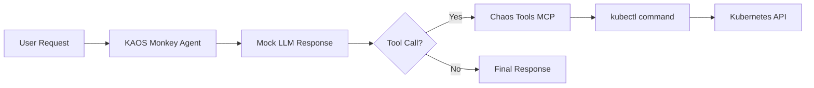

---
jupyter:
  jupytext:
    cell_metadata_filter: -all
    text_representation:
      extension: .md
      format_name: markdown
      format_version: '1.3'
      jupytext_version: 1.19.1
  kernelspec:
    display_name: Python 3 (ipykernel)
    language: python
    name: python3
---

# KAOS Monkey: Kubernetes Chaos Agent

> 📓 **Try it yourself!** This example is available as an executable [Jupyter notebook](/examples/kaos-monkey.ipynb).

This example demonstrates building a "chaos monkey" style agent that can interact with your Kubernetes cluster. The agent uses MCP tools to execute operations, controlled by deterministic mock responses.

::: warning
This example demonstrates powerful capabilities. Use with caution in production environments.
:::

## Prerequisites

- KAOS operator installed ([Installation Guide](/getting-started/installation))
- `kaos-cli` installed
- Access to a Kubernetes cluster

## Overview

We'll create an agent that can:
1. List pods in a namespace
2. Delete specific pods (for chaos testing)
3. Return results of operations

The agent uses **mock responses** for deterministic behavior - this means we control exactly what the LLM "decides" to do, making the example reproducible and testable.

## Setup

First, let's set up the environment and create a unique namespace for this example:

```python
import os, time
# Set namespace as environment variable for shell commands
ns = os.environ.get("TEST_NAMESPACE", f"kaos-monkey-{int(time.time()) % 10000}")
os.environ["NS"] = ns
print(f"Using namespace: {ns}")
```

```python
!kubectl create namespace $NS --dry-run=client -o yaml | kubectl apply -f -
```

## Step 1: Create a ModelAPI

Create a ModelAPI in Proxy mode (we'll use mock responses so no real LLM needed):

```python
!kaos modelapi deploy chaos-api -n $NS --mode Proxy
```

Wait for ModelAPI to be ready:

```python
!kubectl wait deployment/modelapi-chaos-api -n $NS --for=condition=available --timeout=120s
```

## Step 2: Create a Custom MCP Server with Python Tools

We'll create an MCP server with python-string runtime that simulates pod management:

```python
%%writefile /tmp/chaos-mcp.yaml
apiVersion: kaos.tools/v1alpha1
kind: MCPServer
metadata:
  name: chaos-tools
spec:
  runtime: python-string
  params: |
    def list_pods(namespace: str) -> str:
        """List pods in a namespace."""
        import subprocess
        result = subprocess.run(
            ["kubectl", "get", "pods", "-n", namespace, "-o", "name"],
            capture_output=True, text=True
        )
        return result.stdout if result.returncode == 0 else f"Error: {result.stderr}"
    
    def delete_pod(namespace: str, name: str) -> str:
        """Delete a specific pod."""
        import subprocess
        result = subprocess.run(
            ["kubectl", "delete", "pod", name, "-n", namespace, "--ignore-not-found"],
            capture_output=True, text=True
        )
        return f"Deleted pod {name}" if result.returncode == 0 else f"Error: {result.stderr}"
```

```python
!kubectl apply -f /tmp/chaos-mcp.yaml -n $NS
```

Wait for MCP server to be ready:

```python
!kubectl wait deployment/mcpserver-chaos-tools -n $NS --for=condition=available --timeout=120s
```

## Step 3: Create a Test Pod

Create a simple test pod that our chaos agent can target:

```python
!kubectl run chaos-victim -n $NS --image=nginx:alpine --restart=Never
```

Wait for pod to be running:

```python
!kubectl wait pod/chaos-victim -n $NS --for=condition=ready --timeout=60s
```

## Step 4: Create the Chaos Agent

Create the agent with mock responses that will delete the test pod. Each `--mock-response` is consumed in sequence:

```python
# Build mock responses with namespace interpolation
ns = os.environ["NS"]
mock1 = f'I will list the pods first.\n\n```tool_call\n{{"tool": "list_pods", "arguments": {{"namespace": "{ns}"}}}}\n```'
mock2 = f'Found chaos-victim pod. Deleting it now.\n\n```tool_call\n{{"tool": "delete_pod", "arguments": {{"namespace": "{ns}", "name": "chaos-victim"}}}}\n```'
mock3 = "Done! I have deleted the chaos-victim pod to simulate a failure scenario."
```

```python
!kaos agent deploy kaos-monkey -n $NS \
    --modelapi chaos-api \
    --model mock-model \
    --mcp chaos-tools \
    --instructions "You are KAOS Monkey, a chaos engineering agent." \
    --mock-response "$mock1" \
    --mock-response "$mock2" \
    --mock-response "$mock3" \
    --expose
```

Wait for agent to be ready:

```python
!kubectl wait deployment/agent-kaos-monkey -n $NS --for=condition=available --timeout=120s
```

## Step 5: Unleash the Chaos

Now invoke the chaos agent to delete the pod:

```python
!kaos agent invoke kaos-monkey -n $NS --message "Cause some chaos by deleting a pod"
```

## Step 6: Verify the Chaos

Check that the pod was deleted:

```python
import time; time.sleep(2)
!kubectl get pod chaos-victim -n $NS 2>&1 || echo "SUCCESS: Pod was deleted by the chaos agent!"
```

## Understanding Mock Responses

The mock responses include `tool_call` blocks that trigger **real** MCP tool execution - only the LLM reasoning is mocked.

This is essential for:
- **Testing**: Deterministic behavior in CI/CD
- **Cost savings**: No LLM API calls during development
- **Reproducibility**: Same inputs always produce same outputs

## Architecture



## Cleanup

```python
!kubectl delete namespace $NS --ignore-not-found
print(f"Cleaned up namespace: {os.environ['NS']}")
```

## Next Steps

- [Multi-Agent Telemetry](/examples/multi-agent-telemetry) - Add observability
- [Gateway API](/operator/gateway-api) - Secure your agent endpoints
- [Agent CRD Reference](/operator/agent-crd) - Full configuration options
