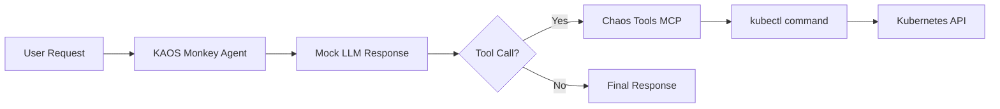

---
jupyter:
  jupytext:
    cell_metadata_filter: -all
    text_representation:
      extension: .md
      format_name: markdown
      format_version: '1.3'
      jupytext_version: 1.19.1
  kernelspec:
    display_name: Python 3 (ipykernel)
    language: python
    name: python3
---

# KAOS Monkey: Kubernetes Chaos Agent

This example demonstrates building a "chaos monkey" style agent that can interact with your Kubernetes cluster. The agent uses MCP tools to execute operations, controlled by deterministic mock responses.

::: warning
This example demonstrates powerful capabilities. Use with caution in production environments.
:::

## Prerequisites

- KAOS operator installed ([Installation Guide](/getting-started/installation))
- `kaos-cli` installed
- Access to a Kubernetes cluster

## Overview

We'll create an agent that can:
1. List pods in a namespace
2. Delete specific pods (for chaos testing)
3. Return results of operations

The agent uses **mock responses** for deterministic behavior - this means we control exactly what the LLM "decides" to do, making the example reproducible and testable.

## Setup

First, let's set up the environment and create a unique namespace for this example:

```python
import os
import subprocess
import time
import json

# Get namespace from environment or create a unique one
namespace = os.environ.get("TEST_NAMESPACE", f"kaos-monkey-{int(time.time()) % 10000}")
print(f"Using namespace: {namespace}")

# Create namespace
subprocess.run(["kubectl", "create", "namespace", namespace], check=False)
```

## Step 1: Create a ModelAPI

Create a ModelAPI in Proxy mode (we'll use mock responses so no real LLM needed):

```python
# Deploy ModelAPI using kaos CLI
result = subprocess.run(
    ["kaos", "modelapi", "deploy", "chaos-api", "-n", namespace, "--mode", "Proxy"],
    capture_output=True, text=True
)
print(result.stdout)
if result.returncode != 0:
    print(f"stderr: {result.stderr}")
```

Wait for ModelAPI to be ready:

```python
# Wait for ModelAPI deployment to be ready
for i in range(60):
    result = subprocess.run(
        ["kubectl", "get", "deployment", "modelapi-chaos-api", "-n", namespace, 
         "-o", "jsonpath={.status.readyReplicas}"],
        capture_output=True, text=True
    )
    if result.stdout.strip() == "1":
        print("ModelAPI is ready!")
        break
    time.sleep(2)
else:
    raise TimeoutError("ModelAPI did not become ready")
```

## Step 2: Create a Custom MCP Server with Python Tools

We'll create an MCP server with python-string runtime that simulates pod management:

```python
# Create MCPServer with python-string runtime
mcp_yaml = f"""
apiVersion: kaos.tools/v1alpha1
kind: MCPServer
metadata:
  name: chaos-tools
  namespace: {namespace}
spec:
  runtime: python-string
  params: |
    def list_pods(namespace: str) -> str:
        \"\"\"List pods in a namespace.\"\"\"
        import subprocess
        result = subprocess.run(
            ["kubectl", "get", "pods", "-n", namespace, "-o", "name"],
            capture_output=True, text=True
        )
        return result.stdout if result.returncode == 0 else f"Error: {{result.stderr}}"
    
    def delete_pod(namespace: str, name: str) -> str:
        \"\"\"Delete a specific pod.\"\"\"
        import subprocess
        result = subprocess.run(
            ["kubectl", "delete", "pod", name, "-n", namespace, "--ignore-not-found"],
            capture_output=True, text=True
        )
        return f"Deleted pod {{name}}" if result.returncode == 0 else f"Error: {{result.stderr}}"
"""

# Apply the MCPServer
result = subprocess.run(
    ["kubectl", "apply", "-f", "-"],
    input=mcp_yaml, capture_output=True, text=True
)
print(result.stdout)
if result.returncode != 0:
    print(f"stderr: {result.stderr}")
```

Wait for MCP server to be ready:

```python
# Wait for MCPServer deployment
for i in range(60):
    result = subprocess.run(
        ["kubectl", "get", "deployment", "mcpserver-chaos-tools", "-n", namespace,
         "-o", "jsonpath={.status.readyReplicas}"],
        capture_output=True, text=True
    )
    if result.stdout.strip() == "1":
        print("MCPServer is ready!")
        break
    time.sleep(2)
else:
    raise TimeoutError("MCPServer did not become ready")
```

## Step 3: Create a Test Pod

Create a simple test pod that our chaos agent can target:

```python
# Create a test pod
pod_yaml = f"""
apiVersion: v1
kind: Pod
metadata:
  name: chaos-victim
  namespace: {namespace}
spec:
  containers:
  - name: nginx
    image: nginx:alpine
  restartPolicy: Never
"""

result = subprocess.run(
    ["kubectl", "apply", "-f", "-"],
    input=pod_yaml, capture_output=True, text=True
)
print(result.stdout)
```

Wait for pod to be running:

```python
# Wait for test pod to be running
for i in range(30):
    result = subprocess.run(
        ["kubectl", "get", "pod", "chaos-victim", "-n", namespace,
         "-o", "jsonpath={.status.phase}"],
        capture_output=True, text=True
    )
    if result.stdout.strip() == "Running":
        print("Test pod is running!")
        break
    time.sleep(2)
else:
    print(f"Pod status: {result.stdout}")
```

## Step 4: Create the Chaos Agent

Create the agent with mock responses that will delete the test pod:

```python
# Mock responses that simulate the agent's decision-making
mock_responses = json.dumps([
    f'I will list the pods first.\n\n```tool_call\n{{"tool": "list_pods", "arguments": {{"namespace": "{namespace}"}}}}\n```',
    f'Found chaos-victim pod. Deleting it now.\n\n```tool_call\n{{"tool": "delete_pod", "arguments": {{"namespace": "{namespace}", "name": "chaos-victim"}}}}\n```',
    'Done! I have deleted the chaos-victim pod to simulate a failure scenario.'
])

# Deploy the chaos agent
result = subprocess.run([
    "kaos", "agent", "deploy", "kaos-monkey",
    "-n", namespace,
    "--modelapi", "chaos-api",
    "--model", "mock-model",
    "--mcp", "chaos-tools",
    "--instructions", "You are KAOS Monkey, a chaos engineering agent.",
    "--mock-response", mock_responses,
    "--expose"
], capture_output=True, text=True)
print(result.stdout)
if result.returncode != 0:
    print(f"stderr: {result.stderr}")
```

Wait for agent to be ready:

```python
# Wait for agent deployment
for i in range(60):
    result = subprocess.run(
        ["kubectl", "get", "deployment", "agent-kaos-monkey", "-n", namespace,
         "-o", "jsonpath={.status.readyReplicas}"],
        capture_output=True, text=True
    )
    if result.stdout.strip() == "1":
        print("Agent is ready!")
        break
    time.sleep(2)
else:
    raise TimeoutError("Agent did not become ready")
```

## Step 5: Unleash the Chaos

Now invoke the chaos agent to delete the pod:

```python
# Invoke the agent
result = subprocess.run([
    "kaos", "agent", "invoke", "kaos-monkey",
    "-n", namespace,
    "--message", "Cause some chaos by deleting a pod"
], capture_output=True, text=True)
print("Agent response:")
print(result.stdout)
if result.returncode != 0:
    print(f"stderr: {result.stderr}")
```

## Step 6: Verify the Chaos

Check that the pod was deleted:

```python
# Verify the pod was deleted
time.sleep(2)
result = subprocess.run(
    ["kubectl", "get", "pod", "chaos-victim", "-n", namespace],
    capture_output=True, text=True
)
if "NotFound" in result.stderr or "chaos-victim" not in result.stdout:
    print("SUCCESS: Pod was deleted by the chaos agent!")
else:
    print(f"Pod still exists: {result.stdout}")
```

## Understanding Mock Responses

The mock responses include `tool_call` blocks that trigger **real** MCP tool execution - only the LLM reasoning is mocked.

This is essential for:
- **Testing**: Deterministic behavior in CI/CD
- **Cost savings**: No LLM API calls during development
- **Reproducibility**: Same inputs always produce same outputs

## Architecture



## Cleanup

```python
# Clean up all resources
subprocess.run(["kubectl", "delete", "namespace", namespace, "--ignore-not-found"], 
               capture_output=True)
print(f"Cleaned up namespace: {namespace}")
```

## Next Steps

- [Multi-Agent Telemetry](/examples/multi-agent-telemetry) - Add observability
- [Gateway API](/operator/gateway-api) - Secure your agent endpoints
- [Agent CRD Reference](/operator/agent-crd) - Full configuration options
