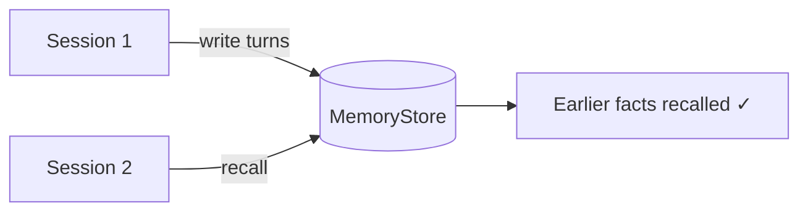

---
jupyter:
  jupytext:
    cell_metadata_filter: -all
    text_representation:
      extension: .md
      format_name: markdown
      format_version: '1.3'
      jupytext_version: 1.19.1
  kernelspec:
    display_name: Python 3 (ipykernel)
    language: python
    name: python3
---

# Cross-Session Memory

> **Try it yourself!** This example is available as an executable [Jupyter notebook](/examples/memory.ipynb).

This example demonstrates KAOS **cross-session memory**. Agents keep a verbatim short-term window of the current conversation and, when bound to a `MemoryStore`, share a central memory service that persists turns and distilled facts beyond a single session. Here we stand up a local-mode `MemoryStore` from a sample and show that turns written under a principal are recalled back in a later, separate session — proving memory survives across sessions.

The checks below are deliberately **model-independent**: the short-term tier is verbatim durable storage, so writing with `infer: false` and recalling exercises real persistence without needing a live model. A [pgvector section](#semantic-long-term-recall-pgvector) at the end shows how to enable genuine semantic long-term recall with a real embedder.

## Understanding the Flow



## Prerequisites

- KAOS operator installed ([Installation Guide](/getting-started/installation))
- `kaos-cli` installed
- Access to a Kubernetes cluster

## Setup

```python
import os
os.environ['NAMESPACE'] = 'memory-example'
```

```bash
kubectl create namespace $NAMESPACE 2>/dev/null || true
kubectl config set-context --current --namespace=$NAMESPACE
```

## Step 1: Deploy the Memory Sample

Deploy the bundled memory sample. It creates a `ModelAPI`, a local-mode `MemoryStore` (embedded Chroma + a SQLite short-term window on a PersistentVolume — no external database), and an `Agent` bound to the store with user scope:

```bash
kaos samples deploy 7-memory-agent --namespace $NAMESPACE
```

## Step 2: Wait for the MemoryStore

The local `MemoryStore` runs a single memory-service replica. Wait for it to report Ready:

```python
import subprocess, time

namespace = os.environ['NAMESPACE']


def jsonpath(kind, name, path):
    out = subprocess.run(
        ["kubectl", "get", kind, name, "-n", namespace, "-o", f"jsonpath={{{path}}}"],
        capture_output=True, text=True,
    )
    return out.stdout.strip()


for _ in range(80):
    ready = jsonpath("memorystore", "shared-memory", ".status.ready")
    phase = jsonpath("memorystore", "shared-memory", ".status.phase")
    if ready == "true" and phase == "Ready":
        print("MemoryStore is Ready")
        break
    time.sleep(3)
else:
    raise AssertionError(f"MemoryStore not Ready (phase={phase!r})")
```

## Step 3: Open a Connection to the Memory Service

Agents reach the store through the in-cluster memory service (`memorystore-shared-memory:8080`). Port-forward it so we can write and recall directly:

```python
import httpx

PORT = 18080
pf = subprocess.Popen(
    ["kubectl", "port-forward", "svc/memorystore-shared-memory",
     f"{PORT}:8080", "-n", namespace],
    stdout=subprocess.PIPE, stderr=subprocess.PIPE,
)
base_url = f"http://localhost:{PORT}"

for _ in range(20):
    try:
        if httpx.get(f"{base_url}/healthz", timeout=2.0).status_code == 200:
            print("Memory service reachable")
            break
    except httpx.HTTPError:
        time.sleep(1)
else:
    raise AssertionError("Memory service did not become reachable")
```

## Step 4: Session 1 — Write a Conversation

Write a couple of turns under the principal `user-42`. `infer: false` stores them verbatim in the short-term window without invoking the extraction model:

```python
scope = {"level": "user", "principal": "user-42"}

write = httpx.post(
    f"{base_url}/v1/write",
    json={
        "scope": scope,
        "turns": [
            {"role": "user", "content": "My favourite deployment port is 8080"},
            {"role": "assistant", "content": "Got it — I'll remember port 8080"},
        ],
        "infer": False,
    },
    timeout=30.0,
)
write.raise_for_status()
assert write.json()["accepted"] is True
print("Session 1 turns written")
```

## Step 5: Session 2 — Recall Across Sessions

A new session is just a new recall against the same principal. The earlier turns come back verbatim, proving the memory persisted across sessions:

```python
recall = httpx.post(
    f"{base_url}/v1/recall",
    json={"scope": scope, "query": "which port", "include_short_term": True},
    timeout=30.0,
)
recall.raise_for_status()
recent = [tuple(pair) for pair in recall.json()["short_term"]["recent"]]
print("Recalled turns:", recent)

assert ("user", "My favourite deployment port is 8080") in recent
assert ("assistant", "Got it — I'll remember port 8080") in recent
print("SUCCESS: earlier session facts recalled in a new session")
```

## Step 6: Scope Isolation

Memory is keyed by scope. A different principal never sees `user-42`'s turns:

```python
other = httpx.post(
    f"{base_url}/v1/recall",
    json={"scope": {"level": "user", "principal": "someone-else"},
          "query": "which port", "include_short_term": True},
    timeout=30.0,
)
other.raise_for_status()
other_recent = [tuple(pair) for pair in other.json()["short_term"]["recent"]]
assert ("user", "My favourite deployment port is 8080") not in other_recent
print("SUCCESS: a different principal cannot see user-42's memory")
```

```python
pf.terminate()
pf.wait()
```

## Semantic Long-Term Recall (pgvector)

The steps above use the verbatim short-term tier, which needs no model. Genuine semantic long-term memory — where the agent distils and recalls facts across sessions in natural conversation — uses the extraction and embedding models and is best backed by pgvector.

Provision a development pgvector Postgres with the installer flag:

```
kaos system install --pgvector-memory-enabled --gateway-enabled --metallb-enabled --wait
```

Then point the sample's `MemoryStore` at it by overriding the `storage` block to `external` mode, referencing the generated `kaos-memory-pgvector` secret:

```
spec:
  storage:
    type: external
    external:
      provider: pgvector
      connectionSecretRef:
        name: kaos-memory-pgvector
        key: dsn
      embeddingDims: 1536
```

With the models pointed at a real provider, write with `infer: true` so facts are extracted into long-term memory, then recall in a later session to see semantic long-term recall. This path needs a real embedder and is verified against a live cluster rather than in the model-independent checks above.

## How It Works

- **Short-term window** — recent turns are stored verbatim per scope and replayed for conversational continuity; no model is needed.
- **Long-term memory** — with `infer: true`, the extraction model distils durable facts that the embedding model makes semantically searchable.
- **Scope** — memory is isolated by scope (`session`, `user`, `shared`), so principals never see each other's memory.
- **Storage** — `local` mode keeps everything in one pod (Chroma + SQLite on a PVC); `external` mode uses pgvector for production and horizontal scaling.

## Cleanup

```bash
kaos samples delete 7-memory-agent --namespace $NAMESPACE 2>/dev/null || true
kubectl delete namespace $NAMESPACE --wait=false 2>/dev/null || true
```
