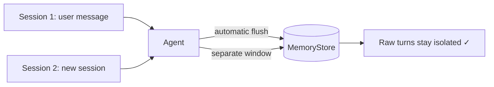

---
jupyter:
  jupytext:
    cell_metadata_filter: -all
    text_representation:
      extension: .md
      format_name: markdown
      format_version: '1.3'
      jupytext_version: 1.19.1
  kernelspec:
    display_name: Python 3 (ipykernel)
    language: python
    name: python3
---

# Agent Memory

> **Try it yourself!** This example is available as an executable [Jupyter notebook](/examples/memory.ipynb).

This example shows how a KAOS **agent** uses a `MemoryStore`. When an agent is bound to a store, the runtime does two things automatically around every request: it **recalls** relevant memory and injects it into the model context *before* the run, and it **persists** the conversation *after* the run. On top of that automatic baseline, `memory.tools` optionally gives the model explicit `save_memory` / `search_memory` tools.

The agent here uses **mock model responses**, so the demonstration is deterministic and needs no live LLM. What we actually verify is the integration: after the agent handles a message, we query the **memory service API** directly and confirm the conversation was written into that session's window, then show that a second session has its own window.

## Understanding the Flow



Every request an agent handles flows through the same memory baseline — recall before, persist after. Verbatim conversational windows are session-local; extracted long-term facts can be recalled across sessions according to the configured scope.

## Prerequisites

- KAOS operator installed ([Installation Guide](/getting-started/installation))
- `kaos-cli` installed
- Access to a Kubernetes cluster

## Setup

```python
import os
os.environ["NAMESPACE"] = "memory-example"
```

```bash
mkdir -p ./tmp
kubectl create namespace "$NAMESPACE" 2>./tmp/null || true
kubectl config set-context --current --namespace="$NAMESPACE"
```

## Step 1: Deploy a Memory-Enabled Agent

We deploy the reusable `memory` sample: one `ModelAPI`, the local-mode `support-memory` store, and three agents with different read entitlements. The primary `user-assistant` uses a mock response, so the example never calls the model.

The important part is the agent's `config.memory` block:

- `memoryStore: support-memory` binds all three agents to the store.
- `user-assistant` uses a user home scope with `defaultReadScope: user`, so the user's facts are auto-recalled on every turn; `session-assistant` is conversation-only, scoped to the current session.
- `agent-bot` keeps agent-scoped memory and exposes no explicit memory tools.
- The store tunes its tiers with typed fields: a small `shortTerm.tokenBudget` makes conversational compaction easy to exercise, and `mediumTerm.enabled` turns on the rolling digest that folds the overflow.

`DEBUG_MOCK_RESPONSES` makes the agent return a canned reply instead of calling the model, so the run is deterministic.

```bash
kaos samples deploy 7-memory-agent -n "$NAMESPACE"
```

## Step 2: Wait for the Store and the Agent

The `MemoryStore` comes up first; the agent's Deployment is only created once its store dependency is Ready.

```bash
for i in $(seq 1 90); do
  phase=$(kubectl get memorystore/support-memory -n "$NAMESPACE" -o jsonpath='{.status.phase}' 2>./tmp/null)
  [ "$phase" = "Ready" ] && break
  sleep 2
done
echo "MemoryStore phase: $phase"

for i in $(seq 1 60); do
  kubectl get deployment/agent-user-assistant -n "$NAMESPACE" >./tmp/null 2>&1 && break
  sleep 2
done
kubectl wait --for=condition=available deployment/agent-user-assistant -n "$NAMESPACE" --timeout=180s
kaos agent tools user-assistant -n "$NAMESPACE" --json
```

The tool output shows `search_memory.parameters_json_schema.properties.level.enum` as `session`, `agent`, `user`, and `group`. Run the same command for `session-assistant` to see its narrower `session`-only entitlement.

## Step 3: Session 1 — Talk to the Agent

Send the agent a fact to remember. This is an ordinary chat request; the agent handles it and, because it is bound to the store, **automatically persists the conversation** afterwards:

```bash
AGENT_PORT=$(kubectl get svc/agent-user-assistant -n "$NAMESPACE" -o jsonpath='{.spec.ports[0].port}')
kubectl port-forward -n "$NAMESPACE" svc/agent-user-assistant "19001:$AGENT_PORT" \
  > ./tmp/memory-agent-port-forward.log 2>&1 &
AGENT_PF=$!
sleep 4
curl --fail --retry 5 --retry-connrefused -s http://localhost:19001/v1/chat/completions \
  -H 'content-type: application/json' \
  -H 'x-principal: alice' \
  -H 'x-session-id: memory-session-1' \
  -d '{"messages": [{"role": "user", "content": "My favourite deployment port is 8080"}]}'
kill "$AGENT_PF" 2>./tmp/null || true
```

## Step 4: Verify the Agent Wrote to the Store

Now we confirm the integration through `kaos memory`. `--all` uses the store's faithful list path, while session scope and `--short-term` return the same conversation's rolling summary and verbatim window:

```bash
kaos memory recall --store support-memory --scope session --session memory-session-1 --all --short-term -n "$NAMESPACE" --json > ./tmp/recall-session1.json
cat ./tmp/recall-session1.json
```

```python
import json

recall = json.load(open("./tmp/recall-session1.json"))
recent = [tuple(pair) for pair in recall["short_term"]["recent"]]
print("Stored turns:", recent)

assert ("user", "My favourite deployment port is 8080") in recent
print("SUCCESS: the agent persisted the conversation to the MemoryStore")
```

## Step 5: Session 2 — A Separate Conversational Window

Recall a different session directly. Its verbatim conversational window starts empty because conversational tiers are always session-keyed:

```bash
kaos memory recall --store support-memory --scope session --session memory-session-2 --all --short-term -n "$NAMESPACE" --json > ./tmp/recall-session2.json
```

```python
recall = json.load(open("./tmp/recall-session2.json"))
recent = [tuple(pair) for pair in recall["short_term"]["recent"]]
print("Session 2 window:", recent)

assert recent == []
print("SUCCESS: each session keeps an independent verbatim window")
```

## Enabling the Tools

The primary `user-assistant` sets `tools: read`. Memory always applies the **automatic baseline** (recall before a run, persist after) — that is what Steps 3–5 exercised. `tools` layers explicit, model-driven tools on top:

| Setting | Tools exposed | Arguments | The model can… |
|---------|---------------|-----------|----------------|
| _(unset)_ | none | — | rely purely on automatic recall/persist |
| `read` | `search_memory` | `query`, required entitled `level` | look facts up at `session`, `agent`, `user`, or `group` when configured |
| `write` | `save_memory` | `content` | save a durable fact at the home scope |
| `all` | both | as above | save and search on demand |

`search_memory` accepts a level but never accepts owner values: the enum is generated from `readScopes`, revalidated by the handler, and combined with the server-derived principal, agent identity, and current session. `save_memory` remains fixed to the home `scope`. Genuine semantic use of `save_memory` (distilling and recalling facts in natural language) needs a real embedding model, shown next.

## Scopes

Memory is partitioned by `scope`, set on the agent's `config.memory` block:

- `session` — one conversation only.
- `group` — extracted facts are shared by every agent and session on the store; raw turns remain session-local.
- `user` — all sessions for an authenticated principal.
- `agent` — only this specific agent.

## Semantic Long-Term Recall (pgvector)

The steps above use the verbatim short-term tier, which needs no model. **Genuine semantic long-term memory** — where the agent distils facts with `save_memory` and recalls them by meaning rather than exact text — uses the embedding model and is best backed by pgvector.

Provision a development pgvector Postgres with the installer flag:

```
kaos system install --pgvector-memory-enabled --gateway-enabled --metallb-enabled --wait
```

Then point the store at it by switching its `storage` block to `external`, referencing the generated `kaos-memory-pgvector` secret, and set the model references to a real provider:

```yaml
spec:
  storage:
    type: external
    external:
      provider: pgvector
      connectionSecretRef:
        name: kaos-memory-pgvector
        key: dsn
      embeddingDims: 1536
```

With a real embedder, a `save_memory` tool call (or automatic extraction) distils durable facts into the long-term vector store, and a later session recalls them semantically. This path is verified against a live cluster rather than in the model-independent checks above.

## How It Works

- **Automatic recall + persist** — bound agents recall relevant memory before every run and persist the conversation after, with no code changes.
- **Short-term window** — recent turns are stored verbatim per session for conversational continuity; no model is needed.
- **Long-term memory** — the embedding model makes distilled facts semantically searchable; `tools: read` lets the primary `user-assistant` search its entitled levels explicitly.
- **Scope** — memory is isolated by scope, so sessions, users, and agents only see what they are entitled to.
- **Storage** — `local` mode keeps everything in one pod (Chroma + SQLite on a PVC); `external` mode uses pgvector for production and horizontal scaling.

## Cleanup

```bash
rm -f ./tmp/recall-session1.json ./tmp/recall-session2.json
kubectl delete namespace "$NAMESPACE" --wait=false 2>./tmp/null || true
```
