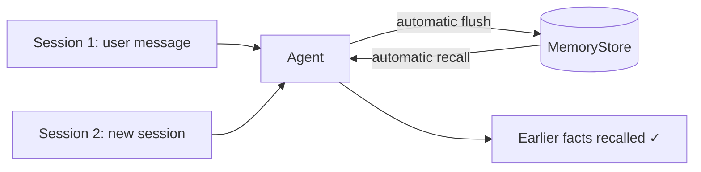

---
jupyter:
  jupytext:
    cell_metadata_filter: -all
    text_representation:
      extension: .md
      format_name: markdown
      format_version: '1.3'
      jupytext_version: 1.19.1
  kernelspec:
    display_name: Python 3 (ipykernel)
    language: python
    name: python3
---

# Agent Memory

> **Try it yourself!** This example is available as an executable [Jupyter notebook](/examples/memory.ipynb).

This example shows how a KAOS **agent** uses a `MemoryStore`. When an agent is bound to a store, the runtime does two things automatically around every request: it **recalls** relevant memory and injects it into the model context *before* the run, and it **persists** the conversation *after* the run. On top of that automatic baseline, `memory.tools` optionally gives the model explicit `save_memory` / `search_memory` tools.

The agent here uses **mock model responses**, so the demonstration is deterministic and needs no live LLM. What we actually verify is the integration: after the agent handles a message, we query the **memory service API** directly and confirm the conversation was written into the central store, then show a second, separate session reading the same memory back.

## Understanding the Flow



Every request an agent handles flows through the same memory baseline — recall before, persist after — so memory written in one session is available to the next.

## Prerequisites

- KAOS operator installed ([Installation Guide](/getting-started/installation))
- `kaos-cli` installed
- Access to a Kubernetes cluster

## Setup

```python
import os
os.environ["NAMESPACE"] = "memory-example"
```

```bash
kubectl create namespace "$NAMESPACE" 2>/dev/null || true
kubectl config set-context --current --namespace="$NAMESPACE"
```

## Step 1: Deploy a Memory-Enabled Agent

We deploy three resources: a `ModelAPI` (never actually called — the agent uses mock responses), a local-mode `MemoryStore` (embedded Chroma + a SQLite short-term window on a PersistentVolume, no external database), and an `Agent` bound to the store.

The important part is the agent's `config.memory` block:

- `memoryStore` binds the agent to the store.
- `scope: shared` keeps a single memory shared across every session of this agent (see [scopes](#scopes) below).
- `tools: all` **enables the explicit memory tools** (`save_memory` and `search_memory`) on top of the automatic recall/persist baseline.

`DEBUG_MOCK_RESPONSES` makes the agent return a canned reply instead of calling the model, so the run is deterministic.

```bash
kubectl apply -n "$NAMESPACE" -f - <<'EOF'
apiVersion: kaos.tools/v1alpha1
kind: ModelAPI
metadata:
  name: memory-modelapi
spec:
  mode: Proxy
  proxyConfig:
    models:
    - "*"
  container:
    env:
    - name: OPENAI_API_KEY
      value: "sk-placeholder"
---
apiVersion: kaos.tools/v1alpha1
kind: MemoryStore
metadata:
  name: shared-memory
spec:
  engine: mem0
  storage:
    type: local
    local:
      provider: chroma
      persistentVolume:
        size: "5Gi"
  models:
    summarization:
      modelAPI: memory-modelapi
      model: gpt-4o-mini
    embedding:
      modelAPI: memory-modelapi
      model: text-embedding-3-small
  defaultFailureMode: soft
---
apiVersion: kaos.tools/v1alpha1
kind: Agent
metadata:
  name: memory-agent
spec:
  modelAPI: memory-modelapi
  model: gpt-4o-mini
  container:
    env:
    - name: DEBUG_MOCK_RESPONSES
      value: '["Noted — your favourite deployment port is 8080."]'
  config:
    description: "An assistant that remembers user facts across sessions"
    instructions: |
      You are a helpful assistant with long-term memory. Remember facts the
      user tells you and recall them in later conversations.
    memory:
      type: remote
      memoryStore: shared-memory
      scope: shared
      tools: all
      failureMode: soft
  agentNetwork:
    expose: true
EOF
```

## Step 2: Wait for the Store and the Agent

The `MemoryStore` comes up first; the agent's Deployment is only created once its store dependency is Ready.

```bash
for i in $(seq 1 90); do
  phase=$(kubectl get memorystore/shared-memory -n "$NAMESPACE" -o jsonpath='{.status.phase}' 2>/dev/null)
  [ "$phase" = "Ready" ] && break
  sleep 2
done
echo "MemoryStore phase: $phase"

for i in $(seq 1 60); do
  kubectl get deployment/agent-memory-agent -n "$NAMESPACE" >/dev/null 2>&1 && break
  sleep 2
done
kubectl wait --for=condition=available deployment/agent-memory-agent -n "$NAMESPACE" --timeout=180s
```

## Step 3: Session 1 — Talk to the Agent

Send the agent a fact to remember. This is an ordinary chat request; the agent handles it and, because it is bound to the store, **automatically persists the conversation** afterwards:

```bash
kaos agent invoke memory-agent -n "$NAMESPACE" \
  -m "My favourite deployment port is 8080"
```

## Step 4: Verify the Agent Wrote to the Store

Now we confirm the integration by asking the **memory service** directly. The agent reaches the store at `memorystore-shared-memory:8080`; we port-forward it and recall the shared scope. The turns the agent just handled are there — proof the agent persisted the conversation to the central store:

```bash
kubectl port-forward -n "$NAMESPACE" svc/memorystore-shared-memory 18080:8080 \
  >/dev/null 2>&1 &
PF=$!
sleep 4
curl -s http://localhost:18080/v1/recall \
  -H 'content-type: application/json' \
  -d '{"scope": {"level": "shared"}, "query": "deployment port", "include_short_term": true}' \
  > recall-session1.json
kill "$PF" 2>/dev/null || true
cat recall-session1.json
```

```python
import json

recall = json.load(open("recall-session1.json"))
recent = [tuple(pair) for pair in recall["short_term"]["recent"]]
print("Stored turns:", recent)

assert ("user", "My favourite deployment port is 8080") in recent
print("SUCCESS: the agent persisted the conversation to the MemoryStore")
```

## Step 5: Session 2 — A New Session Recalls Earlier Memory

`kaos agent invoke` opens a fresh session each time. On this second, separate request the agent's automatic recall pulls the earlier turns from the shared store and injects them into the model context before it answers:

```bash
kaos agent invoke memory-agent -n "$NAMESPACE" \
  -m "What deployment port did I choose earlier?"
```

The store now holds turns from **both** sessions — the agent read the shared memory on this run and wrote to it again. Recall once more to see the cross-session accumulation:

```bash
kubectl port-forward -n "$NAMESPACE" svc/memorystore-shared-memory 18080:8080 \
  >/dev/null 2>&1 &
PF=$!
sleep 4
curl -s http://localhost:18080/v1/recall \
  -H 'content-type: application/json' \
  -d '{"scope": {"level": "shared"}, "query": "deployment port", "include_short_term": true}' \
  > recall-session2.json
kill "$PF" 2>/dev/null || true
```

```python
recall = json.load(open("recall-session2.json"))
recent = [tuple(pair) for pair in recall["short_term"]["recent"]]
print("Cross-session memory:", recent)

assert ("user", "My favourite deployment port is 8080") in recent
assert ("user", "What deployment port did I choose earlier?") in recent
print("SUCCESS: both sessions share one cross-session memory the agent reads and writes")
```

## Enabling the Tools

The agent above sets `tools: all`. Memory always applies the **automatic baseline** (recall before a run, persist after) — that is what Steps 3–5 exercised. `tools` layers explicit, model-driven tools on top:

| Setting | Tools exposed | The model can… |
|---------|---------------|----------------|
| _(unset)_ | none | rely purely on automatic recall/persist |
| `read` | `search_memory` | look facts up on demand |
| `write` | `save_memory` | save a durable fact on demand |
| `all` | both | save and search on demand |

The tools never take a scope from the model — the scope is derived server-side from the agent's configured level and identity, so a tool call can only ever touch memory the agent is entitled to. Genuine semantic use of `save_memory` (distilling and recalling facts in natural language) needs a real embedding model, shown next.

## Scopes

Memory is partitioned by `scope`, set on the agent's `config.memory` block:

- `session` — one conversation only.
- `shared` — shared across every session on the store (used here).
- `user` — all sessions for an authenticated principal.
- `private` — only this specific agent.

## Semantic Long-Term Recall (pgvector)

The steps above use the verbatim short-term tier, which needs no model. **Genuine semantic long-term memory** — where the agent distils facts with `save_memory` and recalls them by meaning rather than exact text — uses the embedding model and is best backed by pgvector.

Provision a development pgvector Postgres with the installer flag:

```
kaos system install --pgvector-memory-enabled --gateway-enabled --metallb-enabled --wait
```

Then point the store at it by switching its `storage` block to `external`, referencing the generated `kaos-memory-pgvector` secret, and set the model references to a real provider:

```yaml
spec:
  storage:
    type: external
    external:
      provider: pgvector
      connectionSecretRef:
        name: kaos-memory-pgvector
        key: dsn
      embeddingDims: 1536
```

With a real embedder, a `save_memory` tool call (or automatic extraction) distils durable facts into the long-term vector store, and a later session recalls them semantically. This path is verified against a live cluster rather than in the model-independent checks above.

## How It Works

- **Automatic recall + persist** — bound agents recall relevant memory before every run and persist the conversation after, with no code changes.
- **Short-term window** — recent turns are stored verbatim per scope for conversational continuity; no model is needed.
- **Long-term memory** — the embedding model makes distilled facts semantically searchable; `tools: all` lets the model save and search them explicitly.
- **Scope** — memory is isolated by scope, so sessions, users, and agents only see what they are entitled to.
- **Storage** — `local` mode keeps everything in one pod (Chroma + SQLite on a PVC); `external` mode uses pgvector for production and horizontal scaling.

## Cleanup

```bash
rm -f recall-session1.json recall-session2.json
kubectl delete namespace "$NAMESPACE" --wait=false 2>/dev/null || true
```
