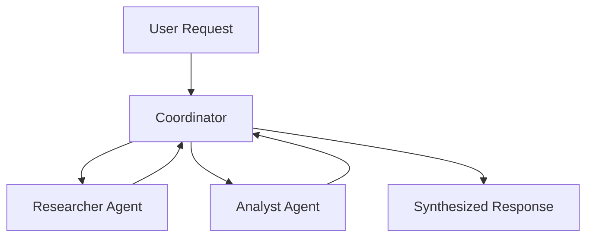

---
jupyter:
  jupytext:
    cell_metadata_filter: -all
    text_representation:
      extension: .md
      format_name: markdown
      format_version: '1.3'
      jupytext_version: 1.19.1
  kernelspec:
    display_name: Python 3 (ipykernel)
    language: python
    name: python3
---

# Multi-Agent System with Telemetry

This example demonstrates building a multi-agent system with delegation between agents. You'll see how a coordinator agent delegates to specialist agents.

## Prerequisites

- KAOS operator installed ([Installation Guide](/getting-started/installation))
- `kaos-cli` installed
- Access to a Kubernetes cluster

## Overview

We'll create:
1. A coordinator agent that delegates to specialists
2. Specialist agents (researcher, analyst) that handle specific tasks
3. Demonstrate agent-to-agent communication via delegation

## Setup

First, let's set up the environment and create a unique namespace:

```python
import os
import subprocess
import time

# Get namespace from environment or create a unique one
namespace = os.environ.get("TEST_NAMESPACE", f"multi-agent-{int(time.time()) % 10000}")
print(f"Using namespace: {namespace}")

# Create namespace
subprocess.run(["kubectl", "create", "namespace", namespace], check=False)
```

## Step 1: Create the ModelAPI

Create a shared ModelAPI for all agents (using mock responses for testing):

```python
# Deploy ModelAPI using kaos CLI
result = subprocess.run(
    ["kaos", "modelapi", "deploy", "team-api", "-n", namespace, "--mode", "Proxy"],
    capture_output=True, text=True
)
print(result.stdout)
if result.returncode != 0:
    print(f"stderr: {result.stderr}")
```

Wait for ModelAPI to be ready:

```python
# Wait for ModelAPI deployment to be ready
for i in range(60):
    result = subprocess.run(
        ["kubectl", "get", "deployment", "modelapi-team-api", "-n", namespace, 
         "-o", "jsonpath={.status.readyReplicas}"],
        capture_output=True, text=True
    )
    if result.stdout.strip() == "1":
        print("ModelAPI is ready!")
        break
    time.sleep(2)
else:
    raise TimeoutError("ModelAPI did not become ready")
```

## Step 2: Create the Researcher Agent

Create a specialist agent that handles research tasks:

```python
# Deploy researcher agent with a single mock response
result = subprocess.run([
    "kaos", "agent", "deploy", "researcher",
    "-n", namespace,
    "--modelapi", "team-api",
    "--model", "mock-model",
    "--instructions", "You are a research specialist. You gather and synthesize information on any topic.",
    "--mock-response", "Here is my research on the topic: AI systems are increasingly being used in enterprise environments. Key trends include automation, decision support, and customer service. Growth is estimated at 40% year-over-year.",
    "--expose"
], capture_output=True, text=True)
print(result.stdout)
if result.returncode != 0:
    print(f"stderr: {result.stderr}")
```

Wait for researcher agent:

```python
# Wait for researcher deployment
for i in range(60):
    result = subprocess.run(
        ["kubectl", "get", "deployment", "agent-researcher", "-n", namespace,
         "-o", "jsonpath={.status.readyReplicas}"],
        capture_output=True, text=True
    )
    if result.stdout.strip() == "1":
        print("Researcher agent is ready!")
        break
    time.sleep(2)
else:
    raise TimeoutError("Researcher agent did not become ready")
```

## Step 3: Create the Analyst Agent

Create another specialist for data analysis:

```python
# Deploy analyst agent with a single mock response
result = subprocess.run([
    "kaos", "agent", "deploy", "analyst",
    "-n", namespace,
    "--modelapi", "team-api",
    "--model", "mock-model",
    "--instructions", "You are a data analyst. You analyze information and provide insights with statistics.",
    "--mock-response", "Based on my analysis: The data shows 40% year-over-year growth in AI adoption. The highest impact areas are customer service automation (60%), decision support systems (25%), and predictive analytics (15%).",
    "--expose"
], capture_output=True, text=True)
print(result.stdout)
if result.returncode != 0:
    print(f"stderr: {result.stderr}")
```

Wait for analyst agent:

```python
# Wait for analyst deployment
for i in range(60):
    result = subprocess.run(
        ["kubectl", "get", "deployment", "agent-analyst", "-n", namespace,
         "-o", "jsonpath={.status.readyReplicas}"],
        capture_output=True, text=True
    )
    if result.stdout.strip() == "1":
        print("Analyst agent is ready!")
        break
    time.sleep(2)
else:
    raise TimeoutError("Analyst agent did not become ready")
```

## Step 4: Create the Coordinator Agent

Create the coordinator that delegates to specialists. The coordinator uses multiple mock responses - one for each step of its reasoning:

```python
# Mock responses for the coordinator
# Note: The delegate block format triggers agent-to-agent communication
mock_resp1 = 'Let me delegate the research portion first.\n\n```delegate\n{"agent": "researcher", "task": "Research AI adoption trends in enterprises"}\n```'
mock_resp2 = 'Now let me get the analyst perspective.\n\n```delegate\n{"agent": "analyst", "task": "Analyze the growth patterns from the research"}\n```'
mock_resp3 = "Based on input from my team: AI is growing with 40% YoY growth, especially in customer service automation."

# Deploy coordinator agent with access to other agents
result = subprocess.run([
    "kaos", "agent", "deploy", "coordinator",
    "-n", namespace,
    "--modelapi", "team-api",
    "--model", "mock-model",
    "--instructions", "You are a coordinator that delegates to specialist agents.",
    "--mock-response", mock_resp1,
    "--mock-response", mock_resp2,
    "--mock-response", mock_resp3,
    "--sub-agent", "researcher",
    "--sub-agent", "analyst",
    "--expose"
], capture_output=True, text=True)
print(result.stdout)
if result.returncode != 0:
    print(f"stderr: {result.stderr}")
    # Check what agents exist
    check = subprocess.run(["kubectl", "get", "agents", "-n", namespace], capture_output=True, text=True)
    print(f"Agents in namespace: {check.stdout}")
```

Wait for coordinator agent:

```python
# Wait for coordinator deployment
for i in range(60):
    result = subprocess.run(
        ["kubectl", "get", "deployment", "agent-coordinator", "-n", namespace,
         "-o", "jsonpath={.status.readyReplicas}"],
        capture_output=True, text=True
    )
    if result.stdout.strip() == "1":
        print("Coordinator agent is ready!")
        break
    time.sleep(2)
else:
    raise TimeoutError("Coordinator agent did not become ready")
```

## Step 5: Test the Multi-Agent System

Send a request to the coordinator and watch it delegate:

```python
# Invoke the coordinator
result = subprocess.run([
    "kaos", "agent", "invoke", "coordinator",
    "-n", namespace,
    "--message", "What are the current trends in enterprise AI adoption?"
], capture_output=True, text=True)
print("Coordinator response:")
print(result.stdout)
if result.returncode != 0:
    print(f"stderr: {result.stderr}")
```

## Step 6: Verify the Result

The coordinator should have delegated to both specialists and synthesized their responses:

```python
# Verify the response contains synthesized information
output = result.stdout.lower()
if "40%" in output or "growth" in output or "yoy" in output:
    print("\nSUCCESS: Multi-agent delegation worked correctly!")
    print("The coordinator synthesized responses from researcher and analyst.")
else:
    print("\nResponse may not contain expected synthesis.")
    print("Check the full output above for details.")
```

## How Delegation Works

The coordinator's mock responses include `delegate` blocks:

```
```delegate
{"agent": "researcher", "task": "Research AI trends"}
```
```

When the agent framework sees this, it:
1. Looks up the `researcher` agent in the sub-agents list
2. Sends the task as a message to that agent
3. Waits for the response
4. Includes the response in the conversation context
5. Continues to the next mock response

## Architecture



## Enabling Telemetry (Production)

For production use, enable OpenTelemetry on your agents:

```yaml
apiVersion: kaos.tools/v1alpha1
kind: Agent
metadata:
  name: coordinator
spec:
  modelAPI: team-api
  model: gpt-4o
  config:
    telemetry:
      enabled: true
      endpoint: "http://otel-collector.monitoring.svc:4317"
```

This sends traces and metrics to your OTEL collector for observability.

## Cleanup

```python
# Clean up all resources
subprocess.run(["kubectl", "delete", "namespace", namespace, "--ignore-not-found"], 
               capture_output=True)
print(f"Cleaned up namespace: {namespace}")
```

## Next Steps

- [Custom MCP Server](/examples/custom-mcp-server) - Build custom tools
- [KAOS Monkey](/examples/kaos-monkey) - Kubernetes management agent
- [Agent CRD Reference](/operator/agent-crd) - Full configuration options
