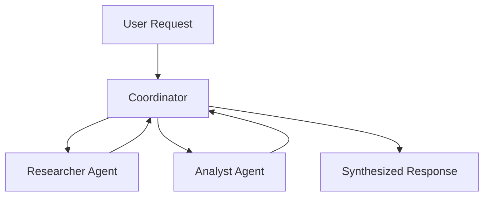

---
jupyter:
  jupytext:
    cell_metadata_filter: -all
    text_representation:
      extension: .md
      format_name: markdown
      format_version: '1.3'
      jupytext_version: 1.19.1
  kernelspec:
    display_name: Python 3 (ipykernel)
    language: python
    name: python3
---

# Multi-Agent System with Telemetry

> **Try it yourself!** This example is available as an executable [Jupyter notebook](/examples/multi-agent-telemetry.ipynb).

This example demonstrates building a multi-agent system with delegation between agents. You'll see how a coordinator agent delegates to specialist agents.

## Understanding the Flow



## Prerequisites

- KAOS operator installed ([Installation Guide](/getting-started/installation))
- `kaos-cli` installed
- Access to a Kubernetes cluster

## Overview

We'll create:
1. A coordinator agent that delegates to specialists
2. Specialist agents (researcher, analyst) that handle specific tasks
3. Demonstrate agent-to-agent communication via delegation

## Setup

First, let's set up the environment and create a namespace:

```python
import os
os.environ['NAMESPACE'] = 'kaos-agent-telemetry-example'
```

```bash
kubectl create namespace $NAMESPACE 2>/dev/null || true
kubectl config set-context --current --namespace=$NAMESPACE
```

## Step 1: Create the ModelAPI

Create a shared ModelAPI for all agents (using mock responses for testing):

```bash
kaos modelapi deploy team-api --mode proxy
```

Wait for ModelAPI to be ready:

```bash
kubectl wait deployment/modelapi-team-api --for=condition=available --timeout=120s
```

## Step 2: Create the Researcher Agent

Create a specialist agent that handles research tasks:

```bash
kaos agent deploy researcher \
    --modelapi team-api \
    --model mock-model \
    --instructions "You are a research specialist. You gather and synthesize information on any topic." \
    --mock-response "Here is my research on the topic: AI systems are increasingly being used in enterprise environments. Key trends include automation, decision support, and customer service. Growth is estimated at 40% year-over-year." \
    --expose
```

Wait for researcher agent:

```bash
kubectl wait deployment/agent-researcher --for=condition=available --timeout=120s
```

## Step 3: Create the Analyst Agent

Create another specialist for data analysis:

```bash
kaos agent deploy analyst \
    --modelapi team-api \
    --model mock-model \
    --instructions "You are a data analyst. You analyze information and provide insights with statistics." \
    --mock-response "Based on my analysis: The data shows 40% year-over-year growth in AI adoption. The highest impact areas are customer service automation (60%), decision support systems (25%), and predictive analytics (15%)." \
    --expose
```

Wait for analyst agent:

```bash
kubectl wait deployment/agent-analyst --for=condition=available --timeout=120s
```

## Step 4: Create the Coordinator Agent

Create the coordinator that delegates to specialists. The coordinator uses multiple mock responses - one for each step of its reasoning:


```bash
kaos agent deploy coordinator \
    --modelapi team-api \
    --model mock-model \
    --instructions "You are a coordinator that delegates to specialist agents." \
    --mock-response $'Let me delegate the research portion first.\n\n```delegate\n{"agent": "researcher", "task": "Research AI adoption trends in enterprises"}\n```' \
    --mock-response $'Now let me get the analyst perspective.\n\n```delegate\n{"agent": "analyst", "task": "Analyze the growth patterns from the research"}\n```' \
    --mock-response "Based on input from my team: AI is growing with 40% YoY growth, especially in customer service automation." \
    --sub-agent researcher \
    --sub-agent analyst \
    --expose
```

Wait for coordinator agent:

```bash
kubectl wait deployment/agent-coordinator --for=condition=available --timeout=120s
```

## Step 5: Test the Multi-Agent System

Send a request to the coordinator and watch it delegate:

```python
import subprocess
result = subprocess.run(
    ["kaos", "agent", "invoke", "coordinator", "--message", "What are the current trends in enterprise AI adoption?"],
    capture_output=True, text=True
)
print(result.stdout)
if result.returncode != 0:
    print(result.stderr)
    raise AssertionError(f"Agent invoke failed with code {result.returncode}")
```

## Step 6: Verify the Result

The coordinator should have delegated to both specialists and synthesized their responses:

```python
# Verify we got a meaningful response containing expected content
if "40%" in result.stdout or "growth" in result.stdout.lower():
    print("\nSUCCESS: Multi-agent delegation worked correctly!")
    print("The coordinator synthesized responses from researcher and analyst.")
else:
    raise AssertionError(f"Unexpected response - delegation may have failed: {result.stdout}")
```

## Enabling Telemetry (Production)

For production use, enable OpenTelemetry on your agents using the `--otel-endpoint` flag:

```bash
kaos agent deploy coordinator --modelapi team-api --model gpt-4o \
    --otel-endpoint "http://otel-collector.monitoring.svc:4317"
```

Or via YAML:

```yaml
apiVersion: kaos.tools/v1alpha1
kind: Agent
metadata:
  name: coordinator
spec:
  modelAPI: team-api
  model: gpt-4o
  config:
    telemetry:
      enabled: true
      endpoint: "http://otel-collector.monitoring.svc:4317"
```

This sends traces and metrics to your OTEL collector for observability.

## How Delegation Works

The coordinator's mock responses include `delegate` blocks:

```
```delegate
{"agent": "researcher", "task": "Research AI trends"}
```
```

When the agent framework sees this, it:
1. Looks up the `researcher` agent in the sub-agents list
2. Sends the task as a message to that agent
3. Waits for the response
4. Includes the response in the conversation context
5. Continues to the next mock response

## Cleanup

```bash
kubectl delete namespace $NAMESPACE
```

## Next Steps

- [Custom MCP Server](/examples/custom-mcp-server) - Build custom tools
- [KAOS Monkey](/examples/kaos-monkey) - Kubernetes management agent
- [Agent CRD Reference](/operator/agent-crd) - Full configuration options
