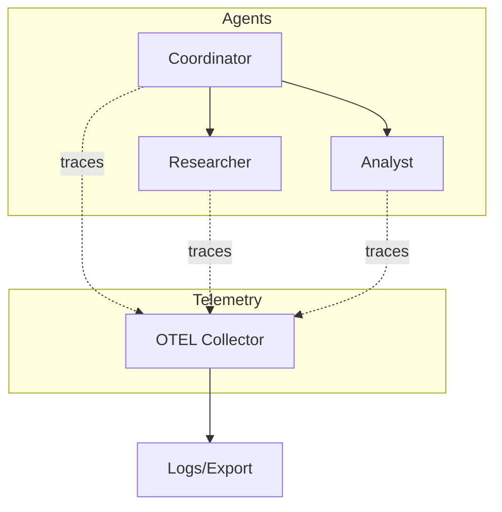

# Multi-Agent System with Telemetry

This example demonstrates building a multi-agent system with OpenTelemetry observability. You'll see how to track agent interactions, tool calls, and delegation events across your agent network.

## Prerequisites

- KAOS operator installed with telemetry enabled ([Installation Guide](/getting-started/installation))
- `kaos-cli` installed
- Helm (for deploying OTEL collector)

## Overview

We'll create:
1. An OTEL collector to receive telemetry
2. A coordinator agent that delegates to specialists
3. Specialist agents for different tasks
4. Dashboard to view traces and metrics

## Step 1: Deploy the OTEL Collector

First, deploy an OpenTelemetry collector to receive agent telemetry:

```console
# Create monitoring namespace
$ kubectl create namespace monitoring

# Deploy a simple OTEL collector
$ kubectl apply -f - <<EOF
apiVersion: v1
kind: ConfigMap
metadata:
  name: otel-collector-config
  namespace: monitoring
data:
  config.yaml: |
    receivers:
      otlp:
        protocols:
          grpc:
            endpoint: 0.0.0.0:4317
          http:
            endpoint: 0.0.0.0:4318
    
    processors:
      batch:
        timeout: 1s
    
    exporters:
      logging:
        verbosity: detailed
    
    service:
      pipelines:
        traces:
          receivers: [otlp]
          processors: [batch]
          exporters: [logging]
        metrics:
          receivers: [otlp]
          processors: [batch]
          exporters: [logging]
---
apiVersion: apps/v1
kind: Deployment
metadata:
  name: otel-collector
  namespace: monitoring
spec:
  replicas: 1
  selector:
    matchLabels:
      app: otel-collector
  template:
    metadata:
      labels:
        app: otel-collector
    spec:
      containers:
        - name: collector
          image: otel/opentelemetry-collector:0.96.0
          args: ["--config=/etc/otel/config.yaml"]
          ports:
            - containerPort: 4317
            - containerPort: 4318
          volumeMounts:
            - name: config
              mountPath: /etc/otel
      volumes:
        - name: config
          configMap:
            name: otel-collector-config
---
apiVersion: v1
kind: Service
metadata:
  name: otel-collector
  namespace: monitoring
spec:
  ports:
    - name: grpc
      port: 4317
    - name: http
      port: 4318
  selector:
    app: otel-collector
EOF
```

Wait for the collector to be ready:

```console
$ kubectl get pods -n monitoring -w
```

## Step 2: Create the ModelAPI

Create a shared ModelAPI for all agents (using mock responses for testing):

```console
$ kaos modelapi deploy telemetry-api --mode Proxy
```

## Step 3: Create Specialist Agents

Create worker agents with telemetry enabled:

```yaml
# agents.yaml
apiVersion: kaos.tools/v1alpha1
kind: Agent
metadata:
  name: researcher
spec:
  modelAPI: telemetry-api
  model: gpt-4o
  config:
    description: "Research specialist agent"
    instructions: "You gather and synthesize information on any topic."
    telemetry:
      enabled: true
      endpoint: "http://otel-collector.monitoring.svc:4317"
  container:
    env:
      - name: DEBUG_MOCK_RESPONSES
        value: '["Here is my research on the topic: AI systems are increasingly being used in enterprise environments for automation, decision support, and customer service."]'
  agentNetwork:
    expose: true
---
apiVersion: kaos.tools/v1alpha1
kind: Agent
metadata:
  name: analyst
spec:
  modelAPI: telemetry-api
  model: gpt-4o
  config:
    description: "Data analyst agent"
    instructions: "You analyze information and provide insights."
    telemetry:
      enabled: true
      endpoint: "http://otel-collector.monitoring.svc:4317"
  container:
    env:
      - name: DEBUG_MOCK_RESPONSES
        value: '["Based on my analysis: The trend shows 40% year-over-year growth in AI adoption, with the highest impact in customer service automation."]'
  agentNetwork:
    expose: true
---
apiVersion: kaos.tools/v1alpha1
kind: Agent
metadata:
  name: coordinator
spec:
  modelAPI: telemetry-api
  model: gpt-4o
  config:
    description: "Coordinator that delegates to specialists"
    instructions: |
      You coordinate between specialist agents:
      - researcher: For gathering information
      - analyst: For analyzing data
      
      Break down complex requests and delegate appropriately.
    telemetry:
      enabled: true
      endpoint: "http://otel-collector.monitoring.svc:4317"
  container:
    env:
      - name: DEBUG_MOCK_RESPONSES
        value: |
          [
            "I'll delegate the research portion first.\n\n```delegate\n{\"agent\": \"researcher\", \"task\": \"Research AI adoption trends in enterprises\"}\n```",
            "Now let me get the analyst's perspective.\n\n```delegate\n{\"agent\": \"analyst\", \"task\": \"Analyze the growth patterns from the research\"}\n```",
            "Based on input from my team:\n\n**Research Summary:** AI is growing in enterprise use.\n\n**Analysis:** 40% YoY growth, especially in customer service.\n\nThe trend indicates continued expansion in AI-powered automation."
          ]
  agentNetwork:
    expose: true
    access:
      - researcher
      - analyst
```

Apply the agents:

```console
$ kubectl apply -f agents.yaml

# Wait for all agents to be ready
$ kubectl get agents -w
```

## Step 4: Test the Multi-Agent System

Send a request to the coordinator:

```console
$ kaos agent invoke coordinator \
  --message "Analyze the current trends in enterprise AI adoption"
```

The coordinator will:
1. Delegate to the researcher
2. Delegate to the analyst  
3. Synthesize the responses

## Step 5: View Telemetry Data

Check the OTEL collector logs to see traces:

```console
$ kubectl logs -n monitoring -l app=otel-collector --tail=100
```

You should see spans like:
- `agent.process_message` - Main request handling
- `agent.delegation.request` - Outbound delegation
- `agent.delegation.response` - Delegation result
- `agent.model.completion` - LLM calls

## Telemetry Architecture



## Available Metrics

When telemetry is enabled, agents emit:

| Metric | Type | Description |
|--------|------|-------------|
| `kaos.requests` | Counter | Total requests processed |
| `kaos.tool_calls` | Counter | Tool invocations |
| `kaos.delegations` | Counter | Agent-to-agent delegations |
| `kaos.tokens` | Counter | LLM tokens used |
| `kaos.latency` | Histogram | Request latency |

## Production Setup with SigNoz

For production, use SigNoz for visualization:

```console
# Install SigNoz in monitoring namespace
$ helm repo add signoz https://charts.signoz.io
$ helm install signoz signoz/signoz -n monitoring

# Update agents to point to SigNoz
$ kubectl patch agent coordinator --type=merge -p '
{
  "spec": {
    "config": {
      "telemetry": {
        "endpoint": "http://signoz-otel-collector.monitoring.svc:4317"
      }
    }
  }
}'
```

Then open the UI with telemetry:

```console
$ kaos ui --monitoring-enabled
```

## Trace Propagation

Traces propagate across agent boundaries. A single user request generates a trace tree:

```
coordinator (root span)
├── model.completion
├── delegation.request [researcher]
│   └── researcher (child trace)
│       └── model.completion
├── delegation.request [analyst]
│   └── analyst (child trace)
│       └── model.completion
└── model.completion (final)
```

## Cleanup

```console
$ kaos agent delete coordinator researcher analyst
$ kaos modelapi delete telemetry-api
$ kubectl delete namespace monitoring
```

## Next Steps

- [OpenTelemetry Reference](/operator/telemetry) - Full telemetry configuration
- [Custom MCP Server](/examples/custom-mcp-server) - Build custom tools
- [Agent CRD Reference](/operator/agent-crd) - Agent configuration options
