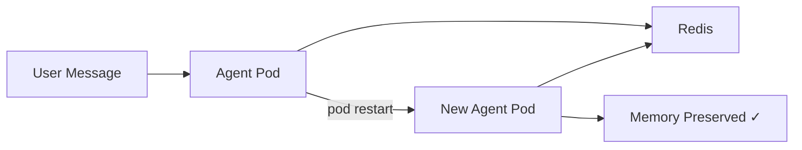

---
jupyter:
  jupytext:
    cell_metadata_filter: -all
    text_representation:
      extension: .md
      format_name: markdown
      format_version: '1.3'
      jupytext_version: 1.19.1
  kernelspec:
    display_name: Python 3 (ipykernel)
    language: python
    name: python3
---

# Redis Distributed Memory

> **Try it yourself!** This example is available as an executable [Jupyter notebook](/examples/redis-memory.ipynb).

This example demonstrates using **Redis-backed distributed memory** so that agent conversation history survives pod restarts. By default agents use in-memory storage which is lost when a pod is recycled — Redis makes sessions durable across replicas and restarts.

## Understanding the Flow



## Prerequisites

- KAOS operator installed ([Installation Guide](/getting-started/installation))
- `kaos-cli` installed
- Access to a Kubernetes cluster

## Global Install (Recommended)

When installing KAOS with `--redis-enabled`, Redis is deployed automatically and all agents default to Redis memory — no per-agent configuration needed:

```{note}
kaos system install --redis-enabled --gateway-enabled --metallb-enabled --wait
```

This sets `agentDefaults.memory.type=redis` and `agentDefaults.memory.redisUrl` in the Helm values, so every agent created after install will use Redis memory by default.

## Setup

For this walkthrough we'll configure Redis and memory explicitly so you can see all the moving parts. If you installed with `--redis-enabled` above, the global defaults already handle this and the explicit env vars below are not necessary.

```python
import os
os.environ['NAMESPACE'] = 'redis-memory-example'
```

```bash
kubectl create namespace $NAMESPACE 2>/dev/null || true
kubectl config set-context --current --namespace=$NAMESPACE
```

## Step 1: Deploy Redis

Deploy a lightweight Redis instance in the namespace:

```bash
kubectl apply -f - <<'EOF'
apiVersion: apps/v1
kind: Deployment
metadata:
  name: redis
spec:
  replicas: 1
  selector:
    matchLabels:
      app: redis
  template:
    metadata:
      labels:
        app: redis
    spec:
      containers:
      - name: redis
        image: redis:7-alpine
        ports:
        - containerPort: 6379
---
apiVersion: v1
kind: Service
metadata:
  name: redis
spec:
  selector:
    app: redis
  ports:
  - port: 6379
    targetPort: 6379
EOF
```

```bash
kubectl wait --for=condition=available deployment/redis --timeout=120s
```

## Step 2: Create a ModelAPI

Create a ModelAPI in Proxy mode (we'll use mock responses so no real LLM needed):

```bash
kaos modelapi deploy redis-api --mode Proxy --wait
```

## Step 3: Create the Agent with Redis Memory

Deploy an agent with Redis memory enabled. The `--env` flags configure the memory backend explicitly:

```bash
REDIS_URL="redis://redis.$NAMESPACE.svc.cluster.local:6379"

kaos agent deploy memory-agent \
    --modelapi redis-api \
    --model mock-model \
    --mock-response "I remember everything, even across restarts!" \
    --env "MEMORY_TYPE=redis" \
    --env "MEMORY_REDIS_URL=$REDIS_URL" \
    --instructions "You are a helpful assistant with persistent memory." \
    --expose \
    --wait
```

## Step 4: Send a Message

Invoke the agent to create a conversation that gets stored in Redis:

```bash
kaos agent invoke memory-agent --message "Remember this: the secret code is 42"
```

## Step 5: Verify Memory is Stored

Check that the memory events were persisted:

```python
import subprocess, json

result = subprocess.run(
    ["kubectl", "exec", "deploy/redis", "--",
     "redis-cli", "KEYS", "kaos:memory:*"],
    capture_output=True, text=True
)
print("Redis keys:", result.stdout.strip())

keys = [k for k in result.stdout.strip().split("\n") if k]
if len(keys) >= 2:
    print("SUCCESS: Memory events are stored in Redis!")
else:
    raise AssertionError(f"Expected Redis keys for session + events, got: {keys}")
```

## Step 6: Restart the Agent Pod

Delete the agent pod to simulate a restart. The deployment controller will recreate it automatically:

```bash
kubectl delete pods -l agent=memory-agent
kubectl rollout status deployment/agent-memory-agent --timeout=180s
```

Allow the new pod time to initialize and connect to Redis:

```python
import subprocess, time

for attempt in range(24):
    ready = subprocess.run(
        ["kubectl", "get", "pods", "-l", "agent=memory-agent",
         "-o", "jsonpath={.items[0].status.conditions[?(@.type=='Ready')].status}"],
        capture_output=True, text=True
    )
    if ready.stdout.strip() == "True":
        print("Agent pod is ready!")
        break
    time.sleep(5)
else:
    debug = subprocess.run(["kubectl", "get", "pods", "-A"], capture_output=True, text=True)
    print(f"All pods:\n{debug.stdout}")
    raise AssertionError("Agent pod did not become ready after restart")
```

## Step 7: Verify Memory Survived

After the pod restart, check that the conversation history is still available in Redis — this is the key benefit of distributed memory:

```python
import subprocess

result = subprocess.run(
    ["kubectl", "exec", "deploy/redis", "--",
     "redis-cli", "KEYS", "kaos:memory:*"],
    capture_output=True, text=True
)

keys = [k for k in result.stdout.strip().split("\n") if k]
events_keys = [k for k in keys if ":events:" in k]

if events_keys:
    # Check the actual events in the list
    result = subprocess.run(
        ["kubectl", "exec", "deploy/redis", "--",
         "redis-cli", "LRANGE", events_keys[0], "0", "-1"],
        capture_output=True, text=True
    )
    events = result.stdout.strip().split("\n")
    event_types = []
    for e in events:
        try:
            import json
            data = json.loads(e)
            event_types.append(data.get("event_type", ""))
        except (json.JSONDecodeError, ValueError):
            pass

    if "user_message" in event_types:
        print(f"SUCCESS: Memory survived pod restart! Found {len(events)} events.")
        print(f"Event types: {event_types}")
    else:
        raise AssertionError(f"Expected user_message in events, got: {event_types}")
else:
    raise AssertionError(f"No events keys found in Redis after restart: {keys}")
```

## How It Works

With Redis memory:
- **Sessions** are stored as Redis hashes (`HSET`/`HGETALL`)
- **Events** are stored as append-only lists (`RPUSH`/`LRANGE`) with automatic trimming
- **Session index** tracks active sessions with sorted sets (`ZADD`/`ZRANGE`)
- **TTL** is applied to session and event keys for automatic cleanup
- All writes are **pipelined** for efficiency and consistency

## Cleanup

```bash
kubectl delete namespace $NAMESPACE --wait=false
```

## Next Steps

- [Agent CRD Reference](/operator/agent-crd) - Full memory configuration options
- [KAOS Monkey](/examples/kaos-monkey) - Agent with MCP tools
- [Multi-Agent Telemetry](/examples/multi-agent-telemetry) - Add observability
