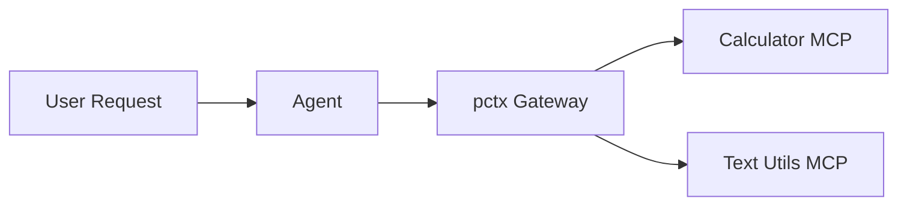

---
jupyter:
  jupytext:
    cell_metadata_filter: -all
    text_representation:
      extension: .md
      format_name: markdown
      format_version: '1.3'
      jupytext_version: 1.19.1
  kernelspec:
    display_name: Python 3 (ipykernel)
    language: python
    name: python3
---

# Optimized MCPs with Unified Code Mode

> **Try it yourself!** This example is available as an executable [Jupyter notebook](/examples/unified-mcp-gateway.ipynb).

This example demonstrates building an **optimized MCP gateway** using [pctx (Port of Context)](https://github.com/portofcontext/pctx). The pctx runtime aggregates multiple MCP servers into a single endpoint, exposing them through a powerful "Code Mode" interface that reduces token usage by up to 98%.

## Understanding Code Mode

With traditional MCP, each tool call requires an LLM round-trip, which means expensive tokens with context flying in and out:

```
LLM: "I'll call add(42, 8)"      -> Tool executes -> Result
LLM: "Now I'll call multiply"    -> Tool executes -> Result
LLM: "Now I'll call power"       -> Tool executes -> Result
LLM: "Now I'll call uppercase"   -> Tool executes -> Result
LLM: "Now I'll call word count"   -> Tool executes -> Result
LLM: "Here's the final answer"
```

With Code Mode, the agent writes TypeScript that executes all tools in one call which means we save significant amount of tokens and time:

```typescript .noeval
LLM: "I'll call the following set of mcpservers in the code mode execution sandbox:

    '''
        const sum = await calc.add({a: 42, b: 8});
        const product = await calc.multiply({x: sum, y: 2});
        const squared = await calc.power({base: product, exponent: 2});
        const wordCount = await text.word_count({text: "The answer is " + squared});
        const result = await text.uppercase({text: "result: " + squared + " (words: " + wordCount + ")"});
        return result;
    '''
        -> Tool executes -> Result
LLM: "Here's the final answer"
```

This reduces:
- **LLM round-trips**: From N+1 to 2 (code generation + final response)
- **Token usage**: Up to 98% reduction for complex workflows
- **Latency**: Dramatically faster for multi-step operations

## Architecture



### Why pctx?
pctx aggregates multiple MCP servers and exposes them through TypeScript namespaces. Each server becomes a namespace (e.g., `calc.add()`, `text.uppercase()`), enabling complex multi-tool orchestration in a single code block.

The pctx config supports:
- **Multiple servers**: Aggregate any number of MCP servers
- **Custom namespaces**: Server names become TypeScript namespaces
- **Authentication**: Add bearer tokens or custom headers
- **External servers**: Reference any HTTP MCP endpoint

## Prerequisites

- KAOS operator installed ([Installation Guide](/getting-started/installation))
- `kaos-cli` installed
- Access to a Kubernetes cluster

## Setup

First, let's set up the environment and create a namespace:

```python
import os
os.environ['NAMESPACE'] = 'pctx-gateway-example'
```

```bash
kubectl create namespace $NAMESPACE 2>/dev/null || true
kubectl config set-context --current --namespace=$NAMESPACE
```

## Step 1: Create a ModelAPI

Create a ModelAPI in Proxy mode (we'll use mock responses for determinism):

```bash
kaos modelapi deploy gateway-api --mode Proxy --wait
```

## Step 2: Create Upstream MCP Servers

We'll create two MCP servers showing both deployment methods.

### Calculator MCP Server (CLI method)

Deploy using the `kaos mcp deploy` command with `--wait` flag:

```bash
export CALC_FUNCS='
def add(a: int, b: int) -> int:
    """Add two numbers together."""
    return a + b

def multiply(x: int, y: int) -> int:
    """Multiply two numbers."""
    return x * y

def power(base: int, exponent: int) -> int:
    """Raise base to the power of exponent."""
    return base ** exponent
'

kaos mcp deploy calculator \
    --runtime python-string \
    --params "$CALC_FUNCS" \
    --wait
```

### Text Utils MCP Server (CRD method)

MCP Servers and other resources can also be deployed directly with the k8s CRD instead of the CLI:

```bash
kubectl apply -f - << EOF
apiVersion: kaos.tools/v1alpha1
kind: MCPServer
metadata:
  name: textutils
spec:
  runtime: python-string
  params: |
    def uppercase(text: str) -> str:
        """Convert text to uppercase."""
        return text.upper()

    def reverse(text: str) -> str:
        """Reverse the characters in text."""
        return text[::-1]

    def word_count(text: str) -> int:
        """Count the number of words in text."""
        return len(text.split())
EOF

kubectl wait mcpserver/textutils --for=jsonpath='{.status.ready}'=true --timeout=180s
```

## Step 3: Create the pctx Gateway

Create the pctx gateway that aggregates both upstream servers:

```bash
export PCTX_CONFIG='
{
  "name": "unified-gateway",
  "version": "1.0.0",
  "servers": [
    {
      "name": "calc",
      "url": "http://mcpserver-calculator.'$NAMESPACE'.svc.cluster.local:8000/mcp"
    },
    {
      "name": "text",
      "url": "http://mcpserver-textutils.'$NAMESPACE'.svc.cluster.local:8000/mcp"
    }
  ]
}'

kaos mcp deploy unified-gateway --runtime pctx --params "$PCTX_CONFIG" --wait
```

## Step 4: Create the Agent

Create an agent connected to the pctx gateway. The mock responses demonstrate Code Mode - the agent writes TypeScript that calls multiple tools in sequence using pctx's `execute` tool:

```bash
# Define the mock code response with formatted TypeScript
# pctx exposes the "execute" tool for running TypeScript code
MOCK_CODE="{\
  \"tool\": \"execute\",\
  \"arguments\": {\
    \"code\": \"\
		async function run() {\
			const sum = await Calc.add({a: 42, b: 8});\
			const product = await Calc.multiply({x: sum.result, y: 2});\
			const squared = await Calc.power({base: product.result, exponent: 2});\
			const wc = await Text.wordCount({text: 'The answer is ' + squared.result});\
			const result = await Text.uppercase({text: 'RESULT: ' + squared.result + ' (' + wc.result + ' words)'});\
			return result;\
		}\"\
  }\
}"

MOCK_END='{}'
MOCK_FINAL='I executed a complex calculation chain: 42+8=50, 50*2=100, 100^2=10000. The final result formatted in uppercase is "RESULT: 10000 (4 WORDS)".'

kaos agent deploy gateway-agent \
    --modelapi gateway-api \
    --model mock-model \
    --mcp unified-gateway \
    --instructions "You use Code Mode to orchestrate multiple tools efficiently." \
    --mock-response "$MOCK_CODE" \
    --mock-response "$MOCK_END" \
    --mock-response "$MOCK_FINAL" \
    --expose \
    --wait
```

## Step 5: Invoke the Agent

Send a request that triggers multi-tool orchestration:

```bash
kaos agent invoke gateway-agent --message "Calculate (42+8)*2, square it, count the words in the result description, and format everything in uppercase"
```

## Step 6: Verify Agent Status

Check that the agent has discovered tools from the pctx gateway:

```bash
kaos agent status gateway-agent
```

Verify the output shows `tool_execution` capability:

```bash
kaos agent status gateway-agent --json | grep -q "tool_execution" || exit 1
```

## Step 7: Verify Memory Events

Check that tool calls were recorded in memory and no errors occurred:

```bash
kaos agent memory gateway-agent
```

Verify a tool_call event exists and no errors were recorded:

```bash
# Check tool_call event exists
kaos agent memory gateway-agent --json | grep -q "tool_call" || exit 1
# Check no tool errors occurred
kaos agent memory gateway-agent --json | grep -q "tool_error" && exit 1 || true
# Check no pctx errors occurred
kaos agent memory gateway-agent --json | grep -q '"success": false' && exit 1 || true
# Check that there was an explicit pass on pctx
kaos agent memory gateway-agent --json | grep -q '"success": true' || exit 1
```

## Cleanup

```bash
kubectl delete namespace $NAMESPACE
```

## Next Steps

- [KAOS Monkey](/examples/kaos-monkey) - Chaos engineering with Kubernetes MCP
- [MCPServer CRD Reference](/operator/mcpserver-crd) - Full pctx configuration
- [pctx Documentation](https://github.com/portofcontext/pctx) - Upstream project
