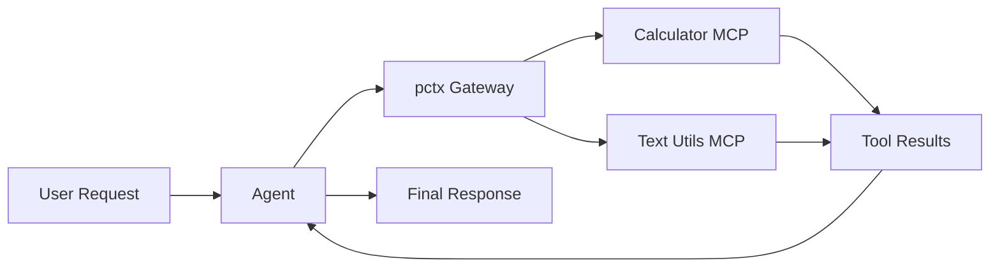

---
jupyter:
  jupytext:
    cell_metadata_filter: -all
    text_representation:
      extension: .md
      format_name: markdown
      format_version: '1.3'
      jupytext_version: 1.19.1
  kernelspec:
    display_name: Python 3 (ipykernel)
    language: python
    name: python3
---

# Optimized MCPs with Unified Code Mode

> **Try it yourself!** This example is available as an executable [Jupyter notebook](/examples/unified-mcp-gateway.ipynb).

This example demonstrates building an **optimized MCP gateway** using [pctx (Port of Context)](https://github.com/portofcontext/pctx). The pctx runtime aggregates multiple MCP servers into a single endpoint, exposing them through a powerful "Code Mode" interface that reduces token usage by up to 98%.

## Understanding Code Mode

With traditional MCP, each tool call requires an LLM round-trip:

```
LLM: "I'll call add(42, 8)"       → Tool executes → Result
LLM: "Now I'll call multiply"    → Tool executes → Result
LLM: "Now I'll call uppercase"   → Tool executes → Result
LLM: "Here's the final answer"
```

With Code Mode, the agent writes TypeScript that executes all tools in one callWith Code Mode, the agent / All tools execute in a single LLM round-trip
With Csum = await calc.add({a: 42, b: 8});
const product = await calc.multiply({x: const product = await calc.multiply({xc.pconst product = await calc.multiply({x: const product = await calc.multiply({xc.pconst product = await calc.multiply({x: sult = await text.uppercase({text: "result: " + squared + " (words: " + wordCount + ")"});
return result;
```

This reduces:
- **LLM round-trips**: From N+1 to 2 (code generation + final response)
- **Token usage**: Up to 98% reduction for complex workflows
- **Latency**: Dramatically faster for multi-step operations

## Architecture



::: tip Why pctx?
pctx aggregates multiple MCP servers and exposes them through TypeScript namespaces. Each server becomes a namespace (e.g., `calc.add()`, `text.uppercase()`), enabling complex multi-tool orchestration in a single code block.
:::

## Prerequisites

- KAOS operator installed ([Installation Guide](/getting-started/installation))
- `kaos-cli` installed
- Access to a Kubernetes cluster

## Setup

First, let's set up the environment and create a namespace:

```python
import os
os.environ['NAMESPACE'] = 'pctx-gateway-example'
```

```bash
kubectl create namespace $NAMESPACE 2>/dev/null || true
kubectl config set-context --current --namespace=$NAMESPACE
```

## Step 1: Create a ModelAPI

Create a ModelAPI in Proxy mode (we'll use mock responses for determinism):

```bash
kaos modelapi deploy gateway-api --mode Proxy --wait
```

## Step 2: Create Upstream MCP Servers

We'll create two MCP servers showing both deployment methods.

### Calculator MCP Server (CLI method)

Deploy using the `kaos mcp deploy` command with `--wait` flag:

```bash
export CALC_FUNCS='def add(a: int, b: int) -> int:
    """Add two numbers together."""
    return a + b

def multiply(x: int, y: int) -> int:
    """Multiply two numbers."""
    return x * y

def power(base: int, exponent: int) -> int:
    """Raise base to the power of exponent."""
    return base ** exponent'

kaos mcp deploy calculator --runtime python-string --params "$CALC_FUNCS" --wait
```

### Text Utils MCP Server (CRD method)

Alternatively, deploy using a Kubernetes manifest directly:

```bash
cat <<'cat <<'cat <<'cat <<'cat <<'cat <<'cat <<'cat <<'cat <ha1
kind: MCPServer
metadata:
  name: textutils
spec:
  runtime: python-string
  params: |
    def uppercase(text: str) -> str:
        """Convert text to uppercase."""
        return text.upper()
    
    def reverse(text: str) -> str:
        """Reverse the characters in text."""
        return text[::-1]
    
    def word_count(text: str) -> int:
        """Count the number of words in text."""
        return len(text.split())
EOF

# Wait for the textutils server using kaos CLI
kaos mcp deploy textutils --runtime python-string --wait 2>/dev/null || \
    kubectl wait mcpserver/textutils --for=jsonpath='{.status.ready}'=true --timeout=180s
```

## Step 3: Create the pctx Gateway

Create the pctx gateway that aggregates both upstream servers:

```bash
export PCTX_CONFIG='{
  "name": "unified-gateway",
  "version": "1.0.0",
  "servers": [
    {
      "name": "calc",
      "url": "h      "url": "h      "url": "h      "url": "h      "url": 800      
                                                                r-              ME        vc.cluster.local:8000/mcp"
    }
  ]
}'

kaos mcp deploy unifiekaos mcp deploy unifiekaos mcp depl$PCTX_CONFIG" --wait
```

## Step 4: Create the Agent

Create an agent connected to the pctx gateway. The mock Create an agent connected to the pctx gatewawrCreate an agent connectels multCreate an agent connected to the pctock response: Agent uses Code Mode to execute a complex multi-tool workflow
# This d# ons# This d# ons# This d# ons# This d# ons# Thisou# This d# ons# This d# ons# This d# ons# This d# ons# Thisou# This d# on"const sum = await calc.add({a: 42, b: 8}); const product = await calc.multiply({x: sum, y: # ); # This d# ons# This d# ons# This {ba# This d# ons# This d# ons# This d# ons# This d# ons# Thisou#{te# ThisThe answer is \" + squar# This d# ons# This d# ons#te# This d# ons# This \"RESULT: \" + squared # This d# ons# This ords)\"}); return result;"}}'
MOCK_END='{}'
MOCK_FINAL='I executed a complex calculatMOCK_FINAL='I executed a complex calculatMOCK_FINAL='I executed a complex calculatMOCK_FINAL='I executed a complex 
kkkkkagkkt keplkkkkkagkkt keplkkkkkagkkt keplkkkkkagkkt keplkkkkkagkkt keplkkkkkagkkt keplk --mcp kkkkkagkkt keplkkkkkagkkt strkkkkkagkkt keplkkkkkagkkt keplkkkkkagkkt keplkkkkkagkkt keplkkkkkagkkt keplkkkkkagkkt keplk --mcp kkkkkagkkt keplkkkkkagkkt strkkkkkagkkt keplkkkkkagkkt keplkkkkkagkkt keplkkkkkagkkt keplkkkkkagkkt keplkkkkkagkkt keplk --mcp kkkkkagkkt keplkkka request that triggers multi-tool orchestration:

```bash
kaos agent invoke gateway-agent --message "Calculate (42+8)*2, square it, count the words in the result description, and format everything in uppercase"
```

## Step 6: Verify Agent Status

Check that the agent has discovered tools from the pctx gateway:

```bash
kaos agent status gateway-agent
```

Verify the output shows `tool_execution` capability:

```bash
kaos agent status gateway-agent --json | grep -q "tool_execution" && echo "kaos agent status gateway-agent --json | grep -q "tool_execution" && echo "kaos agent status gateway-agent --json | grep -q "tool_execution" && echo "kaos rykaos agent status gateway-agent --json | grep -q "tool_execution" && echo "kaos agent status gateway-agent --json | grep -q "tool_execution" && echo "kaos agent status gateway-agent --json | grep -q "tool_execution" && echo "kaos rykaos agent status gateway-agent --json | grep -q "tool_execution" && echo "kaos agent status gateway-agent --json | grep -q "tool_execution" && echo "kaos agent status gateway-agent --js**Authentickaos agent status gateway-agent --json | grep -q "tool_execution" && echo "kaos agent status gateway-agent --json | grep -q "tool_execution" && echo "kc:ka rukaos agent status gateway-age
                                                                          rl                              p"                                                         }
      # Cleanup

```bash
kubectl delete namespace $NAMESPACE
```

## Next Steps

- [KAOS Monkey](/examples/kaos-monkey) - Chaos engineering with Kubernetes MCP
- [MCPServer CRD Reference](/operator/mcpserver-crd) - Full pctx configuration
- [pctx Documentation](https://github.com/portofcontext/pctx) - Upstream project
