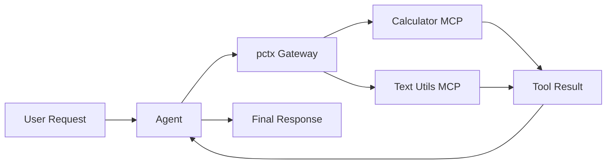

---
jupyter:
  jupytext:
    cell_metadata_filter: -all
    text_representation:
      extension: .md
      format_name: markdown
      format_version: '1.3'
      jupytext_version: 1.19.1
  kernelspec:
    display_name: Python 3 (ipykernel)
    language: python
    name: python3
---

# Unified MCP Gateway with pctx

> **Try it yourself!** This example is available as an executable [Jupyter notebook](/examples/unified-mcp-gateway.ipynb).

This example demonstrates building a **unified MCP gateway** using [pctx (Port of Context)](https://github.com/portofcontext/pctx). The pctx runtime aggregates multiple MCP servers into a single endpoint, exposing them through a powerful "Code Mode" interface that reduces token usage by up to 98%.

## Understanding the Flow



::: tip Why Code Mode?
Traditional MCP requires multiple LLM round-trips for tool calls. Code Mode lets the agent write TypeScript code that executes multiple tools in a single call, dramatically reducing latency and token usage.
:::

## Prerequisites

- KAOS operator installed ([Installation Guide](/getting-started/installation))
- `kaos-cli` installed
- Access to a Kubernetes cluster

## Overview

We'll build a system where:
1. Two upstream MCP servers provide different capabilities (math + text operations)
2. A pctx gateway aggregates them into a unified endpoint
3. An agent uses Code Mode to orchestrate multi-tool workflows

## Setup

First, let's set up the environment and create a namespace:

```python
import os
os.environ['NAMESPACE'] = 'pctx-gateway-example'
```

```bash
kubectl create namespace $NAMESPACE 2>/dev/null || true
kubectl config set-context --current --namespace=$NAMESPACE
```

## Step 1: Create a ModelAPI

Create a ModelAPI in Proxy mode (we'll use mock responses for determinism):

```bash
kaos modelapi deploy gateway-api --mode Proxy --wait
```

## Step 2: Create Upstream MCP Servers

Create two MCP servers with different capabilities using the `python-string` runtime.

### Calculator MCP Server

This server provides mathematical operations:

```bash
cat <<'EOF' | kubectl apply -f -
apiVersion: kaos.tools/v1alpha1
kind: MCPServer
metadata:
  name: calculator
spec:
  runtime: python-string
  params: |
    def add(a: int, b: int) -> int:
        """Add two numbers together."""
        return a + b
    
    def multiply(x: int, y: int) -> int:
        """Multiply two numbers."""
        return x * y
    
    def power(base: int, exponent: int) -> int:
        """Raise base to the power of exponent."""
        return base ** exponent
EOF
```

### Text Utils MCP Server

This server provides text manipulation tools:

```bash
cat <<'EOF' | kubectl apply -f -
apiVersion: kaos.tools/v1alpha1
kind: MCPServer
metadata:
  name: textutils
spec:
  runtime: python-string
  params: |
    def uppercase(text: str) -> str:
        """Convert text to uppercase."""
        return text.upper()
    
    def reverse(text: str) -> str:
        """Reverse the characters in text."""
        return text[::-1]
    
    def word_count(text: str) -> int:
        """Count the number of words in text."""
        return len(text.split())
EOF
```

Wait for both servers to be ready:

```bash
kubectl wait mcpserver/calculator --for=jsonpath='{.status.ready}'=true --timeout=180s
kubectl wait mcpserver/textutils --for=jsonpath='{.status.ready}'=true --timeout=180s
```

## Step 3: Create the pctx Gateway

Now create the pctx gateway that aggregates both upstream servers. The `params` field contains a JSON configuration specifying the upstream servers:

```bash
cat <<EOF | kubectl apply -f -
apiVersion: kaos.tools/v1alpha1
kind: MCPServer
metadata:
  name: unified-gateway
spec:
  runtime: pctx
  params: |
    {
      "name": "unified-gateway",
      "version": "1.0.0",
      "servers": [
        {
          "name": "calc",
          "url": "http://mcpserver-calculator.$NAMESPACE.svc.cluster.local:8000/mcp"
        },
        {
          "name": "text",
          "url": "http://mcpserver-textutils.$NAMESPACE.svc.cluster.local:8000/mcp"
        }
      ]
    }
EOF
```

Wait for the gateway to be ready:

```bash
kubectl wait mcpserver/unified-gateway --for=jsonpath='{.status.ready}'=true --timeout=180s
```

## Step 4: Create the Agent

Create an agent connected to the pctx gateway. The mock responses demonstrate Code Mode - the agent writes TypeScript that calls multiple tools in sequence:

```bash
# Mock response: Agent uses Code Mode to call calc.add and text.uppercase
# pctx exposes tools via TypeScript namespaces matching server names
MOCK_CODE='{"tool": "code_mode", "arguments": {"code": "const sum = await calc.add({a: 42, b: 8}); const result = await text.uppercase({text: \"answer is \" + sum}); return result;"}}'
MOCK_END='{}'
MOCK_FINAL='The calculation is complete! I added 42 + 8 = 50 and formatted the result as "ANSWER IS 50".'

kaos agent deploy gateway-agent \
    --modelapi gateway-api \
    --model mock-model \
    --mcp unified-gateway \
    --instructions "You use Code Mode to orchestrate multiple tools efficiently." \
    --mock-response "$MOCK_CODE" \
    --mock-response "$MOCK_END" \
    --mock-response "$MOCK_FINAL" \
    --expose \
    --wait
```

## Step 5: Invoke the Agent

Send a request that triggers multi-tool orchestration:

```bash
kaos agent invoke gateway-agent --message "Add 42 and 8, then format the result in uppercase"
```

## Step 6: Verify Tool Discovery

Check that the agent card shows tools from the pctx gateway:

```python
import subprocess
import json

# Get the agent card
result = subprocess.run(
    ["kubectl", "exec", "deploy/agent-gateway-agent", "--", 
     "curl", "-s", "http://localhost:8000/.well-known/agent"],
    capture_output=True, text=True
)

if result.returncode != 0:
    raise AssertionError(f"Failed to get agent card: {result.stderr}")

card = json.loads(result.stdout)

# Verify agent has tool_execution capability
assert "tool_execution" in card.get("capabilities", []), \
    f"Missing tool_execution capability: {card}"

# Verify skills are discovered (pctx exposes code_mode tool)
skills = card.get("skills", [])
assert len(skills) > 0, f"No skills discovered: {card}"

print(f"SUCCESS: Agent discovered {len(skills)} tool(s) via pctx gateway")
print(f"Capabilities: {card.get('capabilities', [])}")
```

## Step 7: Verify Memory Events

Check that tool calls were recorded in memory:

```python
import subprocess
import json

# Get memory events
result = subprocess.run(
    ["kubectl", "exec", "deploy/agent-gateway-agent", "--", 
     "curl", "-s", "http://localhost:8000/memory/events"],
    capture_output=True, text=True
)

if result.returncode != 0:
    raise AssertionError(f"Failed to get memory: {result.stderr}")

memory = json.loads(result.stdout)
events = memory.get("events", [])
event_types = [e.get("event_type") for e in events]

# Verify tool_call event exists (from code_mode execution)
assert "tool_call" in event_types, \
    f"No tool_call in memory events: {event_types}"

print(f"SUCCESS: Found {len(events)} memory events")
print(f"Event types: {set(event_types)}")
```

## Understanding Code Mode

With traditional MCP, each tool call requires an LLM round-trip:

```
LLM: "I'll call add(42, 8)"     → Tool executes → Result
LLM: "Now I'll call uppercase"  → Tool executes → Result
LLM: "Here's the final answer"
```

With Code Mode, the agent writes TypeScript that executes all tools in one call:

```typescript
const sum = await calc.add({a: 42, b: 8});
const result = await text.uppercase({text: "answer is " + sum});
return result;
```

This reduces:
- **LLM round-trips**: From N+1 to 2 (code generation + final response)
- **Token usage**: Up to 98% reduction for complex workflows
- **Latency**: Dramatically faster for multi-step operations

## pctx Configuration

The pctx config supports:
- **Multiple servers**: Aggregate any number of MCP servers
- **Custom namespaces**: Server names become TypeScript namespaces
- **Authentication**: Add bearer tokens or custom headers
- **External servers**: Reference any HTTP MCP endpoint

Example with authentication:

```yaml
spec:
  runtime: pctx
  params: |
    {
      "servers": [
        {
          "name": "private_api",
          "url": "https://api.example.com/mcp",
          "bearer": "your-token"
        }
      ]
    }
```

## Cleanup

```bash
kubectl delete namespace $NAMESPACE
```

## Next Steps

- [KAOS Monkey](/examples/kaos-monkey) - Chaos engineering with Kubernetes MCP
- [MCPServer CRD Reference](/operator/mcpserver-crd) - Full pctx configuration
- [pctx Documentation](https://github.com/portofcontext/pctx) - Upstream project
