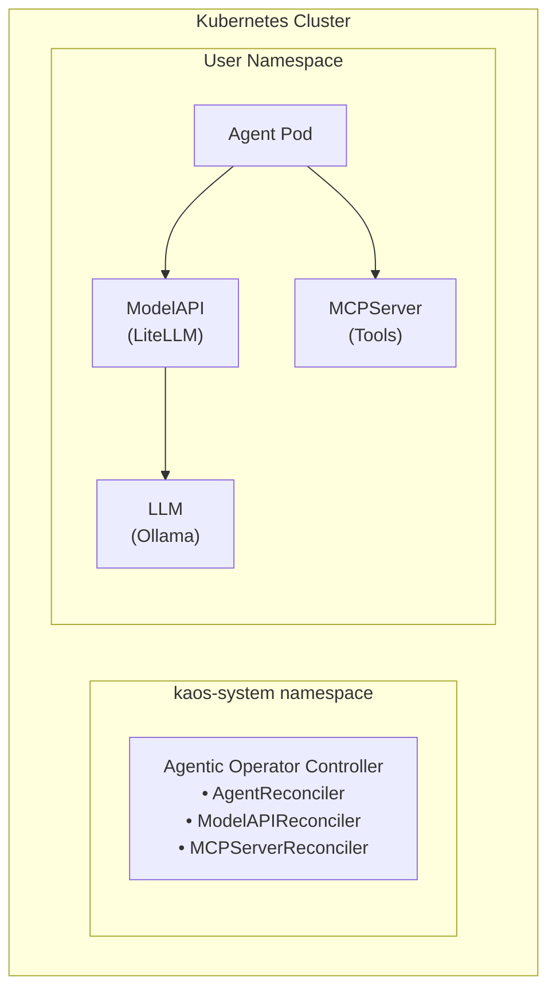

# Core Concepts

## Overview

KAOS provides a declarative way to deploy AI agents that can:
- Process natural language messages using LLMs
- Call external tools via the Model Context Protocol (MCP)
- Delegate tasks to other agents (Agent-to-Agent / A2A)
- Maintain conversation memory and context

## Architecture



## Custom Resource Definitions (CRDs)

### Agent

The Agent CRD defines an AI agent deployment. Each Agent:
- References a ModelAPI for LLM access
- Can reference multiple MCPServers for tool access
- Exposes HTTP endpoints for interaction
- Can delegate to other Agents via A2A protocol

```yaml
apiVersion: kaos.tools/v1alpha1
kind: Agent
metadata:
  name: my-agent
spec:
  modelAPI: my-model      # Required: LLM backend
  mcpServers: [tools]     # Optional: Tool servers
  agentNetwork:           # Optional: A2A networking
    expose: true
    access: [worker-1]
  config:                 # Optional: Agent configuration
    instructions: "..."
```

### ModelAPI

The ModelAPI CRD deploys LLM access. Two modes:

**Proxy Mode**: LiteLLM proxy to external backends
```yaml
spec:
  mode: Proxy
  proxyConfig:
    apiBase: "http://ollama:11434"
```

**Hosted Mode**: Ollama running in-cluster
```yaml
spec:
  mode: Hosted
  serverConfig:
    model: "smollm2:135m"
```

### MCPServer

The MCPServer CRD deploys tool servers using the Model Context Protocol:

```yaml
spec:
  type: python-runtime
  config:
    mcp: "package-name"    # PyPI package
    # OR
    toolsString: |         # Dynamic Python tools
      def my_tool(x: str) -> str:
          return x.upper()
```

## Agentic Loop

The agent implements a reasoning loop that enables tool use and delegation:

```
1. Receive user message
2. Build system prompt (instructions + available tools + available agents)
3. Send to LLM
4. Parse response:
   - If contains tool_call → execute tool → add result → go to step 3
   - If contains delegate → invoke sub-agent → add response → go to step 3
   - Otherwise → return final response
5. Store events in memory
```

Maximum iterations are controlled by `agenticLoop.maxSteps` (default: 5).

## Agent-to-Agent (A2A) Protocol

Agents can discover and invoke each other using the A2A protocol:

1. **Discovery**: Agents expose `/.well-known/agent` endpoint with capabilities
2. **Invocation**: Agents call `/v1/chat/completions` on peer agents
3. **Delegation**: Via agentic loop when model response contains a `delegate` block

The operator automatically configures peer agent URLs based on `agentNetwork.access`.

## Memory and Sessions

Each agent maintains in-memory session storage:
- Sessions track conversation context
- Events logged: user_message, agent_response, tool_call, delegation
- Debug endpoints available for testing: `/memory/events`, `/memory/sessions`

Memory is per-pod and not persisted across restarts.

## Environment Variable Configuration

The operator configures agent pods via environment variables:

| Variable | Source |
|----------|--------|
| `AGENT_NAME` | Agent metadata.name |
| `MODEL_API_URL` | ModelAPI status.endpoint |
| `PEER_AGENTS` | agentNetwork.access list |
| `AGENTIC_LOOP_MAX_STEPS` | config.agenticLoop.maxSteps |

See [Environment Variables](../reference/environment-variables.md) for complete list.
