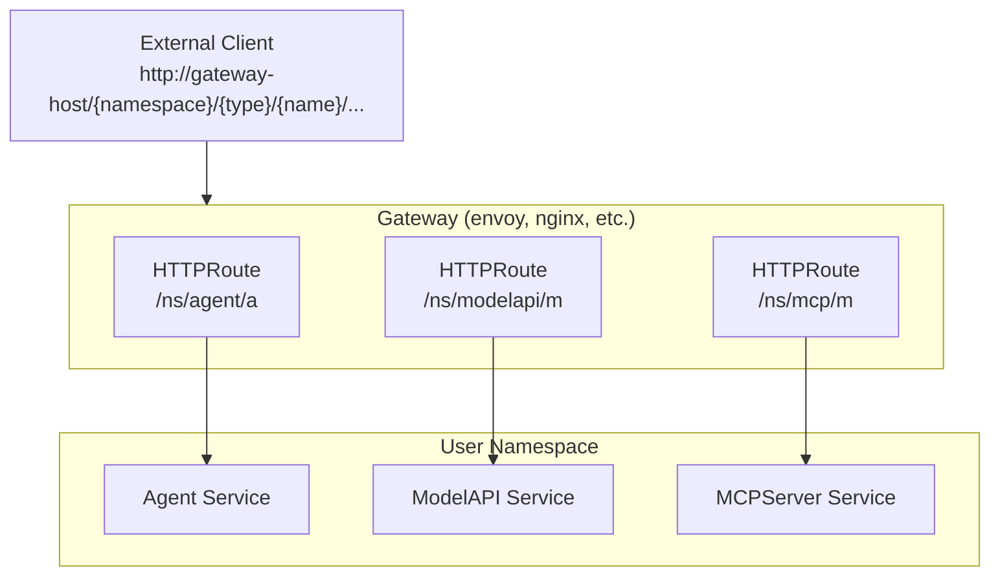

# Gateway API Integration

KAOS supports the [Kubernetes Gateway API](https://gateway-api.sigs.k8s.io/) for exposing Agent, ModelAPI, and MCPServer resources via a unified ingress point.

## Overview

When Gateway API is enabled, the operator automatically creates HTTPRoute resources for each managed resource, allowing external access through a central Gateway.



## Prerequisites

1. **Gateway API CRDs** - Install the Gateway API CRDs:
   ```bash
   kubectl apply -f https://github.com/kubernetes-sigs/gateway-api/releases/download/v1.3.0/experimental-install.yaml
   ```

2. **Gateway Controller** - Install a Gateway controller (e.g., Envoy Gateway, Kong, Nginx):
   ```bash
   # Example: Envoy Gateway
   helm install envoy-gateway oci://docker.io/envoyproxy/gateway-helm \
     --version v1.3.0 \
     --namespace envoy-gateway-system \
     --create-namespace
   ```

3. **GatewayClass** - Create a GatewayClass:
   ```bash
   kubectl apply -f - <<EOF
   apiVersion: gateway.networking.k8s.io/v1
   kind: GatewayClass
   metadata:
     name: envoy-gateway
   spec:
     controllerName: gateway.envoyproxy.io/gatewayclass-controller
   EOF
   ```

## Installation with Gateway API

### Using Helm

```bash
helm install kaos-operator ./operator/chart \
  --namespace kaos-system \
  --create-namespace \
  --set gatewayAPI.enabled=true \
  --set gatewayAPI.createGateway=true \
  --set gatewayAPI.gatewayClassName=envoy-gateway
```

### Helm Values

| Value | Default | Description |
|-------|---------|-------------|
| `gatewayAPI.enabled` | `false` | Enable Gateway API integration |
| `gatewayAPI.gatewayName` | `kaos-gateway` | Name of the Gateway resource |
| `gatewayAPI.gatewayNamespace` | Release namespace | Namespace of the Gateway |
| `gatewayAPI.createGateway` | `false` | Create a Gateway resource |
| `gatewayAPI.gatewayClassName` | Required if createGateway | GatewayClass to use |
| `gatewayAPI.listenerPort` | `80` | Port for HTTP listener |
| `gateway.defaultTimeouts.agent` | `120s` | Default timeout for Agent HTTPRoutes |
| `gateway.defaultTimeouts.modelAPI` | `120s` | Default timeout for ModelAPI HTTPRoutes |
| `gateway.defaultTimeouts.mcp` | `30s` | Default timeout for MCPServer HTTPRoutes |

## Request Timeouts

The operator configures request timeouts on HTTPRoutes to prevent long-running requests from timing out prematurely. Timeouts can be configured at two levels:

### Global Defaults (Helm Values)

Set default timeouts for all resources of each type:

```yaml
gateway:
  defaultTimeouts:
    agent: "120s"      # Agents may do multi-step reasoning
    modelAPI: "120s"   # LLM inference can take time
    mcp: "30s"         # Tool calls are typically fast
```

These values are passed to the operator via environment variables:
- `GATEWAY_DEFAULT_AGENT_TIMEOUT`
- `GATEWAY_DEFAULT_MODELAPI_TIMEOUT`
- `GATEWAY_DEFAULT_MCP_TIMEOUT`

### Per-Resource Override

Override the timeout for a specific resource using `spec.gatewayRoute.timeout`:

```yaml
apiVersion: kaos.tools/v1alpha1
kind: Agent
metadata:
  name: long-running-agent
spec:
  modelAPI: my-model
  gatewayRoute:
    timeout: "300s"  # 5 minutes for this specific agent
```

This works for all CRD types (Agent, ModelAPI, MCPServer).

### Using Existing Gateway

To use an existing Gateway instead of creating one:

```bash
helm install kaos-operator ./operator/chart \
  --namespace kaos-system \
  --create-namespace \
  --set gatewayAPI.enabled=true \
  --set gatewayAPI.gatewayName=my-gateway \
  --set gatewayAPI.gatewayNamespace=gateway-ns
```

## URL Structure

HTTPRoutes use a consistent path structure:

```
/{namespace}/{resource-type}/{resource-name}/...
```

| Resource Type | Path Pattern | Example |
|--------------|--------------|---------|
| Agent | `/{ns}/agent/{name}` | `/prod/agent/coordinator/health` |
| ModelAPI | `/{ns}/modelapi/{name}` | `/prod/modelapi/ollama-proxy/v1/chat/completions` |
| MCPServer | `/{ns}/mcp/{name}` | `/dev/mcp/echo-server/health` |

### Path Rewriting

The operator configures HTTPRoutes with URL rewriting to strip the path prefix. When you call:

```
http://gateway/my-namespace/agent/my-agent/health
```

The backend service receives:

```
/health
```

## Example: Accessing an Agent via Gateway

1. Deploy an agent:
   ```yaml
   apiVersion: kaos.tools/v1alpha1
   kind: Agent
   metadata:
     name: my-agent
     namespace: my-namespace
   spec:
     modelAPI: my-model
     config:
       description: "Example agent"
   ```

2. Access via Gateway:
   ```bash
   # Health check
   curl http://localhost/my-namespace/agent/my-agent/health
   
   # Agent card
   curl http://localhost/my-namespace/agent/my-agent/.well-known/agent
   
   # Chat completions
   curl http://localhost/my-namespace/agent/my-agent/v1/chat/completions \
     -H "Content-Type: application/json" \
     -d '{"model":"my-agent","messages":[{"role":"user","content":"Hello"}]}'
   ```

## Verifying HTTPRoutes

Check created HTTPRoutes:

```bash
kubectl get httproutes -A
```

Example output:
```
NAMESPACE      NAME                     HOSTNAMES   AGE
my-namespace   agent-my-agent                       5m
my-namespace   modelapi-my-model                    5m
```

View HTTPRoute details:
```bash
kubectl get httproute agent-my-agent -n my-namespace -o yaml
```

## Disabling Gateway API

To run without Gateway API (using direct service access):

```bash
helm install kaos-operator ./operator/chart \
  --namespace kaos-system \
  --create-namespace
  # gatewayAPI.enabled defaults to false
```

Without Gateway API, access services via port-forward:
```bash
kubectl port-forward svc/agent-my-agent 8080:8000 -n my-namespace
curl http://localhost:8080/health
```

## Troubleshooting

### HTTPRoute Not Created

Check operator logs:
```bash
kubectl logs -n kaos-system deployment/kaos-operator-controller-manager | grep HTTPRoute
```

Verify Gateway API is enabled:
```bash
kubectl get configmap -n kaos-system kaos-operator-config -o yaml
```

### 404 Errors

1. Verify the HTTPRoute exists and is accepted:
   ```bash
   kubectl get httproute -n your-namespace -o wide
   ```

2. Check HTTPRoute status:
   ```bash
   kubectl describe httproute agent-your-agent -n your-namespace
   ```

3. Verify the Gateway is programmed:
   ```bash
   kubectl get gateway -n kaos-system
   ```

### RBAC Errors

If you see "forbidden" errors for httproutes, ensure the operator has proper RBAC:
```bash
kubectl get clusterrole kaos-operator-kaos-operator -o yaml | grep -A10 gateway
```

## Internal Routing (Future)

When Gateway API is enabled, agents can optionally use Gateway URLs for inter-agent communication instead of direct service DNS. This feature is planned for future releases.
