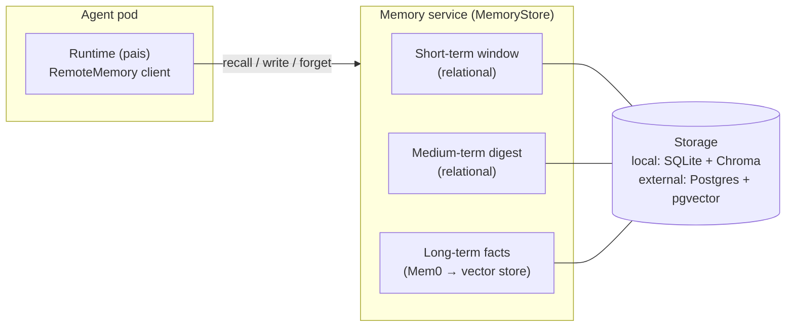

# Memory Architecture

This page explains how KAOS memory works end to end — the tiers, the multi-tenant scope model, the service topology, and the control- and data-plane wiring — and the design choices behind each. For the concrete field references see the [MemoryStore CRD](./memorystore-crd.md), the [Agent CRD memory block](./agent-crd.md#configmemory), and the [runtime memory system](../python-framework/memory.md). For a hands-on walkthrough see the [Agent Memory example](../examples/memory.md).

## Overview

Memory in KAOS is **augmentation, not a hard dependency**: it enriches an agent's context but a memory outage degrades an agent rather than stopping it. An agent binds to a `MemoryStore`, and the operator deploys a single central **memory service** that every bound agent calls over the network. The service composes three tiers behind one HTTP contract, applies a server-derived tenancy scope to every operation, and persists long-term facts through the Mem0 engine embedded as a library.

The service exposes `POST /v1/recall` for semantic search, `POST /v1/list` for a complete scope-filtered long-term listing plus the current session's conversational tiers, `POST /v1/write` for turn persistence, and `POST /v1/forget` for scoped erasure. Recall and list both reject an unresolved owner before store access.

## Memory tiers

A remote-memory agent layers three tiers behind one client. KAOS owns the two conversational tiers as plain relational rows; the Mem0 engine owns the semantic long-term tier as a vector index.

| Tier | Scope | Storage | Owner | Purpose |
|------|-------|---------|-------|---------|
| **Short-term** | session only | relational rows (SQLite/Postgres), no embeddings | KAOS | verbatim recent-turn window replayed for conversational continuity; also the fallback when long-term is degraded |
| **Medium-term** | session only | relational rows, append-only + versioned | KAOS | a single rolling narrative digest per session that preserves continuity once older turns leave the window |
| **Long-term** | cross-session, scope-keyed | Mem0 over a vector store (Chroma/pgvector) | Mem0 engine | semantic + episodic facts extracted from turns and recalled by relevance |

Design choices:

- **The short-term window is session-scoped only.** Every window and digest key combines the stable store group with the session id; agent and principal identities are deliberately excluded, so a run written by an agent can be recalled through any entitled scope using the same session id. A missing session id fails rather than falling back to a shared owner window. User-, agent-, or store-wide verbatim windows would interleave concurrent conversations, so cross-session continuity is served by long-term facts instead of merging live turns. In particular, `scope: group` does not share raw turns across sessions; cross-agent sharing flows through extracted long-term facts. The window is bounded by a configurable **token budget** (with a hard event-count safety cap), not by turn count.
- **The medium-term digest stays out of Mem0.** Mem0 decomposes input into atomic, individually revisable facts for vector retrieval, whereas a rolling digest is a coherent narrative that should be injected directly at recall time. Indexing it into Mem0 would shred narrative continuity into fragments and pollute vector search, so the digest is a relational, append-only, versioned row and Mem0 receives only the raw evicted turns.
- **Short-term is never on Redis and never in Mem0.** It is a cheap append-and-read-window operation co-located with the long-term store (a SQLite table beside embedded Chroma in `local` mode; a plain table on the same Postgres that backs pgvector in `external` mode).
- **Folding and extraction are always off the write path.** The active window is computed lazily on read; when a compaction trigger is crossed, older turns fold into the digest and the raw turns are handed to Mem0 for long-term extraction — all as background work, never blocking the response.

Temporal (bi-temporal validity) and procedural (skill) memory are **deferred** as later capability tiers behind a future graph/temporal engine; the committed set is short-term plus a unified semantic-and-episodic long-term store.

## Multi-tenancy: the scope model

Reads and erasure carry a **scope** selecting long-term visibility. Writes instead carry level-less compound attribution: every verified principal and agent identity is attached, plus session and store-group metadata. Scope and attribution are derived server-side, never accepted from model arguments.

| `scope` | Long-term read filter | Isolation boundary |
|---------|-----------------------|--------------------|
| `agent` (default) | OIDC off: `agent_id = <agent identity>`; OIDC on: `agent_id = <agent identity>` AND `user_id = <principal>` | this agent's pool, partitioned per user when OIDC is enabled |
| `user` | `user_id = <principal>` | every fact this user contributed through any agent or session |
| `group` | `user_id = "*"` plus `kaos_group = <store group>` | every attributed fact on the same `MemoryStore` |
| `session` | `user_id = "*"` plus `kaos_run = <session id>` | facts attributed to one conversation/run |

The `user_id = "*"` entry is Mem0 2.0.10's required wildcard convention for filtering by custom metadata; KAOS pins and regression-tests that behavior. Group membership is metadata, never a synthetic agent identity: `agent_id` always contains the real contributing agent. The group value comes from the active vector collection binding (`KAOS_MEMORY_LOCAL_COLLECTION` or `KAOS_MEMORY_EXTERNAL_COLLECTION`, default `kaos_memory`). That signal is always present even when telemetry is disabled, and the `MemoryStore` itself is the physical group boundary, so the collection name only needs to be stable within that store.

### Posture-derived enforcement

Identity requirements follow one static cluster posture; agents cannot weaken or strengthen them.

| Cluster mode | `agent` owner | Missing principal |
|--------------|---------------|-------------------|
| OIDC user identity enabled (`SecurityEnabled()` plus a configured user issuer) | `{agent_id, user_id}` | writes fail closed; agent reads retain the two-key partition |
| OIDC user identity disabled | `{agent_id}` | allowed; no user key participates in the agent read partition |

The operator injects `MEMORY_REQUIRE_PRINCIPAL=true` when secured user identity is enabled and `MEMORY_REQUIRE_AGENT_IDENTITY=true` whenever security is enabled. It projects equivalent `KAOS_MEMORY_*` settings into the MemoryStore pod, whose write check is authoritative. The runtime repeats the checks as defence in depth. Admin CLI recall and forget remain trusted in-cluster read/erasure paths and do not require agent identity.

Autonomous execution uses the same rule without an exception. The loop's agent bearer self-subjects the run, so its owner is `{agent_id, agent-as-user}`. For a hybrid agent, this means autonomous findings are private to the loop and are not recalled into a human user's agent partition; making those findings human-visible is an explicit publication at `group` level.

Design choices:

- **The store is the group.** A logical group is the set of agents bound to the same `MemoryStore`; there is no separate group CRD. The four scope levels express per-agent, per-user, per-group, and per-session memory.
- **Isolation strength is chosen by how many stores you deploy.** The default is a shared store with scope filtering; deploying one `MemoryStore` per tenant gives **physical** isolation (data is not co-located), so a filtering defect cannot leak across tenants. No isolation-mode field exists.
- **Scope selects long-term visibility, not write ownership.** A user-level read is deliberately broad: it returns everything that principal contributed through any agent and session. Compound attribution lets narrower agent/session reads and user/agent erasure reach the same physical fact without duplicating it.
- **Conversational tiers are always per-session.** The verbatim window and medium-term digest use `kaos_group:<store group>|run:<session id>`; without a configured group an embedded store uses `run:<session id>`. The group is the consistent tenant component supplied by the service on both write and recall, while the unguessable run id is the capability that addresses one window through the scoped service and its network/RBAC boundary. Agent and principal identities live in a separate erasure index rather than the conversational key, so changing the recall scope cannot change the physical session partition. `scope: user` does not create a user-wide conversational window. Session forget deletes one key; user, agent, and group forget use the erasure index to delete every attributed session.
- **Agent configuration is read-only.** `defaultReadScope` selects baseline recall and resolves Agent → MemoryStore → `session`; `readScopes` limits `search_memory`. Writes, including `save_memory`, carry attribution without a level.
- **Enforcement is fail-closed at the service.** Scope is derived **server-side** from the authenticated agent identity and request context — never trusted from model- or tool-supplied arguments. An operation that cannot resolve a usable owner key fails rather than querying an unscoped store. Because the vector providers pre-filter during the query, a tenant's relevant memories are never dropped by an unfiltered nearest-neighbour window.
- **Erasure fans out synchronously across tiers.** User and agent long-term erasure use Mem0's native entity deletion. Session and group erasure use wildcard-qualified custom filters, falling back to filtered id listing plus per-id deletion where the pinned Mem0 version lacks filtered deletion. Pre-existing alpha records without compound attribution cannot be reached by a newly available user-level erasure; there is no data migration.

Gateway-derived principals propagate automatically over cross-agent (A2A) delegation. Administrative cross-user erasure remains deferred.

## Deployment topology

- **One central service per store.** The long-term engine runs as a single KAOS-owned service that imports Mem0 as a library (not the stock Mem0 server, which provides none of the tiering, scope injection, or telemetry). Embedding the engine in each agent was rejected — it would push extraction onto the serving process, multiply datastore connections, bloat every agent image, and diverge memory across replicas.
- **Packaged as `kaos-memory`.** The wire contract, the `MemoryServiceClient`, and the service ship as one library layered behind extras: the core carries the contract and client; `[service]` adds Mem0, the vector store, and the FastAPI service; `[pydantic-ai]` adds the message adapters, server-side scope derivation, and the memory toolset. Client and server import the one contract, so they cannot drift.
- **Two storage modes, both tiers together:**
  - `local` — everything in one container (embedded Chroma + a SQLite short-term table) on one PersistentVolume. Least-effort on-ramp; pinned to a **single replica** because the embedded store is a single-writer file.
  - `external` — pgvector for long-term and a plain table for short-term on the **same** Postgres. The service is stateless and the production path.
- **High availability (external).** Because all durable state is the shared Postgres, external stores default to **two replicas** behind a plain Service with no sticky sessions, guarded by a `PodDisruptionBudget` (`minAvailable=1`). Consolidation is serialized through database-owned fold/flush work, so many replicas write and fold the same session without lost or double folds. Mem0's node-local history is not memory data and is disabled/ignored, so it does not impede scaling.
- **Background extraction is in-process, fire-and-forget.** Long-term extraction, folding, and forgetting run off the response path in a bounded executor with bounded retry and a graceful drain on shutdown. There is **no durable job queue** in this version: the short-term tier is the durable path, and a durable at-least-once queue is a recorded follow-up to build only if crash-durability of extraction becomes a hard requirement.
- **Bind, do not operate.** The operator deploys the service (Deployment, Service, and a PVC in `local` mode) but does not operate the external Postgres — it is bring-your-own via a connection secret. For a turnkey dev on-ramp, `kaos system install --pgvector-memory-enabled` provisions an opt-in development Postgres and a connection secret, never as a production default.

## Control plane

The `MemoryStore` CRD describes infrastructure, model bindings, extraction/failure defaults, and the store-wide default read scope. The two model roles reference an existing `ModelAPI`: `summarization` drives extraction and digest generation; `embedding` drives the vector index.

The Agent memory block selects a store and configures reads with `defaultReadScope`, `readScopes`, and tools. Enabling memory recalls before each run and flushes level-less attributed turns afterward.

Binding is fail-closed and degradation-aware:

- `type: remote` requires a `memoryStore`; `type: local` forbids one. Non-session read scopes and any tools require a `memoryStore`. User read scopes additionally require a secured user-identity posture.
- An `agent` owner is resolved from the injected `AGENT_IDENTITY` (`kaos://agent/<ns>/<name>`), never a name-only or empty owner, so identity-less agents cannot collapse onto one agent partition.
- **Already-running** agents treat a missing/not-ready store as degraded: the operator surfaces a `MemoryDegraded` condition and keeps the pod Ready serving short-term-only — a store outage never removes a serving agent. Only **initial creation** is gated: with `waitForDependencies` (default) the agent stays `Waiting` until the bound store is Ready, so it never starts up degraded.

## Data plane (runtime)

In the agent runtime, `RemoteMemory` is a thin adapter over the `kaos-memory` `MemoryServiceClient` — it speaks the KAOS tiered contract and is not a Mem0 client. It bridges KAOS turns to Pydantic AI message history for full-fidelity replay of a continuing run, injects the assembled memory block (short-term window + medium-term digest + recalled long-term facts) before a run, and flushes the run's turns afterwards. The failure-mode contract is honoured across the client/service boundary: recall is **always soft** (a recall failure returns short-term-only context and never fails the turn), while write and forget re-raise only under `failureMode: strict`.

## Design rationale at a glance

| Decision | Why |
|----------|-----|
| Central service, Mem0 as a library | thin agents, isolated extraction, cross-agent sharing, one datastore connection pool |
| KAOS owns short/medium-term relationally | cheap append-and-read; a narrative digest must not be shredded into vector fragments |
| Compound write attribution, selected read scope | one fact remains reachable through its user and agent while session/group remain filterable metadata; the store is the group, no extra CRD |
| Server-side, fail-closed scope | scope is non-spoofable and an unresolved scope never widens to an unscoped query |
| Store-per-tenant for physical isolation | isolation strength is a deployment choice, not a code path |
| Fire-and-forget extraction, no queue | LLM-dominated turn latency makes the async hop marginal; durability follow-up built only when measured |
| Memory is augmentation | an outage degrades, never stops, an agent |

## Deferred capabilities

Recorded as forward-looking, out of the current critical path: temporal (bi-temporal) and procedural memory tiers; a durable at-least-once extraction queue; a Prometheus `/metrics` endpoint (health/readiness probes and a failure counter cover alpha operability today); dynamic cross-cutting agent groups beyond store membership; per-tenant quotas, logical export/import, and application-level field encryption; and a second long-term engine behind the memory interface.
