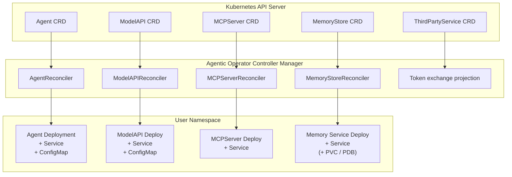
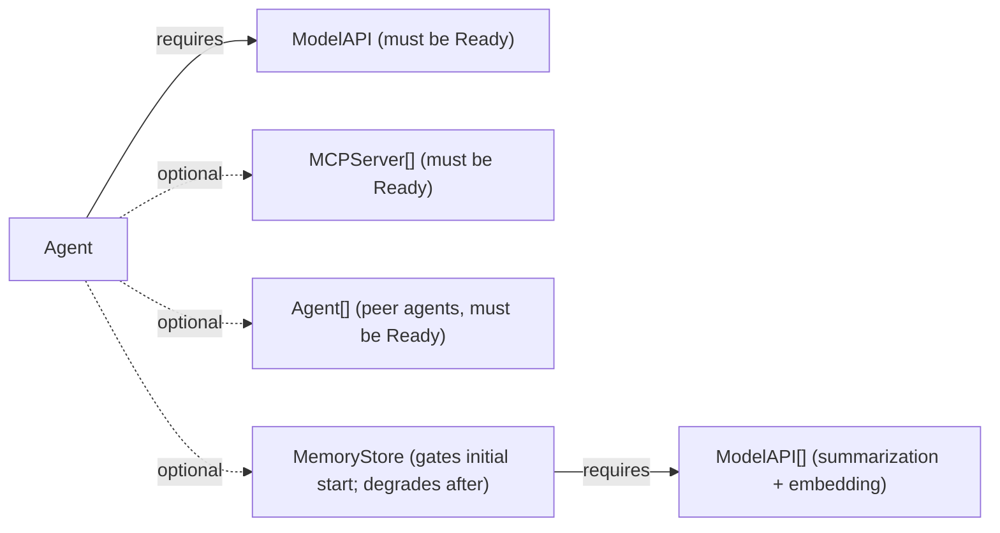

# Kubernetes Operator Overview

KAOS manages the lifecycle of AI agents and their dependencies on Kubernetes.

## Architecture



## Controllers

### AgentReconciler

Manages Agent custom resources:

1. **Validate Dependencies**
   - Check ModelAPI exists and is Ready
   - Check all MCPServers exist and are Ready
   
2. **Resolve Peer Agents**
   - Find Agent resources listed in `agentNetwork.access`
   - Collect their service endpoints

3. **Create/Update Deployment**
   - Build environment variables
   - Configure container with agent image
   - Set resource limits

4. **Create/Update Service**
   - Only if `agentNetwork.expose: true`
   - Exposes port 80 → container 8000

5. **Update Status**
   - Set phase (Pending/Ready/Failed)
   - Record endpoint URL
   - Track linked resources

### ModelAPIReconciler

Manages ModelAPI custom resources:

1. **Determine Mode**
   - Proxy: LiteLLM container
   - Hosted: Ollama container

2. **Create ConfigMap** (if needed)
   - Wildcard mode: Auto-generated config
   - Config mode: User-provided YAML

3. **Create/Update Deployment**
   - Configure container and volumes
   - Set environment variables

4. **Create/Update Service**
   - Proxy: Port 8000
   - Hosted: Port 11434

5. **Update Status**
   - Record endpoint for agents to use

### MCPServerReconciler

Manages MCPServer custom resources:

1. **Determine Tool Source**
   - `mcp`: PyPI package name
   - `toolsString`: Dynamic Python tools

2. **Create/Update Deployment**
   - For `mcp`: Use Python image with pip install
   - For `toolsString`: Use agent image with MCP_TOOLS_STRING

3. **Create/Update Service**
   - Port 80 → container 8000

4. **Update Status**
   - Record available tools

### MemoryStoreReconciler

Manages MemoryStore custom resources (the central memory service backing long-term memory):

1. **Resolve Model Bindings**
   - Validate the referenced `summarization` and `embedding` ModelAPIs exist and are Ready

2. **Create/Update Deployment**
   - Wire storage (`local` PVC-backed SQLite+Chroma, or `external` pgvector via a connection secret)
   - External stores default to two replicas; local stores are single-replica

3. **Create/Update Service and PodDisruptionBudget**
   - A Service fronts the replicas; a PDB (`minAvailable=1`) guards stores running two or more replicas

4. **Update Status**
   - Report health and the service endpoint

See [Memory Architecture](./memory-architecture.md) for the full design.

### ThirdPartyService

`ThirdPartyService` is the optional, namespaced declaration for delegated third-party access. One object contains the provider issuer or explicit OAuth endpoints, a Secret reference for its OAuth client, protected-resource URLs, the dedicated egress `HTTPRoute`, available scopes, and the real Agent-to-scope bindings. When token exchange is disabled, these declarations do not change routing or authorization.

## Resource Dependencies



The operator waits for dependencies before marking an Agent as Ready. A bound MemoryStore gates only the agent's initial creation; once running, a store outage degrades the agent (a `MemoryDegraded` condition) rather than stopping it.

## Status Phases

| Phase | Description |
|-------|-------------|
| `Pending` | Resource created, waiting for dependencies |
| `Ready` | All dependencies ready, pods running |
| `Failed` | Error occurred during reconciliation |
| `Waiting` | Waiting for ModelAPI/MCPServer/MemoryStore to become ready |

## Environment Variable Mapping

The operator translates CRD fields to container environment variables:

### Agent Pod Environment

| CRD Field | Environment Variable |
|-----------|---------------------|
| `metadata.name` | `AGENT_NAME` |
| `spec.model` | `MODEL_NAME` |
| `config.description` | `AGENT_DESCRIPTION` |
| `config.instructions` | `AGENT_INSTRUCTIONS` |
| ModelAPI.status.endpoint | `MODEL_API_URL` |
| `config.reasoningLoopMaxSteps` | `AGENTIC_LOOP_MAX_STEPS` |
| `config.toolCallMode` | `TOOL_CALL_MODE` |
| `config.memory.enabled` | `MEMORY_ENABLED` |
| `config.memory.type` | `MEMORY_TYPE` |
| MemoryStore endpoint (remote only) | `MEMORY_STORE_ENDPOINT` |
| `config.memory.scope` | `MEMORY_SCOPE` |
| `config.memory.tools` | `MEMORY_TOOLS` |
| `config.memory.failureMode` | `MEMORY_FAILURE_MODE` |
| `config.memory.clientParams.tokenBudget` | `MEMORY_SHORT_TERM_TOKEN_BUDGET` |
| `config.memory.clientParams.rollingSummary` | `MEMORY_ROLLING_SUMMARY` |
| `kaos://agent/<ns>/<name>` (always) | `AGENT_IDENTITY` |
| `config.autonomous.goal` | `AUTONOMOUS_GOAL` |
| `config.autonomous.intervalSeconds` | `AUTONOMOUS_INTERVAL_SECONDS` |
| `config.autonomous.maxIterRuntimeSeconds` | `AUTONOMOUS_MAX_ITER_RUNTIME_SECONDS` |
| `config.taskConfig.maxIterations` | `TASK_MAX_ITERATIONS` |
| `config.taskConfig.maxRuntimeSeconds` | `TASK_MAX_RUNTIME_SECONDS` |
| `config.taskConfig.maxToolCalls` | `TASK_MAX_TOOL_CALLS` |
| `agentNetwork.access` | `AGENT_SUB_AGENTS` |
| Each peer agent | `PEER_AGENT_<NAME>_CARD_URL` |

### ModelAPI Pod Environment

| Mode | Container | Key Environment |
|------|-----------|-----------------|
| Proxy | litellm/litellm | `proxyConfig.env[]` |
| Hosted | ollama/ollama | `serverConfig.env[]`, model pulled on start |

### MCPServer Pod Environment

| Source | Container | Key Environment |
|--------|-----------|-----------------|
| `mcp` | python:3.12-slim | Package installed via pip |
| `toolsString` | kaos-agent | `MCP_TOOLS_STRING` |

## RBAC Requirements

The operator requires specific permissions:

```yaml
# In operator/config/rbac/role.yaml
# DO NOT REMOVE - Required for leader election
- apiGroups: [coordination.k8s.io]
  resources: [leases]
  verbs: [get, list, watch, create, update, patch, delete]

- apiGroups: [""]
  resources: [events]
  verbs: [create, patch]

# For managing resources
- apiGroups: [kaos.tools]
  resources: [agents, modelapis, mcpservers]
  verbs: [get, list, watch, create, update, patch, delete]

- apiGroups: [apps]
  resources: [deployments]
  verbs: [get, list, watch, create, update, patch, delete]

- apiGroups: [""]
  resources: [services, configmaps]
  verbs: [get, list, watch, create, update, patch, delete]
```

**Important:** RBAC rules are generated from `// +kubebuilder:rbac:` annotations in Go files. Never manually edit `role.yaml`.

## Building the Operator

```bash
cd operator

# Generate CRDs and RBAC
make generate
make manifests

# Build binary
go build -o bin/manager main.go

# Build Docker image
make docker-build

# Deploy to cluster
make deploy
```

## Running Locally

For development, run the operator locally:

```bash
# Scale down deployed operator
kubectl scale deployment kaos-operator-controller-manager \
  -n kaos-system --replicas=0

# Run locally
cd operator
make run
```

## Watching Resources

Monitor operator logs:

```bash
kubectl logs -n kaos-system \
  deployment/kaos-operator-controller-manager -f
```

Watch custom resources:

```bash
kubectl get agents,modelapis,mcpservers -A -w
```
