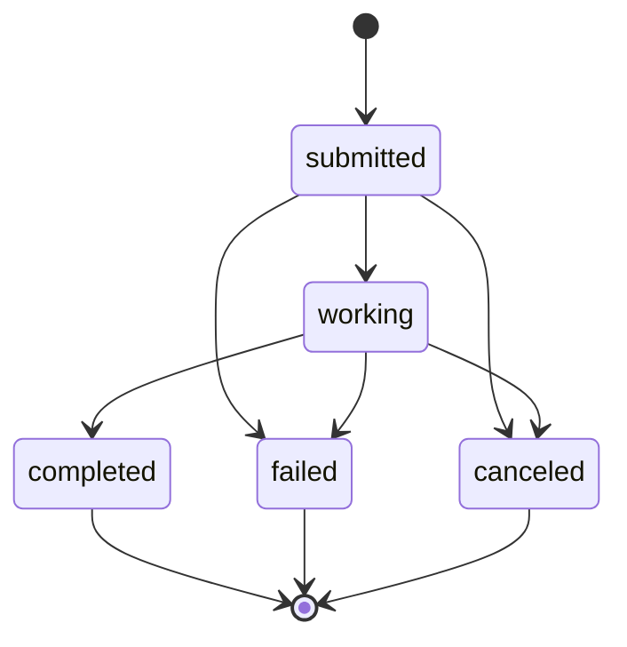

# A2A Tasks & JSON-RPC

KAOS implements the [A2A protocol](https://github.com/google/A2A) (RC v1.0) for agent-to-agent communication via JSON-RPC 2.0.

## Overview

The A2A subsystem provides:
- **TaskManager** orchestrating task lifecycle (submit, execute, cancel, wait) with OTel observability
- **TaskStore** as pure storage backend (local in-memory, extensible to Redis/distributed)
- **JSON-RPC 2.0 endpoint** at `POST /` with A2A spec-compliant methods
- **Agent card** discovery at `/.well-known/agent.json` with A2A capabilities
- **A2A-compliant delegation** — RemoteAgent uses `SendMessage` (blocking) for inter-agent communication

The existing `/v1/chat/completions` endpoint is preserved for interactive/synchronous use.

## Module Organization

- `pais/a2a.py` — TaskManager, JSON-RPC models, dispatcher, method handlers, route setup
- `pais/taskstore.py` — TaskStore ABC, LocalTaskStore, NullTaskStore (pure storage)
- `pais/serverutils.py` — RemoteAgent (A2A + chat completions delegation)

## Task States



## JSON-RPC Methods

### SendMessage

Submit a message for processing. Supports non-blocking (default) and blocking mode.

```bash
# Non-blocking — returns immediately with submitted state
curl -X POST http://agent:8000/ \
  -H "Content-Type: application/json" \
  -d '{
    "jsonrpc": "2.0",
    "method": "SendMessage",
    "id": 1,
    "params": {
      "message": {
        "role": "user",
        "parts": [{"type": "text", "text": "Analyze this data"}]
      },
      "contextId": "optional-session-id"
    }
  }'

# Blocking — waits for completion before responding
curl -X POST http://agent:8000/ \
  -H "Content-Type: application/json" \
  -d '{
    "jsonrpc": "2.0",
    "method": "SendMessage",
    "id": 1,
    "params": {
      "message": {
        "role": "user",
        "parts": [{"type": "text", "text": "Analyze this data"}]
      },
      "configuration": {"blocking": true}
    }
  }'
```

Response:
```json
{
  "jsonrpc": "2.0",
  "id": 1,
  "result": {
    "id": "task-uuid",
    "sessionId": "session-uuid",
    "status": {"state": "submitted", "message": "Task submitted", "timestamp": "..."},
    "history": [{"role": "user", "parts": [{"type": "text", "text": "Analyze this data"}]}]
  }
}
```

### GetTask

Poll task state. Returns current state, history, and output when completed.

```bash
curl -X POST http://agent:8000/ \
  -H "Content-Type: application/json" \
  -d '{"jsonrpc": "2.0", "method": "GetTask", "id": 2, "params": {"id": "task-uuid"}}'
```

### CancelTask

Cancel a running or submitted task.

```bash
curl -X POST http://agent:8000/ \
  -H "Content-Type: application/json" \
  -d '{"jsonrpc": "2.0", "method": "CancelTask", "id": 3, "params": {"id": "task-uuid"}}'
```

### Legacy Aliases

For backward compatibility, lowercase aliases are supported:
- `tasks/send` → `SendMessage`
- `tasks/get` → `GetTask`
- `tasks/cancel` → `CancelTask`

## Error Codes

| Code | Name | Description |
|------|------|-------------|
| -32700 | Parse Error | Invalid JSON |
| -32600 | Invalid Request | Not a valid JSON-RPC request |
| -32601 | Method Not Found | Unknown method |
| -32602 | Invalid Params | Missing or invalid parameters |
| -32603 | Internal Error | Server error during processing |
| -32001 | Task Not Found | Task ID does not exist |

## TaskStore Backends

| Backend | Env Value | Description |
|---------|-----------|-------------|
| `LocalTaskStore` | `local` (default) | In-memory dict-based storage, single-pod |
| `NullTaskStore` | `null` | No-op, disables task lifecycle |

Configure via `TASK_STORE_TYPE` environment variable.

## Agent Card

When TaskStore is active, the agent card reflects A2A capabilities:

```json
{
  "name": "my-agent",
  "protocolVersion": "0.3.0",
  "supportedProtocols": ["jsonrpc"],
  "capabilities": {
    "streaming": true,
    "pushNotifications": false,
    "stateTransitionHistory": true
  }
}
```

## Architecture

### TaskManager vs TaskStore

- **TaskStore** = pure storage (create, get, update_state, set_output, list, cancel) — ready for Redis/distributed backends
- **TaskManager** = orchestration (submit, execute, cancel, wait_for_completion) — wraps TaskStore + owns asyncio tasks + process callback

### Task Execution Flow

1. `SendMessage` → `TaskManager.submit_task()` creates task in TaskStore, spawns `asyncio.Task`
2. `TaskManager._execute_task()` transitions: submitted → working → completed/failed
3. `GetTask` → `TaskStore.get_task()` polls for current state
4. `CancelTask` → `TaskManager.cancel_task()` cancels asyncio.Task and updates TaskStore

### A2A Delegation

RemoteAgent delegates to sub-agents using A2A `SendMessage` (blocking mode) when the remote agent supports it:
1. Agent card is fetched from `/.well-known/agent.json`
2. If `supportedProtocols` includes `"jsonrpc"`, use A2A `SendMessage` with `configuration.blocking: true`
3. Falls back to `/v1/chat/completions` if A2A is unavailable or fails

### Observability

TaskManager is instrumented with OpenTelemetry:
- Spans: `kaos.task.submit`, `kaos.task.execute`, `kaos.task.cancel`
- Metrics: `kaos.tasks` counter (by state), `kaos.task.duration` histogram
- No-op when OTel not initialized
