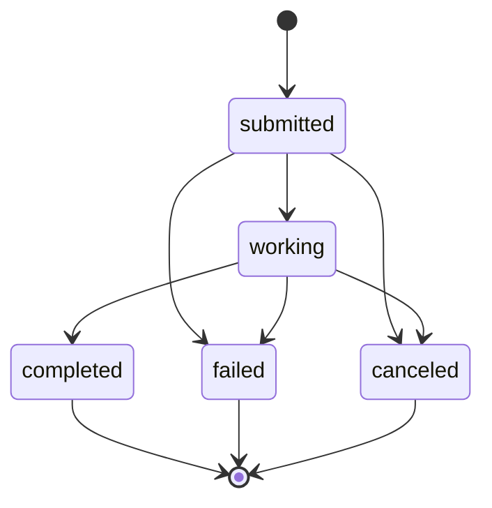

# A2A Tasks & JSON-RPC

KAOS implements the [A2A protocol](https://github.com/google/A2A) for asynchronous agent-to-agent communication via JSON-RPC 2.0.

## Overview

The A2A TaskStore subsystem provides:
- **Task lifecycle management** with state machine (submitted → working → completed/failed/canceled)
- **JSON-RPC 2.0 endpoint** at `POST /` with `tasks/send`, `tasks/get`, `tasks/cancel`
- **Agent card** discovery at `/.well-known/agent.json` with A2A capabilities

The existing `/v1/chat/completions` endpoint is preserved for interactive/synchronous use.

## Task States



## JSON-RPC Methods

### tasks/send

Submit a message for async processing. Returns immediately with `submitted` state.

```bash
curl -X POST http://agent:8000/ \
  -H "Content-Type: application/json" \
  -d '{
    "jsonrpc": "2.0",
    "method": "tasks/send",
    "id": 1,
    "params": {
      "sessionId": "optional-session-id",
      "message": {
        "role": "user",
        "parts": [{"type": "text", "text": "Analyze this data"}]
      }
    }
  }'
```

Response:
```json
{
  "jsonrpc": "2.0",
  "id": 1,
  "result": {
    "id": "task-uuid",
    "sessionId": "session-uuid",
    "status": {"state": "submitted", "message": "Task submitted", "timestamp": "..."},
    "history": [{"role": "user", "parts": [{"type": "text", "text": "Analyze this data"}]}]
  }
}
```

### tasks/get

Poll task state. Returns current state, history, and output when completed.

```bash
curl -X POST http://agent:8000/ \
  -H "Content-Type: application/json" \
  -d '{"jsonrpc": "2.0", "method": "tasks/get", "id": 2, "params": {"id": "task-uuid"}}'
```

### tasks/cancel

Cancel a running or submitted task.

```bash
curl -X POST http://agent:8000/ \
  -H "Content-Type: application/json" \
  -d '{"jsonrpc": "2.0", "method": "tasks/cancel", "id": 3, "params": {"id": "task-uuid"}}'
```

## Error Codes

| Code | Name | Description |
|------|------|-------------|
| -32700 | Parse Error | Invalid JSON |
| -32600 | Invalid Request | Not a valid JSON-RPC request |
| -32601 | Method Not Found | Unknown method |
| -32602 | Invalid Params | Missing or invalid parameters |
| -32603 | Internal Error | Server error during processing |
| -32001 | Task Not Found | Task ID does not exist |

## TaskStore Backends

| Backend | Env Value | Description |
|---------|-----------|-------------|
| `LocalTaskStore` | `local` (default) | In-memory dict-based storage, single-pod |
| `NullTaskStore` | `null` | No-op, disables task lifecycle |

Configure via `TASK_STORE_TYPE` environment variable.

## Agent Card

When TaskStore is active, the agent card reflects A2A capabilities:

```json
{
  "name": "my-agent",
  "protocolVersion": "0.3.0",
  "supportedProtocols": ["jsonrpc"],
  "capabilities": {
    "streaming": true,
    "pushNotifications": false,
    "stateTransitionHistory": true
  }
}
```

## Architecture

Task execution uses `asyncio.create_task()` to run the existing `_process_message()` pipeline asynchronously:

1. `tasks/send` → `_submit_task()` creates task in TaskStore, spawns `asyncio.Task`
2. `_execute_task()` transitions: submitted → working → completed/failed
3. `tasks/get` polls TaskStore for current state
4. `tasks/cancel` cancels the asyncio.Task and updates TaskStore

This in-process model keeps deployment simple (no external queue) while providing the foundation for future distributed execution backends.
