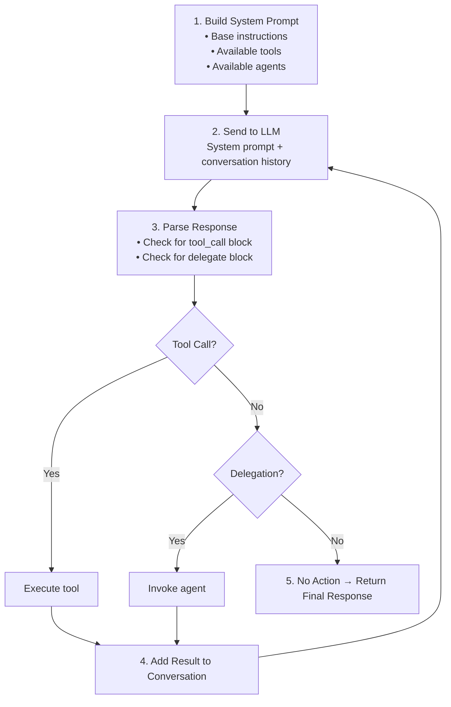

# Agentic Loop

The agentic loop is the reasoning mechanism that enables agents to use tools and delegate tasks iteratively until producing a final response.

## How It Works



## Configuration

The agentic loop is controlled by the `max_steps` parameter passed to the Agent:

```python
agent = Agent(
    name="my-agent",
    model_api=model_api,
    max_steps=5  # Maximum loop iterations
)
```

### max_steps

Prevents infinite loops. When reached, returns message:
```
"Reached maximum reasoning steps (5)"
```

**Guidelines:**
- Simple queries: 2-3 steps
- Tool-using tasks: 5 steps (default)
- Complex multi-step tasks: 10+ steps

## System Prompt Construction

The agent builds an enhanced system prompt:

```python
async def _build_system_prompt(self) -> str:
    parts = [self.instructions]
    
    if self.mcp_clients:
        tools_info = await self._get_tools_description()
        parts.append("\n## Available Tools\n" + tools_info)
        parts.append(TOOLS_INSTRUCTIONS)
    
    if self.sub_agents:
        agents_info = await self._get_agents_description()
        parts.append("\n## Available Agents for Delegation\n" + agents_info)
        parts.append(AGENT_INSTRUCTIONS)
    
    return "\n".join(parts)
```

### Tool Instructions Template

```
To use a tool, respond with a JSON block in this exact format:
```tool_call
{"tool": "tool_name", "arguments": {"arg1": "value1"}}
```
Wait for the tool result before providing your final answer.
```

### Delegation Instructions Template

```
To delegate a task to another agent, respond with:
```delegate
{"agent": "agent_name", "task": "task description"}
```
Wait for the agent's response before providing your final answer.
```

## Response Parsing

### Tool Call Detection

```python
def _parse_tool_call(self, content: str) -> Optional[Dict[str, Any]]:
    match = re.search(r'```tool_call\s*\n({.*?})\s*\n```', content, re.DOTALL)
    if match:
        return json.loads(match.group(1))
    return None
```

**Example LLM Response:**
```
I'll use the calculator tool to compute this.

```tool_call
{"tool": "calculate", "arguments": {"expression": "2 + 2"}}
```
```

### Delegation Detection

```python
def _parse_delegation(self, content: str) -> Optional[Dict[str, Any]]:
    match = re.search(r'```delegate\s*\n({.*?})\s*\n```', content, re.DOTALL)
    if match:
        return json.loads(match.group(1))
    return None
```

**Example LLM Response:**
```
This is a research task, I'll delegate to the researcher agent.

```delegate
{"agent": "researcher", "task": "Find information about quantum computing"}
```
```

## Execution Flow

### Tool Execution

1. Parse tool name and arguments from `tool_call` block
2. Log `tool_call` event to memory
3. Execute tool via MCP client
4. Log `tool_result` event to memory
5. Add result to conversation
6. Continue loop

### Delegation Execution

1. Parse agent name and task from `delegate` block
2. Log `delegation_request` event to memory
3. Invoke remote agent via A2A protocol
4. Log `delegation_response` event to memory
5. Add response to conversation
6. Continue loop

## Memory Events

The loop logs events for debugging and verification:

```python
# After tool execution
events = await agent.memory.get_session_events(session_id)
# Events: [user_message, tool_call, tool_result, agent_response]

# After delegation
events = await agent.memory.get_session_events(session_id)
# Events: [user_message, delegation_request, delegation_response, agent_response]
```

## Testing with Mock Responses

Set `DEBUG_MOCK_RESPONSES` environment variable to test loop behavior deterministically:

```bash
# Test tool calling
export DEBUG_MOCK_RESPONSES='["I will use the echo tool.\n\n```tool_call\n{\"tool\": \"echo\", \"arguments\": {\"text\": \"hello\"}}\n```", "The echo returned: hello"]'

# Test delegation
export DEBUG_MOCK_RESPONSES='["I will delegate to the researcher.\n\n```delegate\n{\"agent\": \"researcher\", \"task\": \"Find quantum computing info\"}\n```", "Based on the research, quantum computing uses qubits."]'
```

For Kubernetes E2E tests, configure via the Agent CRD:
```yaml
spec:
  config:
    env:
    - name: DEBUG_MOCK_RESPONSES
      value: '["```delegate\n{\"agent\": \"worker\", \"task\": \"process data\"}\n```", "Done."]'
```

## Best Practices

1. **Set appropriate max_steps** - Too low may truncate reasoning, too high wastes resources
2. **Clear instructions** - Tell the LLM when to use tools vs. respond directly
3. **Test with mocks** - Verify loop behavior without LLM variability
4. **Monitor events** - Use memory endpoints to debug complex flows
5. **Handle errors gracefully** - Tool failures are fed back to the loop for recovery
