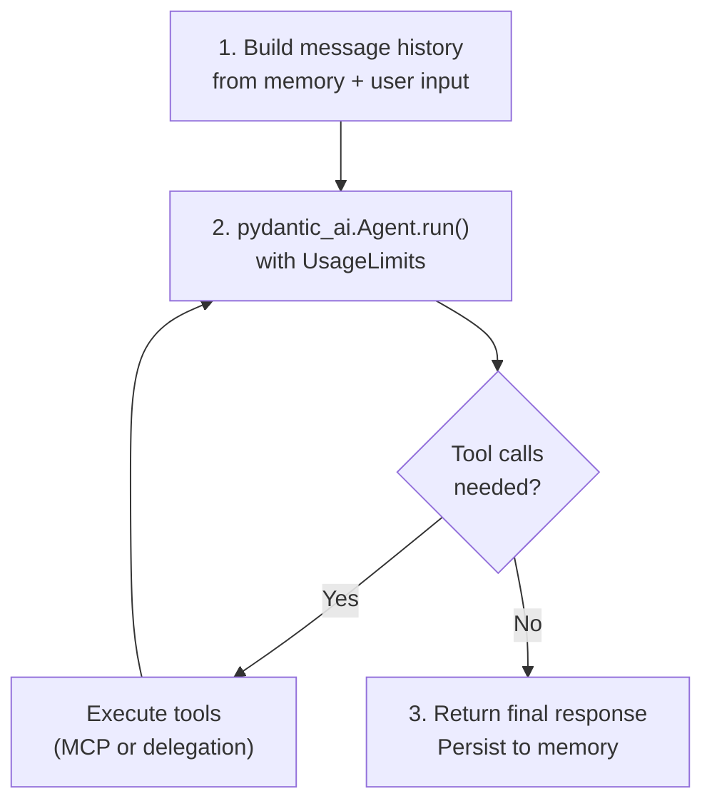

# Agentic Loop

The agentic loop is handled by Pydantic AI's built-in run loop. The KAOS Agent wraps this with memory persistence, delegation tools, and telemetry.

## How It Works


```mermaid
flowchart TB
    start["1. Build message history<br/>from memory + user input"]
    run["2. pydantic_ai.Agent.run()<br/>with UsageLimits"]
    tools{"Tool calls<br/>needed?"}
    exec["Execute tools<br/>(MCP or delegation)"]
    done["3. Return final response<br/>Persist to memory"]

    start --> run
    run --> tools
    tools -->|Yes| exec
    exec --> run
    tools -->|No| done
```

## Key Differences from Previous Architecture

| Aspect | Previous | Current (Pydantic AI) |
|--------|----------|----------------------|
| Loop control | Custom two-phase loop | Pydantic AI `run()` / `run_stream()` |
| Tool calling | Manual extraction + string-mode fallback | Native Pydantic AI tool registration |
| Step limit | Custom counter | `UsageLimits(request_limit=max_steps)` |
| Model detection | `litellm.supports_function_calling()` | Pydantic AI handles internally |
| Streaming | Custom Phase 2 | `run_stream()` with `stream_text()` |

## Configuration

The loop is controlled by `max_steps` on the Agent:

```python
agent = Agent(
    name="my-agent",
    model_api_url="http://ollama:11434",
    model_name="llama3.2",
    max_steps=5,
)
```

`max_steps` maps to `UsageLimits(request_limit=max_steps)` passed to Pydantic AI's `run()`.

## Tool Registration

### MCP Tools

MCP servers are passed as `toolsets` to the Pydantic AI agent:

```python
from pydantic_ai_slim.pydantic_ai.mcp import MCPServerStreamableHTTP

mcp = MCPServerStreamableHTTP(url="http://mcp-server:8000/mcp")
agent._pydantic_agent = PydanticAgent(
    model=model,
    system_prompt=instructions,
    mcp_servers=[mcp],
)
```

### Delegation Tools

Sub-agents are registered as `@agent.tool_plain` functions with `delegate_to_` prefix:

```python
@self._pydantic_agent.tool_plain(name=f"delegate_to_{name}")
async def delegate(task: str) -> str:
    return await self._delegate_to_sub_agent(name, task, session_id)
```

The LLM decides when to delegate based on the tool description.

## Memory Integration

Before each `run()` call, the agent:
1. Creates/retrieves a session
2. Stores the user message event
3. Builds conversation history from memory events → Pydantic AI `ModelRequest`/`ModelResponse` objects
4. After completion, extracts and persists all new events (tool calls, results, final response)

Memory events are bridged between KAOS `MemoryEvent` format and Pydantic AI's `ModelMessage` types via `_memory_events_to_messages()` and `_extract_and_persist_events()`.

## Mock Testing

Use `DEBUG_MOCK_RESPONSES` for deterministic testing. The framework uses Pydantic AI's `FunctionModel` internally:

```bash
# Simple response (no tools) — 1 entry
export DEBUG_MOCK_RESPONSES='["Hello!"]'

# Tool call + final response — 2 entries
export DEBUG_MOCK_RESPONSES='["{\"tool_calls\": [{\"id\": \"call_1\", \"name\": \"echo\", \"arguments\": {\"message\": \"hi\"}}]}", "Done."]'

# Delegation — 2 entries
export DEBUG_MOCK_RESPONSES='["{\"tool_calls\": [{\"id\": \"call_1\", \"name\": \"delegate_to_worker\", \"arguments\": {\"task\": \"process\"}}]}", "Complete."]'
```

::: info Mock Pattern
The previous architecture required 3 mock entries (tool call → no-action → final). With Pydantic AI, only 2 entries are needed (tool call → final).
:::

## Kubernetes E2E

Configure mock responses via the Agent CRD:

```yaml
spec:
  container:
    env:
    - name: DEBUG_MOCK_RESPONSES
      value: '["{\"tool_calls\": [{\"id\": \"call_1\", \"name\": \"echo\", \"arguments\": {\"message\": \"test\"}}]}", "Done."]'
```
