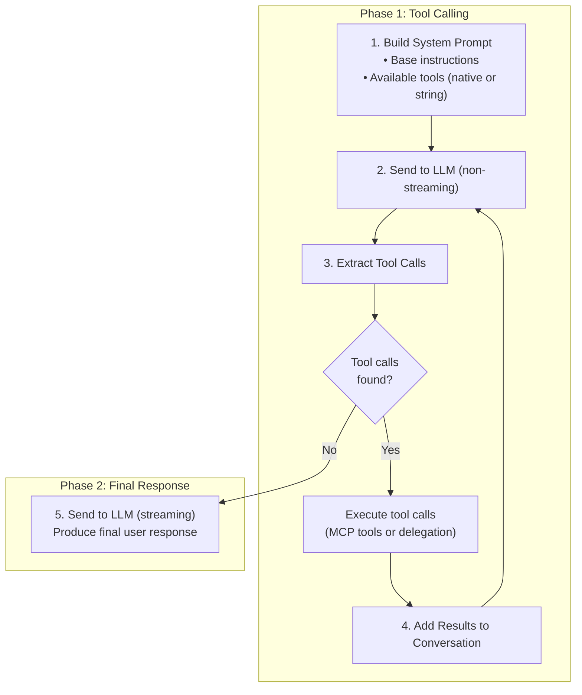

# Agentic Loop

The agentic loop is the two-phase reasoning mechanism that enables agents to collect tool results and delegation responses, then produce a final streamed response.

## How It Works


```mermaid
flowchart TB
    subgraph phase1["Phase 1: Tool Calling"]
        start["1. Build System Prompt<br/>• Base instructions<br/>• Available tools (native or string)"]
        
        llm["2. Send to LLM (non-streaming)"]
        
        extract["3. Extract Tool Calls"]
        
        tool_calls{"Tool calls<br/>found?"}
        
        exec["Execute tool calls<br/>(MCP tools or delegation)"]
        
        add["4. Add Results to Conversation"]
    end
    
    subgraph phase2["Phase 2: Final Response"]
        final["5. Send to LLM (streaming)<br/>Produce final user response"]
    end
    
    start --> llm
    llm --> extract
    extract --> tool_calls
    tool_calls -->|Yes| exec
    tool_calls -->|No| final
    exec --> add
    add --> llm
```

## Auto-Detection

The agent automatically detects tool calling support at initialization:

```python
# Uses litellm's model registry (no HTTP calls needed)
import litellm
supports_native = litellm.supports_function_calling(model="gpt-4o")  # True
supports_native = litellm.supports_function_calling(model="ollama/smollm2:135m")  # False
```

- **Native**: OpenAI `tools` API parameter, structured `tool_calls` in response
- **String fallback**: Tool descriptions in system prompt, JSON parsed from content text

Both modes use the same unified tool call format.

## Configuration

The agentic loop is controlled by the `max_steps` parameter passed to the Agent:

```python
agent = Agent(
    name="my-agent",
    model_api=model_api,
    max_steps=5  # Maximum tool calling iterations
)
```

### max_steps

Prevents infinite loops in Phase 1. When reached, returns message:
```
"Reached maximum reasoning steps (5)"
```

**Guidelines:**
- Simple queries: 2-3 steps
- Tool-using tasks: 5 steps (default)
- Complex multi-step tasks: 10+ steps

## Unified Tool Call Format

Both MCP tools and sub-agent delegation use the same format. Delegation tools are registered with a `delegate_to_` prefix.

### Tool Call

```json
{"tool": "calculator", "arguments": {"expression": "2 + 2"}}
```

### Delegation

```json
{"tool": "delegate_to_researcher", "arguments": {"task": "Find information about quantum computing"}}
```

## Tool Call Extraction

`_extract_tool_calls()` checks `response.tool_calls` first (works for both native mode and mock responses), then falls back to content JSON parsing for string mode:

```python
def _extract_tool_calls(self, response):
    # Structured tool_calls take priority (native API or mock responses)
    if response.tool_calls:
        return response.tool_calls
    # String mode fallback: parse JSON from content
    if not self._supports_native_tools:
        action = self._parse_action(response.content or "")
        if action and action.get("tool"):
            return [ToolCall(...)]
    return []
```

## Progress Blocks

During Phase 1, the agent emits progress blocks when starting tool/delegation execution:

```json
{"type": "progress", "step": 1, "action": "tool_call", "target": "calculator"}
{"type": "progress", "step": 2, "action": "delegate", "target": "researcher"}
```

## Execution Flow

### Tool Execution

1. Extract tool calls from response
2. Emit progress block
3. Log `tool_call` event to memory
4. Execute tool via MCP client
5. Log `tool_result` event to memory
6. Add result to conversation
7. Continue to next loop iteration

### Delegation Execution

1. Extract `delegate_to_{name}` tool call from response
2. Emit progress block
3. Log `delegation_request` event to memory
4. Invoke remote agent via A2A protocol
5. Log `delegation_response` event to memory
6. Add response to conversation
7. Continue to next loop iteration

### Final Response (Phase 2)

1. When no tool calls detected, exit Phase 1
2. Add "provide your final response" prompt
3. Call model with streaming enabled
4. Stream tokens directly to client
5. Log `agent_response` event to memory

## Memory Events

The loop logs events for debugging and verification:

```python
# After tool execution
events = await agent.memory.get_session_events(session_id)
# Events: [user_message, tool_call, tool_result, agent_response]

# After delegation
events = await agent.memory.get_session_events(session_id)
# Events: [user_message, delegation_request, delegation_response, agent_response]
```

## Testing with Mock Responses

Set `DEBUG_MOCK_RESPONSES` environment variable to test loop behavior deterministically.

The `tool_calls` format works for both native and string mode:

```bash
# Test tool calling (tool call → no action → final)
export DEBUG_MOCK_RESPONSES='["{\"tool_calls\": [{\"id\": \"call_1\", \"name\": \"echo\", \"arguments\": {\"text\": \"hello\"}}]}", "No more actions.", "The echo returned: hello"]'

# Test delegation (delegation → no action → final)
export DEBUG_MOCK_RESPONSES='["{\"tool_calls\": [{\"id\": \"call_1\", \"name\": \"delegate_to_researcher\", \"arguments\": {\"task\": \"Find quantum info\"}}]}", "No more actions.", "Based on the research, quantum computing uses qubits."]'

# Simple response (no tools → Phase 2 only)
export DEBUG_MOCK_RESPONSES='["Hello! How can I help you?"]'
```

For Kubernetes E2E tests, configure via the Agent CRD:
```yaml
spec:
  container:
    env:
    - name: DEBUG_MOCK_RESPONSES
      value: '["{\"tool_calls\": [{\"id\": \"call_1\", \"name\": \"delegate_to_worker\", \"arguments\": {\"task\": \"process data\"}}]}", "No more actions.", "Done."]'
```

## Best Practices

1. **Set appropriate max_steps** - Too low may truncate reasoning, too high wastes resources
2. **Clear instructions** - Tell the LLM when to use tools vs. respond directly
3. **Test with mocks** - Use `DEBUG_MOCK_RESPONSES` with `tool_calls` format
4. **Monitor events** - Use memory endpoints to debug complex flows
5. **Handle errors gracefully** - Tool failures are fed back to the loop for recovery
