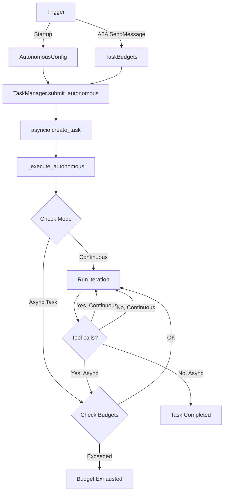

# Autonomous Agent Execution

KAOS supports **autonomous (self-looping) agent execution** with two distinct modes:

1. **Continuous mode** (CRD-activated): Runs forever on pod startup, ideal for monitoring and daemon-like agents
2. **Async task mode** (A2A-triggered): Budget-limited tasks with completion detection

## Overview

### Continuous Mode (CRD Startup)

The agent loops forever on pod boot. There are no overall iteration or runtime limits — the loop only stops on pod shutdown, error, or cancellation. Per-iteration limits control individual reasoning rounds.

### Async Task Mode (A2A-Triggered)

External callers submit goals via A2A `SendMessage`. The agent runs in background with overall budget limits. The task completes when:
- The agent responds without making tool calls (goal achieved)
- A budget limit is reached (iterations, time, or tool calls)
- The task is canceled

## Use Cases

### Startup-Activated Continuous (Use-Case A)

Agent self-loops on pod boot. Runs continuously until the pod is stopped.

```yaml
apiVersion: kaos.tools/v1alpha1
kind: Agent
metadata:
  name: system-monitor
spec:
  modelAPI: my-llm
  model: openai/gpt-4
  config:
    instructions: "You are a system monitoring agent."
    autonomous:
      goal: "Check system health and report any issues"
      intervalSeconds: 10
      maxIterRuntimeSeconds: 60
  mcpServers:
    - kubernetes-mcp
```

### Request-Triggered Async Task (Use-Case B)

External caller submits a goal via A2A `SendMessage` with `configuration.mode: "autonomous"`. Agent executes in background; caller polls via `GetTask`.

```json
{
  "jsonrpc": "2.0",
  "method": "SendMessage",
  "id": 1,
  "params": {
    "message": {
      "role": "user",
      "parts": [{"type": "text", "text": "Research recent AI developments and summarize findings"}]
    },
    "configuration": {
      "mode": "autonomous",
      "budgets": {
        "maxIterations": 20,
        "maxRuntimeSeconds": 600,
        "maxToolCalls": 100
      }
    }
  }
}
```

Response returns immediately with a task in `submitted` state:
```json
{
  "jsonrpc": "2.0",
  "id": 1,
  "result": {
    "id": "task-abc123",
    "sessionId": "session-xyz",
    "status": {"state": "submitted"},
    "mode": "autonomous",
    "events": [{"type": "task.submitted", ...}]
  }
}
```

Poll with `GetTask` to track progress:
```json
{
  "jsonrpc": "2.0",
  "method": "GetTask",
  "id": 2,
  "params": {"id": "task-abc123"}
}
```

## Budget Enforcement

### Continuous Mode (CRD)

No overall budgets — the loop runs forever. Per-iteration limits:

| Budget | Default | Description |
|--------|---------|-------------|
| `maxIterRuntimeSeconds` | 60 | Per-iteration wall-clock limit (0 = unlimited) |
| `intervalSeconds` | 0 | Pause between iterations in seconds (0 = no pause) |

### Async Task Mode (A2A)

Overall budgets prevent runaway execution:

| Budget | Default | Description |
|--------|---------|-------------|
| `maxIterations` | 10 | Maximum outer-loop iterations (0 = unlimited) |
| `maxRuntimeSeconds` | 300 | Wall-clock timeout in seconds (0 = unlimited) |
| `maxToolCalls` | 50 | Cumulative tool calls across all iterations (0 = unlimited) |
| `intervalSeconds` | 0 | Pause between iterations in seconds (0 = no pause) |

Budgets are checked at the **start** of each iteration (before execution). When a budget is exhausted, the task completes with a budget-exceeded message and a `autonomous.budget.exhausted` event.

## Event Log

Each task maintains an append-only event log tracking execution progress:

| Event Type | Description |
|-----------|-------------|
| `task.submitted` | Task created |
| `task.working` | Execution started |
| `autonomous.iteration.started` | Begin iteration N |
| `autonomous.iteration.completed` | Iteration N finished |
| `autonomous.budget.exhausted` | Budget limit reached |
| `task.completed` | Execution finished successfully |
| `task.failed` | Execution failed with error |
| `task.canceled` | Task was canceled |

Events are returned in `GetTask` responses:
```json
{
  "events": [
    {"id": "evt-1", "type": "task.submitted", "timestamp": "2024-01-01T00:00:00Z", "data": {}},
    {"id": "evt-2", "type": "task.working", "timestamp": "2024-01-01T00:00:01Z", "data": {}},
    {"id": "evt-3", "type": "autonomous.iteration.started", "timestamp": "2024-01-01T00:00:01Z", "data": {"iteration": 0}},
    {"id": "evt-4", "type": "autonomous.iteration.completed", "timestamp": "2024-01-01T00:00:05Z", "data": {"iteration": 0, "response_preview": "..."}}
  ]
}
```

## Environment Variables

### Autonomous Mode (CRD)

| Variable | Default | Description |
|----------|---------|-------------|
| `AUTONOMOUS_GOAL` | `""` | Goal for autonomous mode — setting this activates it |
| `AUTONOMOUS_INTERVAL_SECONDS` | `0` | Pause between iterations (seconds) |
| `AUTONOMOUS_MAX_ITER_RUNTIME_SECONDS` | `60` | Per-iteration wall-clock limit |

### Async Task Mode (A2A Defaults)

| Variable | Default | Description |
|----------|---------|-------------|
| `TASK_MAX_ITERATIONS` | `10` | Default max iterations for A2A async tasks |
| `TASK_MAX_RUNTIME_SECONDS` | `300` | Default max wall-clock time for A2A async tasks |
| `TASK_MAX_TOOL_CALLS` | `50` | Default max cumulative tool calls for A2A async tasks |

## CRD Configuration

```yaml
spec:
  config:
    autonomous:
      goal: "Your goal here"           # Setting goal activates autonomous mode
      intervalSeconds: 10              # Pause between iterations
      maxIterRuntimeSeconds: 60        # Per-iteration wall-clock limit (0 = unlimited)
    taskConfig:
      maxIterations: 10                # Default for A2A async tasks
      maxRuntimeSeconds: 300           # Default for A2A async tasks
      maxToolCalls: 50                 # Default for A2A async tasks
```

**Note:** Setting `autonomous.goal` activates autonomous mode on pod startup. If no goal is set, autonomous mode is simply inactive.

## Completion Detection

### Continuous Mode

No automatic completion — the loop runs indefinitely. Iterations continue until:
- Pod shutdown / restart
- Unrecoverable error
- Task cancellation

### Async Task Mode

The autonomous loop detects completion by checking whether the agent made any tool calls during an iteration:

- **Tool calls made**: Agent is still working → continue to next iteration
- **No tool calls**: Agent gave a final text answer → goal achieved, loop ends

This leverages the fact that Pydantic AI runs the full agentic loop internally per iteration. If the agent decides to respond with text only (no tool calls), it's signaling completion.

## Architecture



The autonomous loop is fully owned by `LocalTaskManager._execute_autonomous`. The server provides `_run_agent(message, session_id) → (response_text, tool_call_count)` as the `process_fn` callback. This separation allows future distributed TaskManager implementations to manage execution differently while using the same agent execution primitive.
