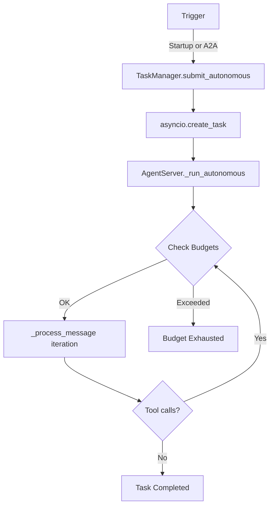

# Autonomous Agent Execution

KAOS supports **autonomous (self-looping) agent execution** — agents that work toward a goal across multiple iterations with budget enforcement, event tracking, and lifecycle management.

## Overview

In autonomous mode, an agent repeatedly calls its agentic loop (`_process_message`) until either:
- The goal is achieved (agent responds without making tool calls)
- A budget limit is reached (iterations, time, or tool calls)
- The task is canceled

This enables use cases like:
- **Continuous monitoring**: Agent checks system health on startup
- **Research tasks**: Agent investigates a topic using multiple tools
- **Multi-step automation**: Agent executes a complex workflow autonomously

## Use Cases

### Startup-Activated (Use-Case A)

Agent self-loops on pod boot. Goal comes from CRD configuration. No API trigger needed.

```yaml
apiVersion: kaos.tools/v1alpha1
kind: Agent
metadata:
  name: system-monitor
spec:
  modelAPI: my-llm
  model: openai/gpt-4
  config:
    instructions: "You are a system monitoring agent."
    autonomous:
      enabled: true
      goal: "Check system health and report any issues"
      maxIterations: 10
      maxRuntimeSeconds: 300
      maxToolCalls: 50
  mcpServers:
    - kubernetes-mcp
```

### Request-Triggered via A2A (Use-Case B)

External caller submits a goal via A2A `SendMessage` with `configuration.mode: "autonomous"`. Agent executes in background; caller polls via `GetTask`.

```json
{
  "jsonrpc": "2.0",
  "method": "SendMessage",
  "id": 1,
  "params": {
    "message": {
      "role": "user",
      "parts": [{"type": "text", "text": "Research recent AI developments and summarize findings"}]
    },
    "configuration": {
      "mode": "autonomous",
      "budgets": {
        "maxIterations": 20,
        "maxRuntimeSeconds": 600,
        "maxToolCalls": 100
      }
    }
  }
}
```

Response returns immediately with a task in `submitted` state:
```json
{
  "jsonrpc": "2.0",
  "id": 1,
  "result": {
    "id": "task-abc123",
    "sessionId": "session-xyz",
    "status": {"state": "submitted"},
    "mode": "autonomous",
    "events": [{"type": "task.submitted", ...}]
  }
}
```

Poll with `GetTask` to track progress:
```json
{
  "jsonrpc": "2.0",
  "method": "GetTask",
  "id": 2,
  "params": {"id": "task-abc123"}
}
```

## Budget Enforcement

Budgets prevent runaway execution:

| Budget | Default | Description |
|--------|---------|-------------|
| `maxIterations` | 10 | Maximum outer-loop iterations (0 = unlimited) |
| `maxRuntimeSeconds` | 300 | Wall-clock timeout in seconds (0 = unlimited) |
| `maxToolCalls` | 50 | Cumulative tool calls across all iterations (0 = unlimited) |
| `intervalSeconds` | 0 | Pause between iterations in seconds (0 = no pause) |

Budgets are checked at the **start** of each iteration (before execution). When a budget is exhausted, the task completes with a budget-exceeded message and a `autonomous.budget.exhausted` event.

## Event Log

Each task maintains an append-only event log tracking execution progress:

| Event Type | Description |
|-----------|-------------|
| `task.submitted` | Task created |
| `task.working` | Execution started |
| `autonomous.iteration.started` | Begin iteration N |
| `autonomous.iteration.completed` | Iteration N finished |
| `autonomous.budget.exhausted` | Budget limit reached |
| `task.completed` | Execution finished successfully |
| `task.failed` | Execution failed with error |
| `task.canceled` | Task was canceled |

Events are returned in `GetTask` responses:
```json
{
  "events": [
    {"id": "evt-1", "type": "task.submitted", "timestamp": "2024-01-01T00:00:00Z", "data": {}},
    {"id": "evt-2", "type": "task.working", "timestamp": "2024-01-01T00:00:01Z", "data": {}},
    {"id": "evt-3", "type": "autonomous.iteration.started", "timestamp": "2024-01-01T00:00:01Z", "data": {"iteration": 0}},
    {"id": "evt-4", "type": "autonomous.iteration.completed", "timestamp": "2024-01-01T00:00:05Z", "data": {"iteration": 0, "response_preview": "..."}}
  ]
}
```

## Environment Variables

| Variable | Default | Description |
|----------|---------|-------------|
| `AUTONOMOUS_ENABLED` | `false` | Enable startup-activated autonomous mode |
| `AUTONOMOUS_GOAL` | `""` | Goal for startup-activated mode |
| `AUTONOMOUS_MAX_ITERATIONS` | `10` | Max iterations |
| `AUTONOMOUS_MAX_RUNTIME_SECONDS` | `300` | Max wall-clock time |
| `AUTONOMOUS_MAX_TOOL_CALLS` | `50` | Max cumulative tool calls |
| `AUTONOMOUS_INTERVAL_SECONDS` | `0` | Pause between iterations (seconds) |

## CRD Configuration

```yaml
spec:
  config:
    autonomous:
      enabled: true                # Activate on pod startup
      goal: "Your goal here"       # Required when enabled
      maxIterations: 10            # 0-1000 (0 = unlimited)
      maxRuntimeSeconds: 300       # 0-86400 (0 = unlimited)
      maxToolCalls: 50             # 0-10000 (0 = unlimited)
      intervalSeconds: 0           # 0-3600 (pause between iterations)
```

## Completion Detection

The autonomous loop detects completion by checking whether the agent made any tool calls during an iteration:

- **Tool calls made**: Agent is still working → continue to next iteration
- **No tool calls**: Agent gave a final text answer → goal achieved, loop ends

This leverages the fact that Pydantic AI runs the full agentic loop internally per iteration. If the agent decides to respond with text only (no tool calls), it's signaling completion.

## Architecture


