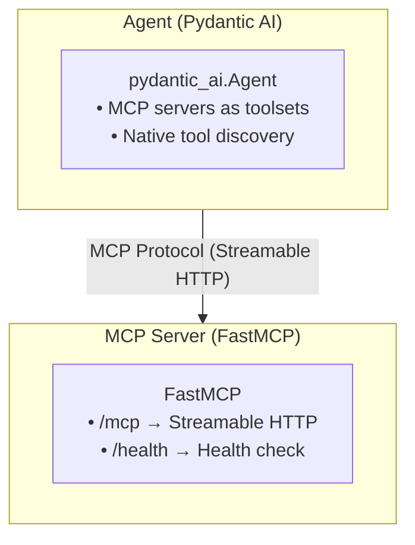

# MCP Tools

MCP (Model Context Protocol) tools are integrated via Pydantic AI's native `MCPServerStreamableHTTP` support. The Agent discovers and calls tools from any MCP-compliant server.

## Architecture



## How It Works

MCP servers are passed directly to the Pydantic AI agent as `toolsets`. Tool discovery and invocation are handled natively by Pydantic AI — there is no custom `MCPClient` wrapper.

### Agent Configuration

```python
from pydantic_ai_slim.pydantic_ai.mcp import MCPServerStreamableHTTP

mcp = MCPServerStreamableHTTP(url="http://mcp-server:8000/mcp")
agent = Agent(
    name="tool-agent",
    model_api_url="http://ollama:11434",
    model_name="llama3.2",
    mcp_servers=[mcp],
)
```

### Environment Variable Configuration

In Kubernetes, MCP servers are configured via environment variables:

```bash
# Comma-separated list of MCP server names
export MCP_SERVERS="echo,calc"

# URL for each server (auto-appends /mcp)
export MCP_SERVER_ECHO_URL="http://echo-server:8000"
export MCP_SERVER_CALC_URL="http://calc-server:8000"
```

The `AgentServerSettings` parses these into `MCPServerStreamableHTTP` instances.

### Agent CRD

```yaml
apiVersion: kaos.tools/v1alpha1
kind: Agent
metadata:
  name: tool-agent
spec:
  modelApiRef:
    name: my-model
  mcpServerRefs:
  - name: echo-server
  - name: calc-server
```

The operator resolves `mcpServerRefs` to service URLs and sets `MCP_SERVERS` + `MCP_SERVER_*_URL` env vars.

## MCPServer CRD

### Runtime-Based Architecture

MCPServers use a `runtime` field to specify the tool implementation:

```yaml
apiVersion: kaos.tools/v1alpha1
kind: MCPServer
metadata:
  name: echo-server
spec:
  runtime: python-string
  params: |
    def echo(message: str) -> str:
        """Echo the input message."""
        return f"Echo: {message}"
```

### Supported Runtimes

| Runtime | Description |
|---------|-------------|
| `python-string` | Dynamic Python functions defined inline |
| `kubernetes` | Kubernetes API operations |
| `slack` | Slack API integration |
| `custom` | Custom container image |

## MCP Server Implementation

The `data-plane/mcp-servers/python-string/` module provides the `python-string` runtime:

```python
from mcptools.server import MCPServer, MCPServerSettings

settings = MCPServerSettings(
    mcp_host="0.0.0.0",
    mcp_port=8000,
    mcp_tools_string="def echo(text: str) -> str: return text"
)
server = MCPServer(settings)
server.run(transport="streamable-http")
```

Tools are registered from the `MCP_TOOLS_STRING` environment variable at startup.

## Tool Definition Guidelines

```python
def search(query: str, limit: int = 10) -> str:
    """Search for information.
    
    Args:
        query: The search query
        limit: Maximum results to return
    """
    return f"Results for: {query}"
```

- **Type annotations** are required for all parameters
- **Docstrings** become tool descriptions for the LLM
- **Return type** should be `str` for best LLM compatibility
