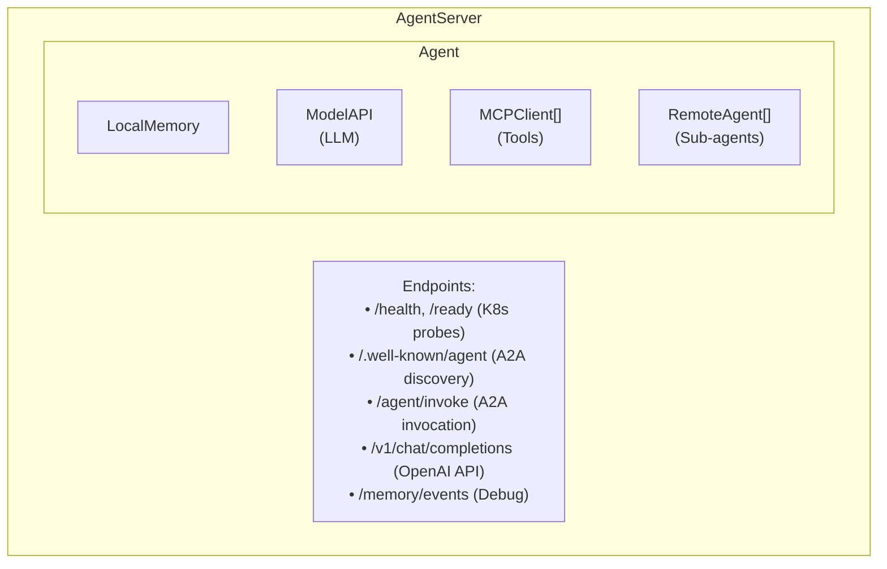

# Python Agent Framework Overview

The Python agent framework provides the runtime components for AI agents. It replaces Google ADK with a simpler, Kubernetes-native implementation.

## Design Principles

1. **Keep It Simple** - Minimal abstractions, clear data flow
2. **HTTP-First** - All components communicate via HTTP
3. **OpenAI Compatible** - Standard `/v1/chat/completions` API
4. **Kubernetes Native** - Environment variable configuration, health probes

## Module Structure

```
python/
├── agent/
│   ├── client.py      # Agent, RemoteAgent, AgentCard, AgenticLoopConfig
│   ├── server.py      # AgentServer, HTTP endpoints
│   └── memory.py      # LocalMemory, MemoryEvent, SessionMemory
├── mcptools/
│   ├── server.py      # MCPServer with FastMCP
│   └── client.py      # MCPClient for tool discovery
├── modelapi/
│   └── client.py      # ModelAPI for LLM calls
├── tests/             # Test suite
└── Dockerfile         # Container image
```

## Component Relationships



## Quick Start

### Programmatic Usage

```python
from agent.client import Agent, AgenticLoopConfig
from agent.server import AgentServer
from modelapi.client import ModelAPI

# Create model API client
model_api = ModelAPI(
    model="smollm2:135m",
    api_base="http://localhost:8000"
)

# Create agent
agent = Agent(
    name="my-agent",
    model_api=model_api,
    instructions="You are a helpful assistant.",
    loop_config=AgenticLoopConfig(max_steps=5)
)

# Create and run server
server = AgentServer(agent, port=8080)
server.run()
```

### Environment Variable Configuration

```bash
export AGENT_NAME="my-agent"
export MODEL_API_URL="http://localhost:8000"
export AGENT_INSTRUCTIONS="You are a helpful assistant."

# Run with uvicorn
cd python
uvicorn agent.server:get_app --factory --host 0.0.0.0 --port 8000
```

## Key Classes

| Class | Description |
|-------|-------------|
| `Agent` | Main agent with agentic loop, tools, sub-agents |
| `AgentServer` | FastAPI server exposing agent endpoints |
| `RemoteAgent` | Client for invoking remote agents |
| `ModelAPI` | OpenAI-compatible LLM client |
| `MCPClient` | MCP tool discovery and invocation |
| `MCPServer` | MCP tool hosting with FastMCP |
| `LocalMemory` | In-memory session/event storage |

## Documentation

- [Agent](agent.md) - Agent class details
- [Agentic Loop](agentic-loop.md) - Reasoning loop implementation
- [Memory](memory.md) - Session and event management
- [MCP Tools](mcp-tools.md) - Tool integration
- [ModelAPI](model-api.md) - LLM client
- [Server](server.md) - HTTP endpoints
