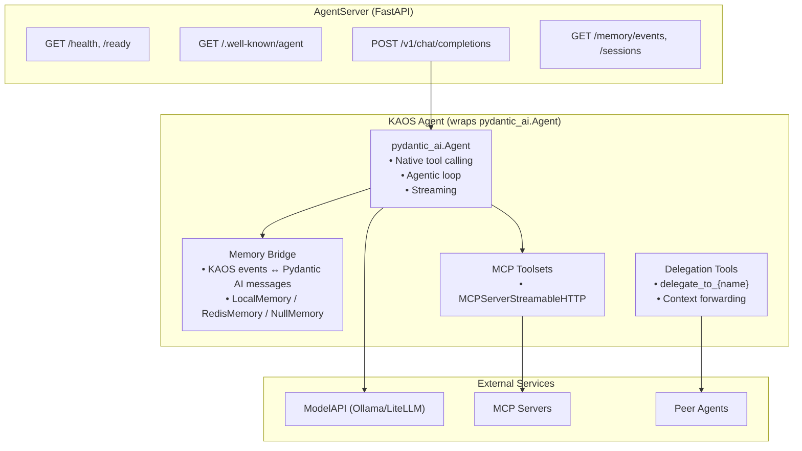

# Python Agent Framework Overview

The Python agent framework provides the runtime components for AI agents, built on [Pydantic AI](https://ai.pydantic.dev/) as the core agent runtime.

## Design Principles

1. **Keep It Simple** - Thin wrapper around Pydantic AI, minimal abstractions
2. **HTTP-First** - All components communicate via HTTP
3. **OpenAI Compatible** - Standard `/v1/chat/completions` API
4. **Kubernetes Native** - Environment variable configuration, health probes

## Module Structure

```
data-plane/pai-server/
├── pai_server/
│   ├── client.py      # Agent (wraps pydantic_ai.Agent), RemoteAgent, AgentCard
│   ├── server.py      # AgentServer, HTTP endpoints, env-var configuration
│   └── memory.py      # LocalMemory, RedisMemory, NullMemory
├── telemetry/
│   └── manager.py     # OpenTelemetry tracing, metrics, context propagation
├── tests/             # Test suite (75+ unit tests)
└── Dockerfile         # Container image
```

## Component Relationships


```mermaid
flowchart TB
    subgraph server["AgentServer (FastAPI)"]
        health["GET /health, /ready"]
        a2a["GET /.well-known/agent"]
        chat["POST /v1/chat/completions"]
        mem_ep["GET /memory/events, /sessions"]
    end

    subgraph agent["KAOS Agent (wraps pydantic_ai.Agent)"]
        pydantic["pydantic_ai.Agent<br/>• Native tool calling<br/>• Agentic loop<br/>• Streaming"]
        memory["Memory Bridge<br/>• KAOS events ↔ Pydantic AI messages<br/>• LocalMemory / RedisMemory / NullMemory"]
        delegation["Delegation Tools<br/>• delegate_to_{name}<br/>• Context forwarding"]
        mcp["MCP Toolsets<br/>• MCPServerStreamableHTTP"]
    end

    subgraph external["External Services"]
        model["ModelAPI (Ollama/LiteLLM)"]
        mcpsrv["MCP Servers"]
        peers["Peer Agents"]
    end

    chat --> pydantic
    pydantic --> model
    pydantic --> mcp
    mcp --> mcpsrv
    delegation --> peers
    pydantic --> memory
```

## Key Environment Variables

| Variable | Required | Description |
|----------|----------|-------------|
| `AGENT_NAME` | Yes | Agent name |
| `MODEL_API_URL` | Yes | LLM API base URL (auto-appends `/v1`) |
| `MODEL_NAME` | Yes | Model name |
| `AGENT_INSTRUCTIONS` | No | System prompt |
| `AGENT_DESCRIPTION` | No | Agent description for A2A card |
| `MCP_SERVERS` | No | Comma-separated MCP server names |
| `MCP_SERVER_<NAME>_URL` | No | URL for each MCP server |
| `PEER_AGENTS` | No | Comma-separated peer agent names |
| `PEER_AGENT_<NAME>_CARD_URL` | No | URL for each peer agent |
| `MEMORY_TYPE` | No | `local` (default) or `redis` |
| `MEMORY_ENABLED` | No | Enable/disable memory (default: true) |
| `MEMORY_CONTEXT_LIMIT` | No | Max history events (default: 6) |
| `DEBUG_MOCK_RESPONSES` | No | JSON array for mock testing |

## Architecture

The KAOS Agent wraps `pydantic_ai.Agent` to add:
- **Memory persistence**: KAOS memory events bridged to Pydantic AI `message_history`
- **Sub-agent delegation**: Registered as `delegate_to_{name}` tool functions
- **MCP tools**: Passed as `MCPServerStreamableHTTP` toolsets
- **Telemetry**: Custom OTel spans for agent runs, tool calls, delegation
- **HTTP surface**: OpenAI-compatible `/v1/chat/completions` endpoint

The agentic loop (tool calling, retries, streaming) is handled entirely by Pydantic AI.

## Further Reading

- [Agent](./agent) — Core agent class and delegation
- [Agentic Loop](./agentic-loop) — How Pydantic AI handles tool calling
- [Memory](./memory) — Session storage and event tracking
- [MCP Tools](./mcp-tools) — Tool server integration
- [Server](./server) — HTTP API and configuration
