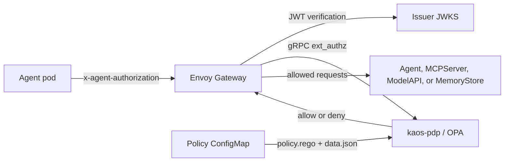

# Security overview

KAOS authenticates and authorizes agent traffic at Envoy Gateway before it reaches an internal resource. The self-contained security topology uses Kubernetes ServiceAccount tokens for agent identity, Envoy Gateway `SecurityPolicy` resources for JWT verification and external authorization, and an in-chart Open Policy Agent (OPA) deployment for policy decisions.

## Request path



The operator creates a `SecurityPolicy` for each internal route. Envoy verifies the actor JWT, then calls `kaos-pdp.<release-namespace>.svc:9191` over the Envoy external-authorization gRPC protocol. The policy is fail-closed: `failOpen` is explicitly false, so an unavailable PDP never permits a request.

The PDP runs stock `openpolicyagent/opa:1.18.1-envoy-static` with the Envoy plugin listening on port 9191. It watches `/policy/policy.rego` and `/policy/data.json`, mounted from the policy ConfigMap in the release namespace. The decision path is `kaos/authz/result`, matching the package and `result` rule in the shipped policy.

## Identity issuers

Exactly one agent identity issuer is active:

- `serviceaccount` uses one owned ServiceAccount per Agent. Kubernetes projects a short-lived token with audience `kaos-gateway` into the agent pod at `/var/run/secrets/kaos-agent/token`; `AGENT_AUTH_TOKEN_FILE` points the runtime to that file. The operator discovers the cluster issuer and JWKS through the Kubernetes API, embeds the JWKS in gateway policies, and projects the issuer-keyed keys into OPA data.
- `aib` registers each Agent with the Agentic Identity Broker and delivers OAuth client credentials in a Secret. The runtime obtains actor tokens through `client_credentials`. One issuer URL configures the broker's public issuer and every KAOS verifier.
- `oidc` accepts an explicitly configured OIDC issuer for advanced deployments.

ServiceAccount identity needs no external identity service and is the agent issuer selected by the `kaos-internal` preset.

## Install presets

Use `kaos system install --auth-enabled <preset>`:

| Preset | Agent identity | User identity | Authorization | External dependencies |
|---|---|---|---|---|
| `kaos-internal` | Kubernetes ServiceAccount tokens | none | In-chart OPA with CRD-derived grants | none |
| `aib-only` | AIB OAuth client credentials | none | In-chart OPA with CRD-derived grants | AIB |
| `aib-keycloak` | AIB OAuth client credentials | Keycloak JWTs at the gateway | In-chart OPA with CRD-derived grants | AIB and Keycloak |

All three presets enable the PDP, automated policy projection, internal gateway routing, and NetworkPolicy generation. AIB provisions identity only; authorization decisions remain in the gateway-external PDP. Keycloak supplies the user JWT provider in `aib-keycloak`.

```bash
kaos system install --auth-enabled kaos-internal --metallb-enabled --wait
kaos system install --auth-enabled aib-only --aib-chart-path ./agentic-identity-broker/chart --wait
kaos system install --auth-enabled aib-keycloak --aib-chart-path ./agentic-identity-broker/chart --wait
```

## Traffic confinement

The presets route internal calls through Envoy Gateway and generate NetworkPolicies that restrict direct workload access. NetworkPolicy enforcement depends on the cluster CNI; KIND's default kindnet does not enforce these policies. See [Gateway API](/operator/gateway-api#strict-gateway-only-traffic).

## Current limits

- Authorization evaluates agent actor → resource grants. User identity can be verified at the gateway, but user → resource grants are not part of the decision yet.
- Projection is eventually consistent. Allow changes and revocations can take about 90 seconds to reach every controller, ConfigMap mount, OPA watcher, and gateway dataplane.
- In ServiceAccount mode, the operator discovers and caches the cluster issuer JWKS at startup. Restart the operator after the cluster rotates its ServiceAccount signing keys so new keys reach Envoy and OPA.

See [Authorization](/security/authorization) for the request contract and policy-data schema.
