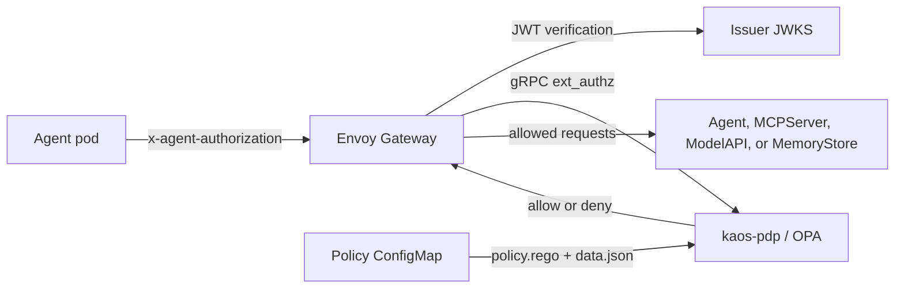

# Security overview

KAOS authenticates and authorizes agent traffic at Envoy Gateway before it reaches an internal resource. The self-contained security topology uses Kubernetes ServiceAccount tokens for agent identity, Envoy Gateway `SecurityPolicy` resources for JWT verification and external authorization, and an in-chart Open Policy Agent (OPA) deployment for policy decisions.

## Request path



The operator creates a `SecurityPolicy` for each internal route. Envoy verifies the actor JWT, then calls `kaos-pdp.<release-namespace>.svc:9191` over the Envoy external-authorization gRPC protocol. The policy is fail-closed: `failOpen` is explicitly false, so an unavailable PDP never permits a request.

The PDP runs stock `openpolicyagent/opa:1.18.1-envoy-static` with the Envoy plugin listening on port 9191. It watches `/policy/policy.rego` and `/policy/data.json`, mounted from the policy ConfigMap in the release namespace. The decision path is `kaos/authz/result`, matching the package and `result` rule in the shipped policy.

## Identity issuers

Exactly one agent identity issuer is active:

- `serviceaccount` uses one owned ServiceAccount per Agent. Kubernetes projects a short-lived token with audience `kaos-gateway` into the agent pod at `/var/run/secrets/kaos-agent/token`; `AGENT_AUTH_TOKEN_FILE` points the runtime to that file. The operator discovers the cluster issuer and JWKS through the Kubernetes API, embeds the JWKS in gateway policies, and projects the issuer-keyed keys into OPA data.
- `aib` registers each Agent with the Agentic Identity Broker and delivers OAuth client credentials in a Secret. The runtime obtains actor tokens through `client_credentials`. One issuer URL configures the broker's public issuer and every KAOS verifier.
- `oidc` uses RFC 7591/7592 Dynamic Client Registration to create one OAuth client per Agent and deliver its credentials. Select it with `--agent-auth-enabled keycloak`; its initial access token Secret is provisioned manually before the operator starts.

ServiceAccount identity needs no external identity service and is selected by `--agent-auth-enabled service-account`.

## Install flags

Agent and user identity are selected independently:

| Flag | Modes | Default when passed without a value |
|---|---|---|
| `--agent-auth-enabled` | `service-account`, `aib`, `keycloak` | `service-account` |
| `--user-auth-enabled` | `keycloak`, `none` | `keycloak` |

With neither flag, security stays disabled. When either flag is present, the unspecified plane uses its default. `--user-auth-enabled none` disables the user plane. Enabled user authentication also enables strict Gateway API mode, which includes internal gateway routing and NetworkPolicy isolation; all authentication presets include the PDP and automated policy projection.

The former presets map to the new flags as follows:

| Former preset | Equivalent flags |
|---|---|
| `kaos-internal` | `--agent-auth-enabled service-account --user-auth-enabled none` |
| `aib-only` | `--agent-auth-enabled aib --user-auth-enabled none` |
| `aib-keycloak` | `--agent-auth-enabled aib --user-auth-enabled keycloak` |
| `oidc-keycloak` | `--agent-auth-enabled keycloak --user-auth-enabled keycloak` |

```bash
kaos system install --agent-auth-enabled service-account --user-auth-enabled none --metallb-enabled --wait
kaos system install --agent-auth-enabled aib --user-auth-enabled none --aib-chart-path ./agentic-identity-broker/chart --wait
kaos system install --agent-auth-enabled aib --user-auth-enabled keycloak --aib-chart-path ./agentic-identity-broker/chart --wait
kaos system install --agent-auth-enabled keycloak --user-auth-enabled keycloak --wait
```

## Traffic confinement

The auth flags route internal calls through Envoy Gateway and generate NetworkPolicies that restrict direct workload access. NetworkPolicy enforcement depends on the cluster CNI; KIND's default kindnet does not enforce these policies. See [Gateway API](/operator/gateway-api#strict-gateway-only-traffic).

## Current limits

- A verified subject is required on every hop. User `AccessGrant`s gate entry, while Agent grants gate internal movement; user grants are not reevaluated for each downstream hop.
- Projection is eventually consistent. Allow changes and revocations can take about 90 seconds to reach every controller, ConfigMap mount, OPA watcher, and gateway dataplane.
- In ServiceAccount mode, the operator discovers and caches the cluster issuer JWKS at startup. Restart the operator after the cluster rotates its ServiceAccount signing keys so new keys reach Envoy and OPA.
- Token signature verification supports RS256 only.

See [Agent identity](/security/walkthrough-agent-identity), [User identity](/security/walkthrough-user-identity), and [Authentication and authorization](/security/walkthrough-auth) for the identity planes and their enforcement path. See [Authorization](/security/authorization) for the policy-data schema.
