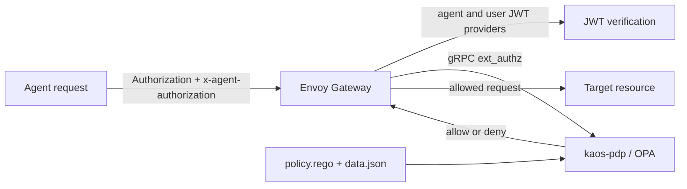

# Authentication and authorization

KAOS joins the agent actor and user subject planes at Envoy Gateway, then sends the request to the gateway-external OPA policy decision point (PDP).

## Request path



The gateway `jwt_authn` configuration contains two independent providers when both planes are configured:

- `agent` reads `x-agent-authorization`, verifies the selected actor issuer, and requires audience `kaos-gateway`.
- `user` reads `Authorization` and verifies the configured Keycloak issuer and audience.

The generated JWT rule uses `optional: true` so agent-issuer tokens carried in `Authorization` can reach the PDP for autonomous self-subjecting. Optional gateway JWT authentication does not make identity optional: the PDP verifies every required token in policy and is authoritative for the allow or deny decision. The gateway invokes OPA through the Envoy gRPC `ext_authz` filter, and the `SecurityPolicy` sets `failOpen: false`; invalid identity, an explicit policy denial, or an unavailable PDP does not reach the workload.

## Subject-required authorization model

Every protected request requires a verified subject on every hop:

- A user subject is a verified Keycloak token whose `sub` or `email`, and optional short-name `groups`, identify the user.
- An autonomous Agent can self-subject with its own verified agent token only when `data.kaos.agents[id].autonomous` is `true`. A non-autonomous Agent cannot self-subject.

Entry and internal movement use different grants:

- At entry, `Authorization` carries the user token and no actor token is present. An enforced `AccessGrant` in `data.kaos.user_grants` must cover the path-derived target for that user or one of their groups.
- On an internal hop, `Authorization` carries the propagated subject and `x-agent-authorization` carries the calling Agent's token. The subject must remain valid, while `data.kaos.grants` determines whether that Agent may move to the target resource.

This keeps user intent attached to the complete call chain while separating permission to enter the system from permission for each Agent to move inside it.

## Keycloak groups claim requirement

Group-based `AccessGrant`s require a Keycloak Group Membership protocol mapper that emits the `groups` claim in access tokens. Configure the mapper with access-token claims enabled and `full.path: false`; group subjects consequently use short names, such as `name: researchers`, rather than `/researchers`.

This mapper is a hard requirement: without the `groups` claim, group-based grants cannot match. The CLI provisions it automatically for the managed Keycloak preset, while bring-your-own-Keycloak deployments must configure it themselves.

## Request conventions

The actor credential is:

```http
x-agent-authorization: Bearer <actor-jwt>
```

The subject credential is:

```http
Authorization: Bearer <subject-jwt>
```

At user entry the subject is a Keycloak token. During autonomous execution it is the autonomous Agent's own agent token. Internal calls propagate the subject unchanged and replace the actor token with the current calling Agent's token.

Protected resources use logical ids:

- `kaos://agent/<namespace>/<name>`
- `kaos://mcpserver/<namespace>/<name>`
- `kaos://modelapi/<namespace>/<name>`
- `kaos://memorystore/<namespace>/<name>`

OPA derives the target from the operator-owned route path `/<namespace>/<route-kind>/<name>/...`; route kind `mcp` maps to `mcpserver`. Although routes stamp `x-kaos-target-resource` for the forwarded request, route header modifiers run after external authorization. The PDP therefore does not trust an inbound target-resource header.

## Published policy contract

OPA reads the following stable fields from `data.kaos`:

- `data.kaos.grants`: logical actor id to allowed target-resource ids.
- `data.kaos.user_grants`: `user:<sub-or-email>` or `group:<name>` to allowed entry-resource ids.
- `data.kaos.jwks`: exact actor-token issuer to JWKS.
- `data.kaos.agents`: logical actor id to issuer-specific token subject and autonomous status.

The shipped policy verifies subject and actor tokens, resolves agent subjects through `data.kaos.agents`, derives the target resource from the request path, and applies the entry or internal grant check.

## Does not support

- Per-user downstream authorization is not supported. User grants gate entry; internal hops require a valid propagated subject but authorize movement with the calling Agent's grants.
- Policy and grant changes, including revocations, can take about 90 seconds to pass through reconciliation, the ConfigMap volume, OPA file watching, and gateway configuration.
- ServiceAccount JWKS is discovered and cached at operator startup. Restart the operator after ServiceAccount signing-key rotation.
- Token signature verification supports RS256 only.

The default decision is deny. Missing or invalid subjects, invalid actors on internal hops, unknown targets, and absent grants are denied.
