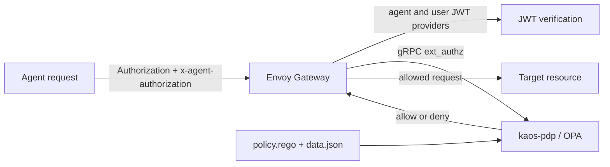

# Authentication and authorization

KAOS joins the agent actor and user subject planes at Envoy Gateway, then sends the request to the gateway-external OPA policy decision point (PDP).

## Request path



The gateway `jwt_authn` configuration contains two independent providers when both planes are configured:

- `agent` reads `x-agent-authorization`, verifies the selected actor issuer, and requires audience `kaos-gateway`.
- `user` reads `Authorization` and verifies the configured Keycloak issuer and audience.

The gateway then invokes OPA through the Envoy gRPC `ext_authz` filter. The `SecurityPolicy` sets `failOpen: false`; an invalid or missing required actor token, an explicit policy denial, or an unavailable PDP does not reach the workload.

## Keycloak groups claim requirement

Group-based `AccessGrant`s require a Keycloak Group Membership protocol mapper that emits the `groups` claim in access tokens. Configure the mapper with access-token claims enabled and `full.path: false`; group subjects consequently use short names, such as `name: researchers`, rather than `/researchers`.

This mapper is a hard requirement: without the `groups` claim, group-based grants cannot match. The CLI provisions it automatically for the managed Keycloak preset, while bring-your-own-Keycloak deployments must configure it themselves.

## Request conventions

The actor credential is:

```http
x-agent-authorization: Bearer <actor-jwt>
```

Protected resources use logical ids:

- `kaos://agent/<namespace>/<name>`
- `kaos://mcpserver/<namespace>/<name>`
- `kaos://modelapi/<namespace>/<name>`
- `kaos://memorystore/<namespace>/<name>`

OPA derives the target from the operator-owned route path `/<namespace>/<route-kind>/<name>/...`; route kind `mcp` maps to `mcpserver`. Although routes stamp `x-kaos-target-resource` for the forwarded request, route header modifiers run after external authorization. The PDP therefore does not trust an inbound target-resource header.

## Published policy contract

OPA reads the following stable fields from `data.kaos`:

- `data.kaos.grants`: logical actor id to allowed target-resource ids.
- `data.kaos.jwks`: exact actor-token issuer to JWKS.
- `data.kaos.agents`: logical actor id to issuer-specific token subject.

The shipped policy verifies the actor token again against `data.kaos.jwks`, resolves its `sub` through `data.kaos.agents`, derives the target resource from the request path, and checks membership in `data.kaos.grants`.

## Current decision model

A request is allowed only when the actor token is valid and the resolved actor has an explicit grant for the path-derived resource. The PDP denies requests with a missing or invalid actor token, no derivable target resource, or no actor-to-resource grant. The default decision is deny.

User-to-resource authorization through `AccessGrant` is forthcoming. User JWT verification and propagation exist today, but the current PDP decision is actor to resource only.

Policy projection is eventually consistent. Allow changes and revocations can take about 90 seconds to pass through reconciliation, the ConfigMap volume, OPA file watching, and gateway configuration.
